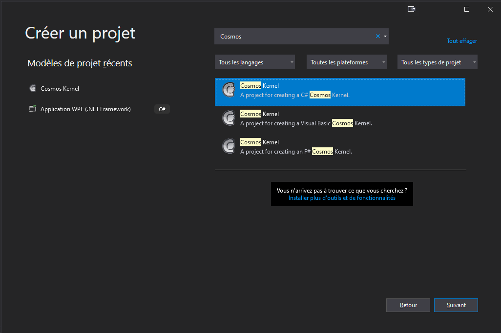
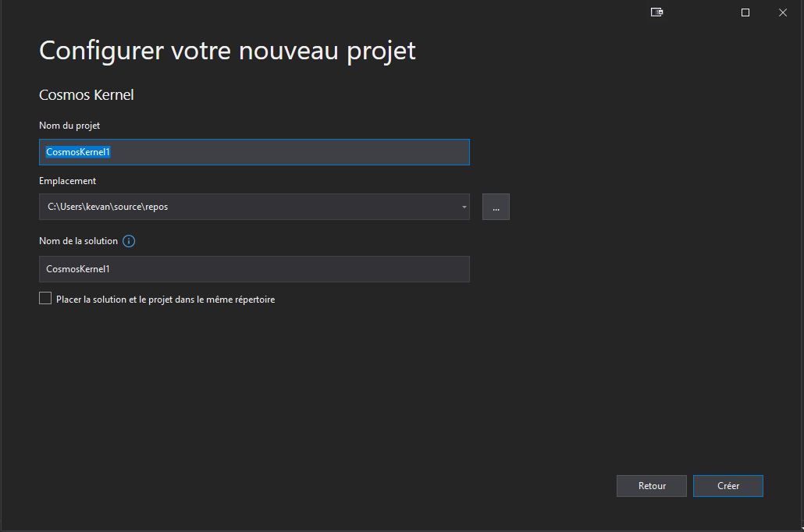
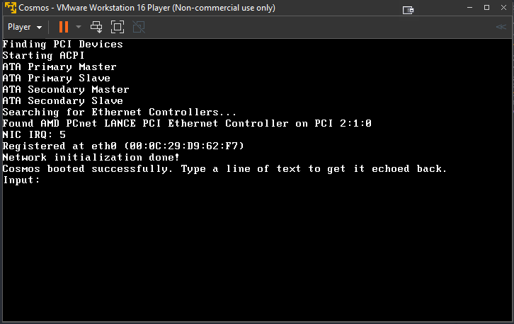
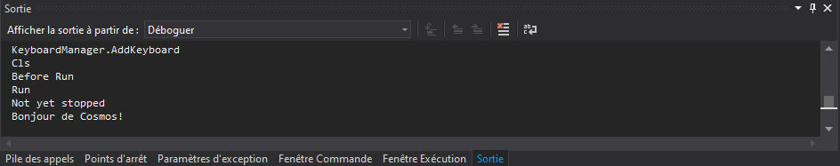

# Commencer

## Présentation de Cosmos

Cosmos (C# Open Source Managed Operating System) est un 
"kit de développement" de système d'exploitation qui utilise Visual Studio comme environnement de développement.
Malgré C# dans le nom, tout langage basé sur .NET peut être utilisé, y compris VB.NET,
Fortran, Delphi Prism, IronPython, F# et plus encore. Cosmos lui-même et le noyau
les routines sont principalement écrites en C#, et donc le nom Cosmos. Par ailleurs,
NOSMOS (.NET Open Source Managed Operating System) semble stupide.

Cosmos n'est pas un système d'exploitation au sens traditionnel du terme, mais plutôt
un "Operating System Kit", ou comme j'aime à le dire "Operating System Legos".
Cosmos vous permet de créer des systèmes d'exploitation comme Visual Studio et C# normalement
vous permet de créer des applications. La plupart des utilisateurs peuvent écrire et démarrer leur propre système d'exploitation
système en quelques minutes, le tout à l'aide de Visual Studio. L'étape 5 comprend
de nouvelles fonctionnalités telles qu'un type de projet intégré dans Visual Studio et un
débogueur intégré. Vous pouvez déboguer votre système d'exploitation directement à partir de Visual
Studio utilisant des points d'arrêt.

Cosmos est disponible en deux distributions, le kit de développement (kit de développement) et le
kit utilisateur. Le kit de développement est conçu pour les utilisateurs qui souhaitent travailler sur Cosmos lui-même.
Le kit utilisateur est conçu pour ceux qui souhaitent créer leur propre
système d'exploitation et faire du travail sur Cosmos (obselète depuis des années, utilisez le kit développeur à la place). Le kit de développement pourrait être pensé
comme le SDK Cosmos. Cet article se concentre sur le kit utilisateur.

## Écrire votre premier système d'exploitation

Créez un nouveau projet comme vous le feriez pour n'importe quel projet C#, mais sélectionnez Cosmos Kernel
(Précédemment CosmosBoot ; mêmes fonctionnalités) que le type de projet.

Un projet de démarrage sera créé. Il ressemble beaucoup à un C# standard
application de la console.

Program.cs contient le code de démarrage et d'exécution. Au lieu de voir un Windows
fenêtre de la console, vous verrez ce qui suit :

Il s'agit de votre système d'exploitation exécuté dans VMWare Player ! Cosmos peut bien sûr
également être démarré dans VMWare Workstation, Oracle VirtualBox, QEMU, Hyper-V, Virtual PC, Bochs ou sur de vrais
Matériel. Mais par défaut, Cosmos utilise VMWare Player car il est à la fois gratuit,
et fiable. Cosmos peut même déboguer dans Visual Studio, même lorsqu'il s'exécute sur
un autre appareil.

## Débogage intégré

Le débogage est un problème majeur dans le développement du système d'exploitation. L'équipe Cosmos
n'était pas assez contente pour simplement conquérir la construction et le déploiement, nous voulons
rendre le développement du système d'exploitation aussi facile que le développement d'applications Windows.
Le débogage d'un système d'exploitation basé sur Cosmos devrait vous sembler très familier.

## Communication du débogueur

Le débogueur utilise le port série pour communiquer. Pour cette raison, le débogage
ne fonctionne qu'avec les environnements de virtualisation prenant en charge les ports série tels que
VMware. QEMU prend également en charge les ports série, mais son implémentation de port série
est sérieusement cassé sous Windows et rend le débogage impossible avec QEMU. À
déboguer sur du matériel réel, vous devez utiliser un câble série physique. À l'avenir
Cosmos prendra également en charge le débogage via Ethernet.

## Débogage supplémentaire

Cosmos prend en charge certaines méthodes explicites qui peuvent être utilisées pour communiquer avec le
débogueur et utiliser des fonctionnalités supplémentaires. Il est accessible à l'aide du débogueur
classe dans l'espace de noms Cosmos.Debug dans l'assembly Cosmos.Kernel. Cette
assembly est utilisé par tous les projets Cosmos.

## Sortie de débogage

Les chaînes de débogage peuvent être sorties dans la fenêtre de débogage de l'hôte. Parce que Cosmos
ne supporte pas encore les montres, cette fonctionnalité peut être très utile pour
regarder les valeurs des variables et effectuer un traçage sans points d'arrêt.

    
    Debugger.Send("Bonjour de Cosmos!");

Lorsque cette ligne est exécutée, elle enverra un message sur le canal de débogage
et il apparaîtra dans la fenêtre de sortie de Visual Studio.

##  Quel est le piège?

Il n'y a vraiment pas de piège. Tout ce que nous avons montré ici fonctionne comme on le voit.
Aucune maquette n'a été utilisée. Cependant nous avons encore beaucoup de travail à faire. Les articles d'intérêts qui figurent sur notre liste de tâches actuelle incluent les interfaces (nécessaires pour
boucles foreach), les systèmes de fichiers (une prise en charge partielle existe), les threads, la mise en réseau et
graphique. Nous avons des prototypes et des expérimentations pour chacun, mais aucun n'a été
intégré dans le développement principal de Cosmos pour le moment.

## Quelle était cette chose Syslinux que j'ai vue au démarrage ?

Cosmos ne fonctionne pas sous Linux. Un chargeur de démarrage appelé Syslinux est utilisé pour démarrer
Cosmos. Après le démarrage, Syslinux n'est pas utilisé. Syslinux est un chargeur de démarrage et n'est
pas une distribution Linux. Syslinux simplifie le processus de démarrage en effectuant des tâches telles que l'activation de la porte A20, l'initialisation du matériel et le passage en mode réel (qui sont tous requis par les systèmes d'exploitation modernes).

## Obtention de Cosmos

   * Site Web Cosmos - [http://www.GoCosmos.org](http://www.GoCosmos.org)
   * Code source - Kit de développement et kit utilisateur - [http://github.com/CosmosOS/Cosmos/](http://github.com/CosmosOS/Cosmos/)

###### Traduction par Kiirox