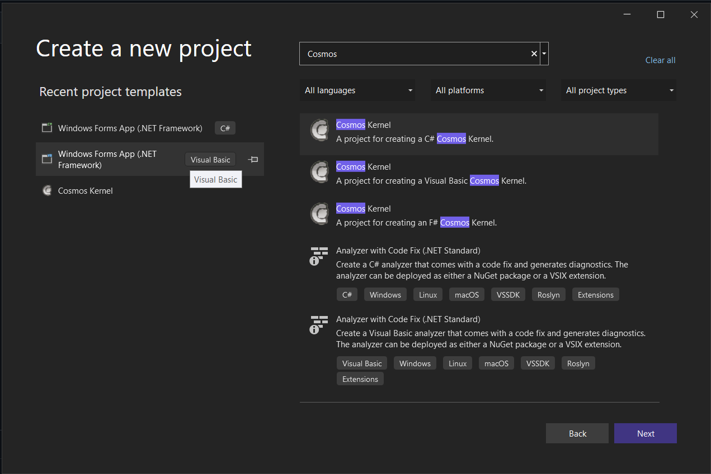
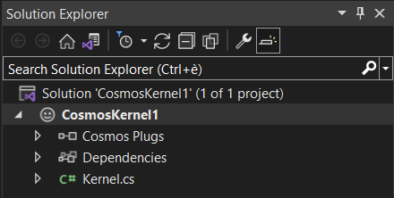
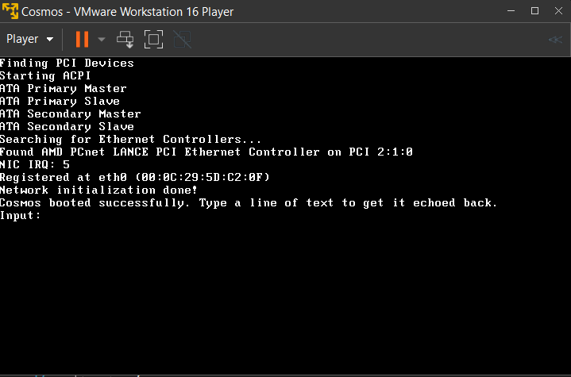
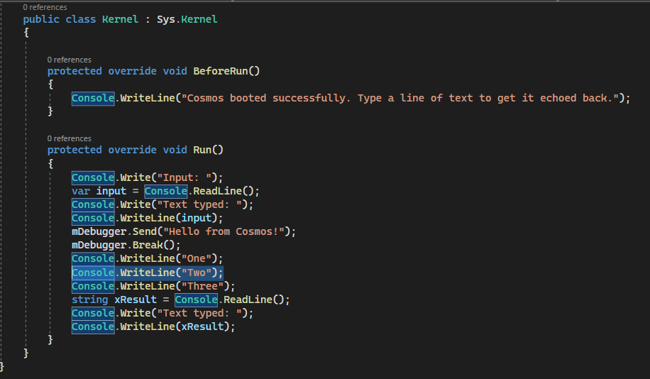
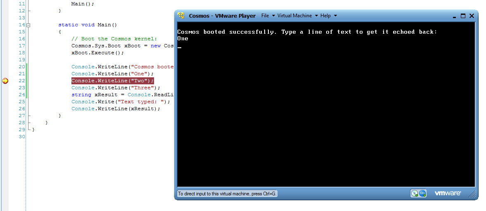
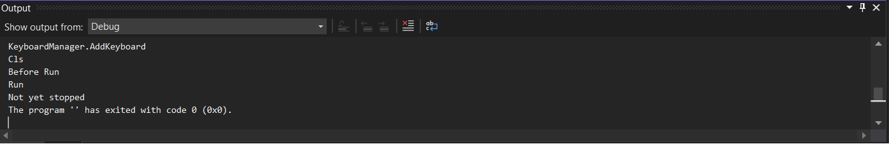

# Getting Started

##  Introducing Cosmos

Cosmos (C# Open Source Managed Operating System) is an operating system
development kit which uses Visual Studio as its development environment.
Despite C# in the name, any .NET based language can be used, including VB.NET,
Fortran, Delphi Prism, IronPython, F# and more. Cosmos itself and the kernel
routines are primarily written in C#, and thus the Cosmos name. Besides that,
NOSMOS (.NET Open Source Managed Operating System) sounds silly.

Cosmos diverts from traditional operating systems because it is not an operating system in the conventional sense; rather, it is an "Operating System Kit," similar to "Operating System Legos". With Cosmos, you have the flexibility to construct operating systems just as how Visual Studio and C# help you develop applications. Using Visual Studio, most users can swiftly write and boot their own operating system within minutes. Additionally, debugging your operating system directly from Visual Studio is a feature, allowing for efficient troubleshooting through breakpoints.

Cosmos is available in two distributions, the developer kit (abbr. *DevKit*), and the user kit. 
The DevKit was originally designed for those who want to work on Cosmos's core features, but now has superceded the inferior user kit due to having much more technical ability.
The User Kit was designed for those who are interested in building their own operating system and doing some Cosmos work. Since the User Kit is so heavily outdated, it is often recommended to download the DevKit when installing. The documentation will cover both.

##  Writing your first Operating System

Once you have installed Cosmos (see other docs), you can create a new project as you would any C# project, but select Cosmos as the project type.

A starter project will be created. It looks very much like a standard C#
console application.

Kernel.cs contains the boot and execution code. Instead of seeing a Windows
console window, you will see the following:

This is your operating system running in VMware Player! Cosmos can of course
also be booted in VMware Workstation, VirtualBox, Bochs, or on real
hardware. But by default, Cosmos uses VMware Player because it is both free,
and reliable. Cosmos can even debug in Visual Studio, even when running on
another machine.

##  Integrated Debugging

Debugging is a major issue with operating system development. The Cosmos team
was not content enough to simply conquer building and deployment, we want to
make developing operating systems as easy as developing Windows applications.
Debugging a Cosmos based operating system should feel very familiar to you.
Lets modify our project a little bit to show the effect, and set a breakpoint. 
*Note that the debugger only works in Visual Studio, and not Linux!*

Now run the project again.

Notice how the execution stopped at "One"? That is becuase in Visual Studio our
project has stopped on a breakpoint. Simply press F5 to continue just as you
would in a normal application!

In addition to breakpoints, Cosmos also supports step into (F11) as well. Trace
over (F10) is not supported yet.

##  Debugger Communication

The debugger uses the serial port to communicate. Because of this, debugging
only works within virtualization environments that support serial ports, such as
VMware. QEMU supports serial ports as well, but its serial port implementation
is seriously broken on Windows and makes debugging impossible using QEMU. To
debug on real hardware, you must use a physical serial cable. In the future,
Cosmos will also support debugging over Ethernet.

##  Extra Debugging

Cosmos supports some explicit methods that can be used to communicate with the
debugger and use additional functionality. It is accessed using the Debugger
class in the Cosmos.Debug namespace in the Cosmos.Kernel assembly. This
assembly is used by all Cosmos projects.

##  Code Based Breakpoints

    
    mDebugger.Break();

Break can be used to issue a code based break. Visual Studio will break on the
line after this statement.

Since Cosmos does not support conditional breakpoints in the IDE yet, code
base breaks are very useful for implementing such. For example:

    
    if (x == 5) {
        mDebugger.Break();
    }

Or you can use the .NET BCL debugger break:

    
    System.Diagnostics.Debugger.Break();

Both functions will produce the same result.

##  Debug Output

Debug strings can be outputted to the debug window of the host. Because Cosmos
does not support watches yet, this functionality can be very useful for
watching variable values and for performing tracing without breakpoints.

    
    mDebugger.Send("Hello from Cosmos!");

When this line is executed, it will send a message over the debugging channel
and it will appear in the Visual Studio output window.

##  What's the catch?

There really is no catch. Everything we've shown here is functioning as seen.
No mockups were used. However, we still have a lot of work to do. Items of
interest that are on our current task list include multithreading and x64 systems. 
We have prototypes and experiments for each, but none have been rolled into 
the mainline Cosmos development as of yet.

##  Obtaining Cosmos

  * Cosmos website - [http://www.GoCosmos.org](http://www.GoCosmos.org)
  * Source code - Both DevKit and User Kit - [http://github.com/CosmosOS/Cosmos/](http://github.com/CosmosOS/Cosmos/)

*Last updated on 24 March 2024.*