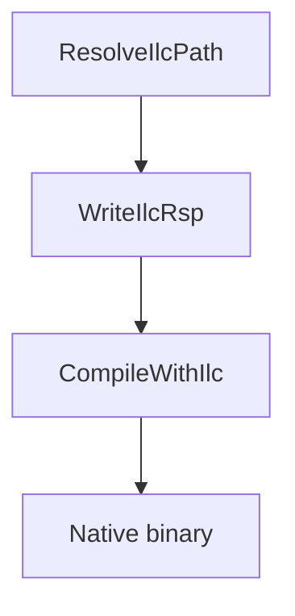

## Overview

`Cosmos.ilc.Build` integrates the native AOT [ILCompiler](https://github.com/dotnet/runtime/blob/main/docs/design/coreclr/botr/ilc-architecture.md) into the MSBuild pipeline. It consumes patched assemblies emitted by [`Cosmos.Build.Patcher`](https://github.com/valentinbreiz/nativeaot-patcher/blob/main/src/Cosmos.Build.Patcher) and transforms them into native object files later linked with platform libraries for CosmosOS.

---

## Flow chart

---

## Parameters

| Name | Description | Default |
| --- | --- | --- |
| `IlcToolsPath` | Path to the `ilc` executable resolved from the `Microsoft.DotNet.ILCompiler` runtime pack. | auto-resolved |
| `IlcIntermediateOutputPath` | Directory where `.ilc.rsp` and `.o` files are written. | `$(IntermediateOutputPath)/cosmos/native/` |
| `IlcSystemModule` | System module used as ILCompiler entry point. | `System.Private.CoreLib` |
| `UnmanagedEntryPointsAssembly` | Assemblies whose methods are exported via `--generateunmanagedentrypoints`. | `Cosmos.Kernel.Runtime` |

---

## Tasks

| Task | Description | Depends On |
| --- | --- | --- |
| `ResolveIlcPath` | Downloads and locates ILCompiler, setting `IlcToolsPath`. | `Build` |
| `WriteIlcRsp` | Produces the ILCompiler response file listing inputs, references, and options. | `ResolveIlcPath` |
| `CompileWithIlc` | Runs `ilc` using the response file to emit a native object file. | `WriteIlcRsp` |

---

## Detailed workflow

1. **ResolveIlcPath** uses `GetPackageDirectory` to find the `runtime.<RID>.Microsoft.DotNet.ILCompiler` package and sets `IlcToolsPath`.
2. **WriteIlcRsp** creates `$(IlcIntermediateOutputPath)$(AssemblyName).ilc.rsp`, gathering patched assemblies from `$(IntermediateOutputPath)/cosmos`, references from `cosmos/ref`, and ILCompiler options such as `--runtimeknob` and `--feature` flags.
3. **CompileWithIlc** executes `ilc` with the generated response file, producing `$(AssemblyName).o` in `$(IlcIntermediateOutputPath)`.
4. The native binary is ready for further packaging, such as bootloader integration.

---

## Outputs

- Response file: `$(IntermediateOutputPath)/cosmos/native/$(AssemblyName).ilc.rsp` listing inputs, references, and ILCompiler options.
- Native object: `$(IntermediateOutputPath)/cosmos/native/$(AssemblyName).o` produced by `CompileWithIlc` for linking.

Notes:
- Reference assemblies resolved by ILC are located under `$(IntermediateOutputPath)/cosmos/ref/` and come from the Patcher step.

---

## Related components

- [`Cosmos.Build.Ilc`](https://github.com/valentinbreiz/nativeaot-patcher/blob/main/src/Cosmos.Build.Ilc)
- [`Cosmos.Build.Patcher`](https://github.com/valentinbreiz/nativeaot-patcher/blob/main/src/Cosmos.Build.Patcher)
- [`Cosmos.Patcher`](https://github.com/valentinbreiz/nativeaot-patcher/blob/main/src/Cosmos.Patcher)
