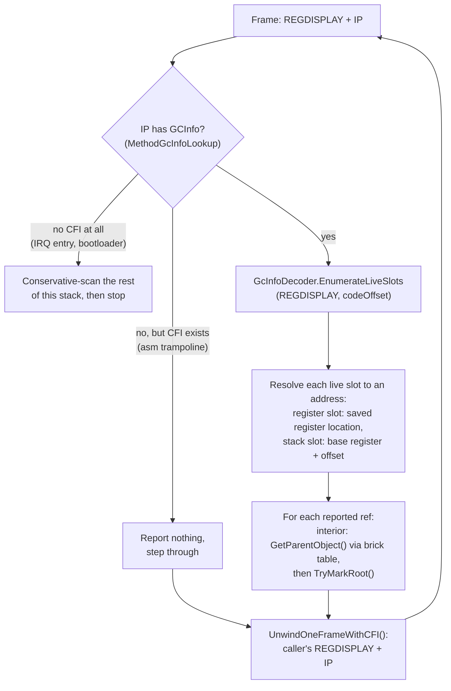

## Overview

A stack scan can [guess or know](gc-concepts/conservative-vs-precise.md) which stack words are object references. This article covers the knowing side: the **GCInfo** metadata that ILC emits for every method, how the GC uses it to walk the triggering thread frame by frame, and the [safepoint](gc-concepts/safepoint.md) constraint that decides which threads it can cover. It continues the [Mark phase](garbage-collector.md#mark-phase) section of the Garbage Collector article.

> [!NOTE]
> Status: the precise scan is live for the GC-triggering thread and for exception [funclet](gc-concepts/funclet.md) frames, and it resolves interior pointers to their parent objects (epic [#348](https://github.com/valentinbreiz/nativeaot-patcher/issues/348) phases 1 to 3 and 5, interior pointer support from [#376](https://github.com/valentinbreiz/nativeaot-patcher/issues/376)/[#384](https://github.com/valentinbreiz/nativeaot-patcher/issues/384)). Threads preempted in the scheduler keep the conservative scan until [return-address hijacking](#the-safepoint-constraint) lands ([#385](https://github.com/valentinbreiz/nativeaot-patcher/issues/385)).

---

## Why precise scanning

The [conservative scan](gc-concepts/conservative-vs-precise.md) does not know which stack words are references, so it treats every pointer-sized word as a candidate (`ScanThreadStack` and `ScanMemoryRange` feeding `TryMarkRoot` in [`GarbageCollector.Mark.cs`](https://github.com/valentinbreiz/nativeaot-patcher/blob/main/src/Cosmos.Kernel.Core/Memory/GarbageCollector/GarbageCollector.Mark.cs)), keeping any that lands in the GC heap and carries a plausible `MethodTable`. Those are plausibility filters, not proof, and two problems follow.

**Over-rooting.** Any stale heap pointer left in a dead spill slot or a not-yet-overwritten callee frame becomes a [root](gc-concepts/gc-roots.md), so the dead object it points at survives the collection, along with everything it transitively references. A false root through a strong reference leaks silently. One that keeps a weak reference's target alive is at least visible: a weak handle that should have cleared still resolves, which is what CI catches.

**Layout fragility.** Whether a stale pointer sits in a scanned slot is an accident of compilation, so correctness shifts whenever codegen shifts. Issue [#346](https://github.com/valentinbreiz/nativeaot-patcher/issues/346) is the archetype: adding a single 8-byte field to a stack-allocated struct (`InterruptScope`, inlined around every GC and scheduler path) moved the slots below it, a stale array pointer landed where the scan reads, and the weak reference tests failed. Adding a field, introducing a local, or upgrading the compiler were all the same class of failure until the triggering thread's scan became precise.

A tempting half-measure is to keep the conservative scan but only read the live frame ranges found by walking the frame-pointer chain. That is unsafe here: ILC compiles many functions without a frame pointer, so the chain silently skips frames. Exception dispatch can tolerate a skipped frame; the GC cannot, because a missed root frees a live object and turns into a use-after-free during sweep, strictly worse than the over-rooting it was meant to remove. Asking the compiler where the references are is the only correct path.

---

## What GCInfo is

When ILC compiles a method it emits, alongside the machine code, a small GCInfo blob that answers one question:

> If a GC fires while execution is at code offset N inside this method, which CPU registers and which stack slots hold live object references, which of those are interior pointers, and which are pinned?

One blob per method. It is what makes a precise scan possible: instead of guessing which stack words look like pointers, the GC asks the compiler.

### Where it lives in the binary

Finding the blob at runtime rides on the ELF unwind machinery, so four DWARF terms recur below. Every binary carries an `.eh_frame` section: a table with one entry per function (an **FDE**, frame description entry) whose call-frame information (**CFI**) rules let a runtime reconstruct the caller's registers from any instruction inside that function. Each FDE can also point at a blob of language-specific data (the **LSDA**), a free-form area the unwinder itself never interprets. NativeAOT parks its per-method record behind that LSDA pointer.

ILC writes one record per method into the `.dotnet_eh_table` section, laid out `[LSDA header][GCInfo blob][EH clauses]`. The linker keeps the section and its bounds: see `*(.dotnet_eh_table)` and `__dotnet_eh_table_start` / `__dotnet_eh_table_end` in [`linker.x64.ld`](https://github.com/valentinbreiz/nativeaot-patcher/blob/main/src/Cosmos.Build.Templates/Linker/linker.x64.ld) and [`linker.arm64.ld`](https://github.com/valentinbreiz/nativeaot-patcher/blob/main/src/Cosmos.Build.Templates/Linker/linker.arm64.ld). The DWARF `.eh_frame` FDE for a method carries a pointer to that record's LSDA header, and [`MethodGcInfoLookup`](https://github.com/valentinbreiz/nativeaot-patcher/blob/main/src/Cosmos.Kernel.Core/Runtime/GcInfo/MethodGcInfoLookup.cs) walks `.eh_frame` to resolve an instruction pointer to it. So an IP is only an LSDA-header walk away from the GCInfo blob. No build-pipeline, post-link tool, or patcher change is needed.

The `.dotnet_eh_table` section is a sequence of these records, one per method, each laid out in this order:

| Record part | Contents |
|-------------|----------|
| LSDA header, byte 0 | `unwindBlockFlags`: `UBF_FUNC_KIND_MASK` 0x03 (ROOT / HANDLER / FILTER), `UBF_FUNC_HAS_EHINFO` 0x04, `UBF_FUNC_HAS_ASSOCIATED_DATA` 0x10 |
| funclet records only | An int32 self-relative offset to the main method's LSDA plus an int32 start delta; a funclet reuses its main method's GCInfo |
| if `HAS_ASSOCIATED_DATA` | int32 pointer |
| if `HAS_EHINFO` | int32 pointer |
| **GCInfo blob** | Bit-packed (see below); this is what the precise scan decodes |
| EH clauses | The try/catch/finally table |

A method's `.eh_frame` FDE points its LSDA pointer at that record's first byte, and the code offset for the GCInfo query is `ip - methodStart`.

> [!NOTE]
> Upstream reference: the LSDA header layout is the format the NativeAOT runtime parses in `FindMethodInfo` / `GetCodeOffset` of [`UnixNativeCodeManager.cpp`](https://github.com/dotnet/runtime/blob/main/src/coreclr/nativeaot/Runtime/unix/UnixNativeCodeManager.cpp).

### What's inside the blob

GCInfo is a tightly bit-packed stream; every field takes the minimum number of bits and nothing is byte-aligned. Logically it has three parts:

| Part | Contents |
|------|----------|
| **Header** | Flags (the version is fixed by the runtime, not encoded in the blob), code length (equals the FDE's PC range, a useful sanity check), the stack-base register that stack slot offsets are relative to (`SP` or the frame register), whether a GS cookie or generics context is present, the number of safepoints, and the number of fully-interruptible ranges. |
| **Slot table** | The universe of slots this method ever uses for object refs. Each slot is either a register (by number) or a stack slot (base register plus signed offset). Per-slot flags: `GC_SLOT_INTERIOR` (the value points into the middle of an object, not at its header) and `GC_SLOT_PINNED` (the target must not move). Untracked slots, live for the whole method body, sit at the end of the table. |
| **Liveness** | Which slots are live at which code offsets. A fully-interruptible range encodes liveness valid at any IP inside it; a partially-interruptible method encodes liveness per **safepoint** (call site) only. |

### A tiny worked example

```csharp
static void Foo()
{
    byte[] a = new byte[128];     // 'a' is an object reference
    Bar();                        // ←(I) call site = safepoint; 'a' still needed below, so live here
    GC.KeepAlive(a);
    string s = Compute();         // 's' is an object reference; 'a' is now dead
    Console.WriteLine(s);         // ←(II) call site = safepoint; 's' live, 'a' dead here
}
```

The GCInfo ILC emits for `Foo`, conceptually. First the slot table:

| Slot | Location | Holds | Flags |
|------|----------|-------|-------|
| 0 | register `RSI` | `s` | none |
| 1 | stack, frame base - 0x18 | `a` | none |

A method holding a `ref` into an array would add a slot flagged `INTERIOR`, and a `fixed` block one flagged `PINNED`; `Foo` has neither. Then the liveness of the slots over the method body, from offset 0x00 to the code length:

| Code offset | Live slots |
|-------------|------------|
| 0x00 to 0x4A | none |
| 0x4A to 0x6C | only slot 1 (the array) |
| 0x6C to code length | only slot 0 (the string) |

- A GC fires while `Foo`'s frame is on the stack with the IP at the return address after `Bar()`. The code offset resolves to safepoint (I), GCInfo reports only the slot holding `a`, and the `byte[128]` is kept. Nothing else.
- A GC fires with the IP at the return address after `WriteLine`. Safepoint (II) reports only the register holding `s`. The `byte[128]` is not reported and is collected, even though its stale pointer still sits in `a`'s stack slot. That last case is exactly what the conservative scan gets wrong.

> [!NOTE]
> Upstream reference: the authoritative format and decoder semantics are `GcInfoDecoder::EnumerateLiveSlots` in [`gcinfodecoder.cpp`](https://github.com/dotnet/runtime/blob/main/src/coreclr/vm/gcinfodecoder.cpp) (built with `GCINFODECODER_NO_EE` for NativeAOT), with the types in [`gcinfotypes.h`](https://github.com/dotnet/runtime/blob/main/src/coreclr/inc/gcinfotypes.h) and [`gcinfodecoder.h`](https://github.com/dotnet/runtime/blob/main/src/coreclr/inc/gcinfodecoder.h). The kernel's decoder is a direct port of the v4 subset it needs.

---

## How the precise scan walks a thread

The scan walks the GC-triggering thread one frame at a time. For each frame it has two inputs: the IP (a return address pointing into that method's code) and a `REGDISPLAY`, a struct holding this frame's register state. Both come from machinery built for exception handling: the CFI unwinder in [`ExceptionHelper.cs`](https://github.com/valentinbreiz/nativeaot-patcher/blob/main/src/Cosmos.Kernel.Core/Runtime/ExceptionHandling/ExceptionHelper.cs) reconstructs caller register state frame by frame, and a small native stub (`_native_capture_regdisplay`) seeds the initial `REGDISPLAY` for the scan's own frame.

The driver is `PreciseScanCurrentThread` in [`GarbageCollector.PreciseStack.cs`](https://github.com/valentinbreiz/nativeaot-patcher/blob/main/src/Cosmos.Kernel.Core/Memory/GarbageCollector/GarbageCollector.PreciseStack.cs), dispatched from `ScanStackRoots` for the GC-triggering thread only. The walk is capped at 256 unwind steps past the first frame.



Per reported slot, the callback (`PreciseRootTrampoline`) does one of two things:

- A plain reference is passed to `TryMarkRoot` directly; the usual heap-range and `MethodTable` checks are harmless belt and braces on a precisely reported root.
- A slot flagged `GC_CALL_INTERIOR` holds a pointer into the middle of an object (a byref, a span's reference). The callback resolves it to the containing object with `GetParentObject`, through the owning segment's [brick table](garbage-collector.md#brick-table); the step-by-step mechanism is in [Garbage Collector: Interior pointers](garbage-collector.md#interior-pointers). This is the fix for objects reachable only through a byref (issue [#384](https://github.com/valentinbreiz/nativeaot-patcher/issues/384)).

Frames without GCInfo come in two kinds. A hand-written asm trampoline that still carries `.cfi` directives (`RhpCallCatchFunclet`, `RhpCallFilterFunclet`, `RhpThrowEx`) is stepped through reporting nothing: the managed frames on either side cover its register save locations, and the in-flight exception object stays reported because managed frames deeper on the stack (the funclet body's exception local, the managed dispatcher `RhThrowEx` that the stub calls) hold it in slots their own GCInfo describes. A frame with no CFI at all (interrupt entry stubs, the bootloader) ends the walk: the scanner conservatively scans the remaining stack range and stops rather than crashing. The same conservative tail runs if the unwinder fails mid-walk or a method's slot table overflows the decoder's fixed buffer. Two exits are harsher: an unwound frame that fails the sanity checks (an IP of zero, a stack pointer that does not increase or leaves the stack) or a walk that exhausts its 256-frame cap stops the scan with no conservative tail, and any older frames go unscanned for that collection.

[Funclet](gc-concepts/funclet.md) frames (catch, filter, and finally bodies) carry no GCInfo of their own. Their LSDA header redirects to the main method's record, and the code offset is resolved against the main method's start, so the funclet is scanned with the parent's slot table on the frame it actually runs on. Filter funclets run mid-throw, so the parent's untracked slots may be stale there and are not reported (`NoReportUntracked`); catch and finally funclets report them normally, and marking is idempotent, so double-reporting with the parent frame is harmless.

---

## The safepoint constraint

GCInfo is only valid at [safepoints](gc-concepts/safepoint.md): call sites for a partially-interruptible method, or any IP inside a fully-interruptible range. So whether a precise scan of a given thread is sound depends on where that thread's instruction pointer is when the GC runs:

1. **The thread that triggered the GC.** It reached the collector through a managed call chain into the allocator, so every return address up its stack is a call-site safepoint. A precise scan of this thread is sound. Exception funclet frames are entered through the dispatcher's `call` too, so they are also safepoints.

2. **Threads parked in the scheduler.** A thread in the run queue, blocked, or sleeping was preempted by the timer IRQ at an arbitrary instruction, not necessarily a safepoint, so its GCInfo lookup may be meaningless there. The preempted IP can land inside a fully-interruptible range by luck, where the lookup would be valid, but nothing guarantees it: most method bodies are described only at their call sites, so a scan that is precise only sometimes would still need the conservative fallback for every other stop. Stock NativeAOT solves this with return-address hijacking: before scanning such a thread, the runtime overwrites an on-stack return address with the address of a stub, lets the thread run to that return, parks it at the stub (a safepoint by construction), scans it precisely, then restores the real return address. Cosmos has no such subsystem yet; this is issue [#385](https://github.com/valentinbreiz/nativeaot-patcher/issues/385).

Until then, threads other than the GC-triggering one keep the conservative scan described in [Garbage Collector: Mark phase](garbage-collector.md#mark-phase). The threads and their saved register state come from the scheduler's registry; see [Scheduler](scheduler.md).

---

## Source files

| Piece | Where | Notes |
|-------|-------|-------|
| Precise per-frame walk | [`GarbageCollector.PreciseStack.cs`](https://github.com/valentinbreiz/nativeaot-patcher/blob/main/src/Cosmos.Kernel.Core/Memory/GarbageCollector/GarbageCollector.PreciseStack.cs) | walk loop, root callback, interior pointer resolution; `ScanStackRoots` in `GarbageCollector.Mark.cs` dispatches to it |
| GCInfo v4 decoder | [`GcInfoDecoder.cs`](https://github.com/valentinbreiz/nativeaot-patcher/blob/main/src/Cosmos.Kernel.Core/Memory/GarbageCollector/GcInfo/GcInfoDecoder.cs), [`GcSlotTable.cs`](https://github.com/valentinbreiz/nativeaot-patcher/blob/main/src/Cosmos.Kernel.Core/Memory/GarbageCollector/GcInfo/GcSlotTable.cs), [`GcInfoTypes.cs`](https://github.com/valentinbreiz/nativeaot-patcher/blob/main/src/Cosmos.Kernel.Core/Memory/GarbageCollector/GcInfo/GcInfoTypes.cs), [`GcInfoBitStreamReader.cs`](https://github.com/valentinbreiz/nativeaot-patcher/blob/main/src/Cosmos.Kernel.Core/Memory/GarbageCollector/GcInfo/GcInfoBitStreamReader.cs) | header, slot table, `EnumerateLiveSlots`; port of `gcinfodecoder.cpp` |
| IP to GCInfo lookup | [`MethodGcInfoLookup.cs`](https://github.com/valentinbreiz/nativeaot-patcher/blob/main/src/Cosmos.Kernel.Core/Runtime/GcInfo/MethodGcInfoLookup.cs), [`EhFrameNative.cs`](https://github.com/valentinbreiz/nativeaot-patcher/blob/main/src/Cosmos.Kernel.Core/Bridge/Import/EhFrameNative.cs) | the kernel's single `.eh_frame` / LSDA parser: IP → FDE → LSDA → GCInfo blob, including the funclet-to-main redirect; also serves the exception unwinder |
| CFI unwinder, `REGDISPLAY` | [`ExceptionHelper.cs`](https://github.com/valentinbreiz/nativeaot-patcher/blob/main/src/Cosmos.Kernel.Core/Runtime/ExceptionHandling/ExceptionHelper.cs) (+ `ExceptionHelper.X64.cs` / `ExceptionHelper.ARM64.cs`, [`RegisterContext.X64.cs`](https://github.com/valentinbreiz/nativeaot-patcher/blob/main/src/Cosmos.Kernel.Core/Runtime/ExceptionHandling/RegisterContext.X64.cs) / [`RegisterContext.ARM64.cs`](https://github.com/valentinbreiz/nativeaot-patcher/blob/main/src/Cosmos.Kernel.Core/Runtime/ExceptionHandling/RegisterContext.ARM64.cs)) | `UnwindOneFrameWithCFI` executes DWARF call-frame instructions to reconstruct the caller's register state, built for [#227](https://github.com/valentinbreiz/nativeaot-patcher/issues/227) |
| `_native_capture_regdisplay` stub | `src/Cosmos.Kernel.Native.X64/CPU/ContextCapture.s`, `src/Cosmos.Kernel.Native.ARM64/CPU/ContextCapture.s`, [`ContextSwitchNative.cs`](https://github.com/valentinbreiz/nativeaot-patcher/blob/main/src/Cosmos.Kernel.Core/Bridge/Import/ContextSwitchNative.cs) | seeds the initial `REGDISPLAY` for the GC-triggering thread |
| `.dotnet_eh_table` kept, with `__dotnet_eh_table_start/end` | [`linker.x64.ld`](https://github.com/valentinbreiz/nativeaot-patcher/blob/main/src/Cosmos.Build.Templates/Linker/linker.x64.ld), [`linker.arm64.ld`](https://github.com/valentinbreiz/nativeaot-patcher/blob/main/src/Cosmos.Build.Templates/Linker/linker.arm64.ld) | GCInfo is reachable at runtime via the FDE LSDA |
| Conservative scan (parked threads) | [`GarbageCollector.Mark.cs`](https://github.com/valentinbreiz/nativeaot-patcher/blob/main/src/Cosmos.Kernel.Core/Memory/GarbageCollector/GarbageCollector.Mark.cs) | `ScanThreadStack` / `ScanMemoryRange` / `TryMarkRoot`; what remains until hijacking lands |
| Tests | `tests/Kernels/Cosmos.Kernel.Tests.GarbageCollector` | `GC_GcInfoDecoder`, `GC_PreciseStackScan`, `GC_FuncletNoFalseRoot`, `GC_FuncletNoCrashOnAllocInCatch`, `GC_StackScanPaddingStress`, `GC_InteriorPointerRoot` |
| Hijack stub | not yet written | [#385](https://github.com/valentinbreiz/nativeaot-patcher/issues/385), phase 4 of the epic |
