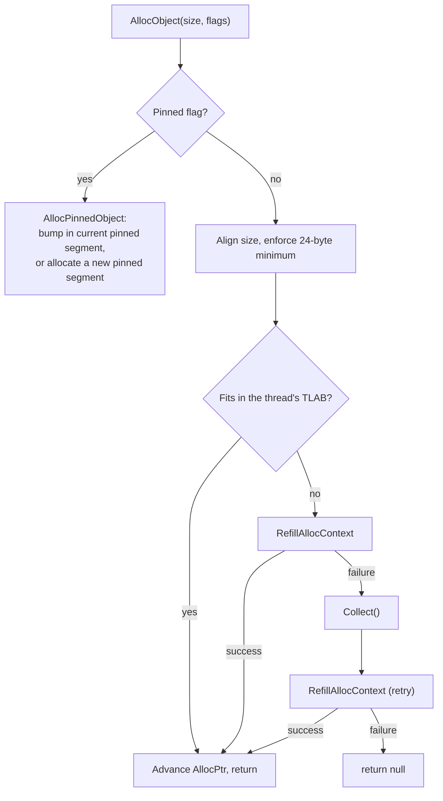
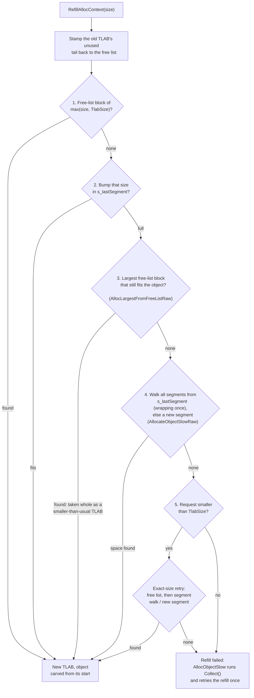
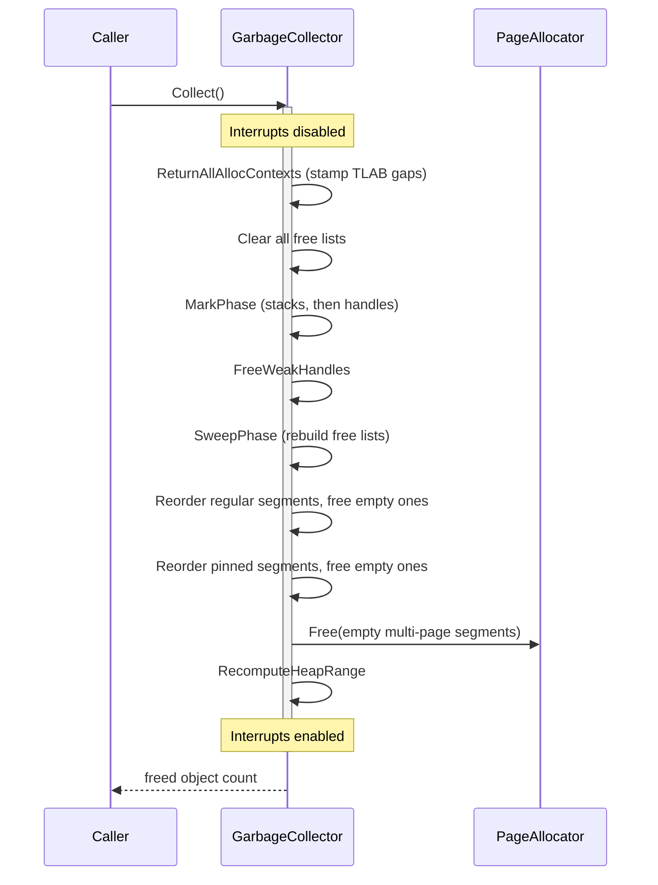
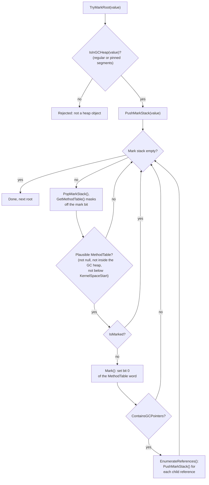
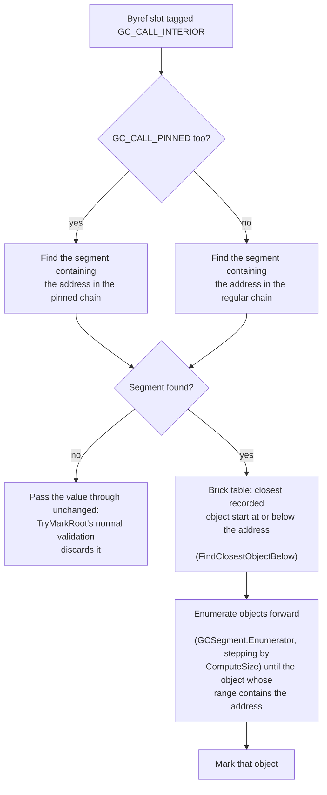
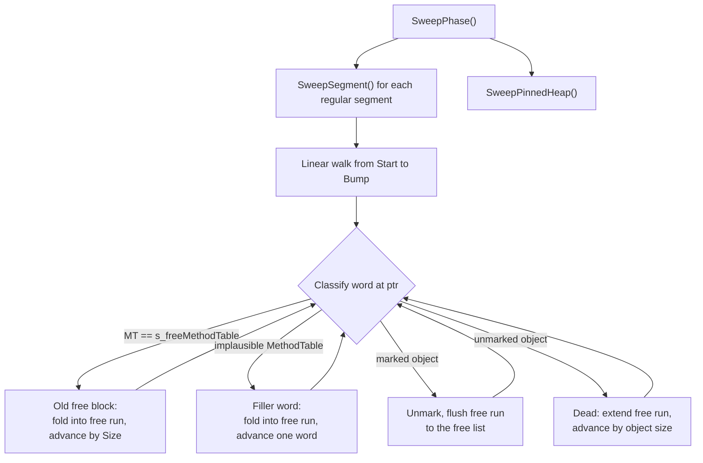

*OrionGC's namesake. Image credit & copyright: [Stanislav Volskiy](https://apod.nasa.gov/apod/ap151123.html), APOD 2015 November 23.*

## Overview

The garbage collector (it identifies itself as **OrionGC** in the runtime configuration table) is a [stop-the-world](gc-concepts/stop-the-world.md), [non-moving](gc-concepts/non-moving.md), [mark-and-sweep](gc-concepts/mark-and-sweep.md) collector with a [single generation](gc-concepts/gc-generations.md). Every collection pauses all threads, marks the objects that are still reachable, frees the rest in place, and never changes a live object's address. Each linked term has a short background note in the [glossary](garbage-collector-glossary.md). The collector manages four kinds of memory:

- the [regular GC heap](#regular-heap), where every `new` allocates,
- the [pinned object heap](#pinned-heap), for objects whose address must never change,
- the [GC handle store](#handle-store), references to heap objects held from outside the heap,
- [frozen segments](#frozen-segments), read-only objects baked into the kernel binary, never collected.

The GC usually operates in a threaded kernel, but does not require one. When the [scheduler](scheduler.md) is running, it preempts threads from the timer interrupt, keeps every live thread in a global registry the GC scans from, and stores each thread's allocation state on its `SchedulerThread` control block; interrupt handlers allocate too (the scheduler tick, input drivers). Before the scheduler starts, or in kernels that compile it out, the GC works the same way with a single static allocation context and the current stack as the only stack root. In either mode there is no dedicated GC thread: a collection runs on whichever thread triggered it, inside `InternalCpu.DisableInterruptsScope()`, so no thread switch or interrupt handler can observe the heap mid-collection.

Since every thread and interrupt handler can allocate, allocation goes through per-thread [TLABs](gc-concepts/tlab.md) (thread-local allocation buffers): each thread bumps a pointer inside its own buffer and, apart from a global allocated-bytes counter, only touches shared state when the buffer runs out and needs a refill. Collection is a last resort. When a refill fails, the collector first grows the heap; `Collect()` runs only when the page allocator itself has nothing left to give, or when called explicitly.

Marking starts from the [roots](gc-concepts/gc-roots.md), the reference-holding locations that exist outside the heap. OrionGC scans three groups: the stack of the thread that triggered the collection, scanned [precisely](gc-concepts/conservative-vs-precise.md) from NativeAOT GCInfo (see [Precise Stack Scanning (GCInfo)](garbage-collector-gcinfo.md)); the stacks and saved registers of every other registered thread, scanned conservatively; and the strong GC handles (the handle types that keep their target alive). Static fields need no separate scan: during module initialization, the objects that hold each module's static fields are gathered into spine arrays kept alive by a strong handle, so the handle scan reaches every static field transitively.

That scanning split constrains the whole design. A preempted thread can be stopped at any instruction, so its stack can only be scanned conservatively, and a conservative reference pins its target: a word that merely looks like a heap pointer might be an integer, so the collector may never relocate the object it appears to point to. Non-moving in turn keeps the rest simple: object addresses are stable for life, and pinning costs nothing. A single generation means no [write barriers or remembered sets](gc-concepts/gc-generations.md); reference stores compile to plain writes. The recurring trade is throughput for simplicity and verifiability: every collection scans the whole heap, but every structure can be walked by hand and the accounting is exact, down to the freed-object counts the [test suite](#tests) asserts. What the design gives up is collected in [Limitations and evolution](#limitations-and-evolution).

The code lives in `src/Cosmos.Kernel.Core/Memory/GarbageCollector/`. The `GarbageCollector` class itself is a static partial class split by phase (`.Alloc`, `.Tlab`, `.Mark`, `.Sweep`, and so on); segments, handles, and the TLAB struct sit in their own types, and the `GcInfo/` folder holds the decoder for the precise stack scan. The full file map is in [Source files](#source-files) at the end of this article.

---

## Core structures

Four data shapes underpin everything else in this article: the type descriptor the compiler emits for every managed type, the object as the GC sees it, the free block that describes dead space, and the per-thread allocation state. Every later section builds on these.

### MethodTable

Every managed type compiled by ILC (the NativeAOT ahead-of-time compiler; see [Kernel Compilation Steps](build/kernel-compilation-steps.md)) has a `MethodTable`, a type descriptor that lives in the kernel's data sections, never on the GC heap. The GC reads a handful of its fields:

| Field | Purpose |
|-------|---------|
| `RawBaseSize` | Size of a fixed-size object in bytes |
| `BaseSize` / `ComponentSize` | Base size plus per-element size for arrays and strings |
| `HasComponentSize` | True for arrays and strings |
| `ContainsGCPointers` | True if instances contain references the GC must trace |

Because `MethodTable` pointers always live in kernel space, outside the heap, the GC uses that as a validity filter: a candidate object whose first word is null, points inside the GC heap, or sits below `AddressSpace.KernelSpaceStart` cannot be a real object.

The one thing these fields do not describe is where the references inside an instance sit. That layout lives in the GCDesc stored just before the `MethodTable` (see [GCDesc](#gcdesc)).

### Object header

Every object on the GC heap starts with a [`GCObject`](https://github.com/valentinbreiz/nativeaot-patcher/blob/main/src/Cosmos.Kernel.Core/Memory/GarbageCollector/GCObject.cs) header:

| Offset | Size (x64) | Contents | Notes |
|--------|------------|----------|-------|
| 0 | 8 bytes | `MethodTable*` | Bit 0 doubles as the mark bit |
| 8 | 4 bytes | `Length` | Element count; only arrays and strings have this slot |
| 8, 12 or 16 | rest of the object | Fields or elements | Fields start at 8 for fixed-size objects; string characters at 12; array elements at 16 (4 padding bytes after `Length`) |

`MethodTable` pointers are aligned, so bit 0 is normally zero. `Mark()` sets it, `Unmark()` clears it, and `GetMethodTable()` masks it off before dereferencing. `ComputeSize()` returns `BaseSize + Length * ComponentSize` for arrays and strings, `RawBaseSize` for everything else.

### FreeBlock

Dead space is described by `FreeBlock` entries linked into size-class free lists. A `FreeBlock` is laid out so the sweep can walk over it like an object, with the marker `MethodTable` at offset 0 and `Size` where `GCObject.Length` sits:

| Offset | Size (x64) | Contents | Notes |
|--------|------------|----------|-------|
| 0 | 8 bytes | `MethodTable*` | Points at the `s_freeMethodTable` marker that identifies free blocks |
| 8 | 4 bytes | `Size` | Total size of this free block (4 bytes of padding follow) |
| 16 | 8 bytes | `Next*` | Next free block in the same size class |

The header is 24 bytes, which is why `MinBlockSize` is 24: every allocation is rounded up to at least that, so any object can later be turned into a free block in place.

### AllocContext (TLAB)

[`AllocContext`](https://github.com/valentinbreiz/nativeaot-patcher/blob/main/src/Cosmos.Kernel.Core/Memory/GarbageCollector/AllocContext.cs) is the per-thread allocation state (the [TLAB](gc-concepts/tlab.md) itself), stored inline on each `SchedulerThread` (with a static fallback context used before the scheduler runs, and for the whole kernel lifetime when the scheduler is compiled out):

| Field | Meaning |
|-------|---------|
| `AllocPtr` | Current allocation pointer, advances toward `AllocLimit` |
| `AllocLimit` | End of the TLAB; reaching it forces a refill |
| `AllocBytes` | Cumulative bytes this thread allocated on the regular heap |
| `AllocBytesUoh` | Cumulative bytes this thread allocated on the pinned heap |

---

## Memory layout

This section answers where managed memory lives and how the GC finds its way around it: the anatomy of one segment and its brick table, how segments chain into the two heaps, then the two structures that sit beside the heaps (the handle store and the frozen segments), and finally what deliberately stays outside the GC's reach.

### Segments

A segment is a contiguous range of pages from the page allocator (`PageType.GCHeap`). The [`GCSegment`](https://github.com/valentinbreiz/nativeaot-patcher/blob/main/src/Cosmos.Kernel.Core/Memory/GarbageCollector/GCSegment.cs) header sits at the base of the allocation, followed by the segment's brick table, then 8 reserved bytes, then the usable region:

The strip is one contiguous allocation in address order, page-aligned base on the left. `Start` points at the first byte after the reserved slot, `Bump` at the boundary where the next allocation lands (it advances toward `End`, one past the segment's last byte), and `Next` links the segments into the chains shown below. `TotalSize` is `End - Start`; `UsedSize` counts the bytes in use before sweep.

- `Start` to `Bump` holds allocated objects and free blocks left behind by earlier collections.
- `Bump` to `End` is untouched space; [bump allocation](gc-concepts/bump-allocation.md) hands out memory from `Bump` and advances it.
- The 8 reserved bytes before `Start` exist because the runtime writes a [runtime object header](gc-concepts/object-header.md) (identity hash or thin lock) at `objRef - 4`. For the first object in a segment that write must land in reserved filler instead of the segment's own metadata.

Segment allocation lives in [`GCSegmentManager`](https://github.com/valentinbreiz/nativeaot-patcher/blob/main/src/Cosmos.Kernel.Core/Memory/GarbageCollector/GCSegmentManager.cs). `AllocateSegment(requestedSize)` clamps the request to at least one page, sizes the brick table, rounds the total up to whole pages, and appends the new segment to its manager's linked list. Page rounding slack is given to the usable region, so `TotalSize` is usually a bit larger than the request.

### Brick table

During marking the GC sometimes holds an address that points into the middle of an object rather than at its start: a `ref` to an array element, or the reference inside a `Span<T>` (see [Interior pointers](#interior-pointers)). To mark the object it must first find where the object starts, and heap memory offers no way back: objects sit end to end with no back-pointers, so the only guaranteed way to find a start from an arbitrary interior address is to walk the segment from `Start`, object by object, until reaching the one that contains the address. For a large segment that is far too slow to do once per pointer.

The brick table is the shortcut. Each segment carries a coarse index that records where recent objects start, so a lookup can jump close to the target and walk forward only a short distance instead of starting from the beginning. The standard .NET GC keeps a brick table for exactly the same job, which is where the name comes from.

The mechanics: the usable region is divided into chunks of 255 pointer-sized slots (about 2 KiB, sized so a slot index fits in one byte), and the table stores one byte per chunk holding the 1-based slot index of the last recorded object start in that chunk (0 means none). `GCSegment.MarkObject(addr)` records starts at allocation time: on the pinned heap that is every object, but on the regular heap only each buffer bump-allocated from the segment, which in practice means each TLAB. So the first object of a TLAB is recorded, the objects that follow inside it are not, and a TLAB recycled from the free list adds no entry at all. Entries are therefore hints, not truth: `FindClosestObjectBelow(addr)` scans the table backwards for the nearest recorded start at or below the address, and the caller walks forward object by object from there until it reaches the object containing the address. The forward walk is what guarantees correctness; the table only shortens it.

### Segment chains

#### Regular heap

The regular chain is the managed heap, the memory behind every `new` in kernel C# code. Class instances, arrays, strings and boxed values all start life in one of its segments; user code never picks a segment, the allocator does. Growing the heap means appending a segment to the chain; shrinking it means returning an empty segment to the page allocator. The standard .NET GC organizes its heap the same way, in segments or regions carved from larger reservations.

> [!NOTE]
> Official docs: [Fundamentals of garbage collection](https://learn.microsoft.com/en-us/dotnet/standard/garbage-collection/fundamentals).

#### Pinned heap

The pinned chain exists because an object's address sometimes escapes the GC's world: a buffer handed to a device for DMA, a struct passed to native code, a pointer taken with `fixed`. In standard .NET, where the collector compacts, such objects must be pinned so they are not relocated mid-operation, either temporarily (the `fixed` statement, `GCHandle.Alloc` with `GCHandleType.Pinned`) or for their whole lifetime by allocating them on a dedicated pinned object heap (`GC.AllocateArray<T>(length, pinned: true)`), which keeps long-lived pinned objects from fragmenting the main heap. In OrionGC nothing ever moves, so pinning adds no constraint; the pinned chain honors the runtime's pinned-heap flag with a segment list of its own (see [Pinned allocation](#pinned-allocation) for the mechanics).

> [!NOTE]
> Official docs: [the fixed statement](https://learn.microsoft.com/en-us/dotnet/csharp/language-reference/statements/fixed), [GC.AllocateArray](https://learn.microsoft.com/en-us/dotnet/api/system.gc.allocatearray), [Internals of the Pinned Object Heap](https://devblogs.microsoft.com/dotnet/internals-of-the-poh/).

Both heaps keep their segments in a singly linked list, each owned by its own `GCSegmentManager` instance (`s_segmentManager` for the regular heap, `s_pinnedSegmentManager` for the pinned one):

`s_lastSegment` is the segment where the next bump attempt starts; `s_currentSegment` mirrors it (every update site assigns both the same segment). Objects allocated with the `GC_ALLOC_PINNED_OBJECT_HEAP` flag go to the pinned chain instead.

After each collection the segments of both chains are regrouped in FULL, SEMIFULL, FREE order, and empty segments spanning more than one page are returned to the page allocator (see [Segment reordering](#segment-reordering)).

To reject arbitrary values quickly, the GC caches a bounding box (`s_gcHeapMin` / `s_gcHeapMax`) over the regular segments. `IsInGCHeap` checks the box first, then walks the segment list; anything outside the box, or inside the box but between segments, is checked against the pinned chain with a plain linear walk (`IsInPinnedHeap`). The box is recomputed lazily whenever `s_heapRangeDirty` is set by a segment change.

### Handle store

A GC handle is a reference to a managed object that lives outside normal root scanning and has an explicit lifetime: code allocates the handle, uses it, and frees it. C# code meets handles in three main forms. `GCHandle.Alloc` keeps an object alive (and optionally pinned) while native code holds a raw pointer to it, the interop pattern. `WeakReference` observes an object without keeping it alive, the cache pattern. `DependentHandle`, the mechanism behind `ConditionalWeakTable`, ties one object's lifetime to another's, which is how extra state gets attached to objects that cannot be modified. The kernel runtime is a client too: its internal caches and the statics spine from the overview live behind handles.

> [!NOTE]
> Official docs: [GCHandle](https://learn.microsoft.com/en-us/dotnet/api/system.runtime.interopservices.gchandle), [Weak references](https://learn.microsoft.com/en-us/dotnet/standard/garbage-collection/weak-references), [DependentHandle](https://learn.microsoft.com/en-us/dotnet/api/system.runtime.dependenthandle).

The store is owned by a single [`GCHandleManager`](https://github.com/valentinbreiz/nativeaot-patcher/blob/main/src/Cosmos.Kernel.Core/Memory/GarbageCollector/GCHandleManager.cs) (the `s_gCHandleManager` instance) and is organized by handle type: one `GCHandleSegmentStore` per handle type, plus a separate store for dependent handles.

| Type | Value | Keeps target alive? | Notes |
|------|-------|--------------------|-------|
| `Weak` | 0 | No | Freed after collection if the target died |
| `WeakTrackResurrection` | 1 | No | Allocatable; there is no [finalization](gc-concepts/finalization.md) yet, so it behaves like storage only |
| `Normal` | 2 | Yes | Scanned as a strong root |
| `Pinned` | 3 | Yes | Scanned as a strong root; the target sits on the non-moving heap anyway |
| dependent | 6 | Conditional | Primary in `Object`, secondary in `ExtraInfo`; matches the runtime's `HNDTYPE_DEPENDENT`. There is no named enum member for it |

Each store is a linked list of `GCHandleSegment` pages. A segment is one 4 KiB page: a 16-byte header followed by 170 handle slots of 24 bytes each:

A `GCHandle` slot is `{ GCObject* Object; nint ExtraInfo; GCHandleType Type; }`. Free slots are stamped with the sentinel type `(GCHandleType)(-1)` and chained through `ExtraInfo` into an intra-segment free list. The list head, the alive count, and an [ABA](gc-concepts/aba-problem.md) version tag are packed into one 64-bit word updated with `Interlocked.CompareExchange`, so slot allocation and free are lock-free within a segment. When every segment of a store is full, the store allocates one more page.

A handle value handed to the runtime is simply the address of its slot. Allocation, `RhHandleSet`, dependent secondary access, and freeing all cast the `IntPtr` back to a `GCHandle*`.

During collection, `Normal` and `Pinned` stores are scanned as roots, dependent handles are processed by a convergence loop, and weak handles are never scanned; see [Handles during marking](#handles-during-marking).

### Frozen segments

Objects whose contents are known at build time do not need to be built at runtime. ILC lays out string literals, frozen arrays and preinitialized static data as ready-made objects in the kernel binary's data sections, so they exist from the first instruction at addresses that never change, occupy no heap space, and cost the collector nothing. There is no C# API for this; code gets it automatically by using string literals and static data the compiler can evaluate ahead of time. Upstream .NET calls this the non-GC heap.

> [!NOTE]
> Official docs: [NonGC-Heap design notes](https://github.com/dotnet/runtime/blob/main/docs/design/features/NonGC-Heap.md).

The runtime registers each such region at startup through `RhRegisterFrozenSegment`, and `ManagedModule` registers each module's `FrozenObjectRegion` directly. The GC records them in a linked list of `FrozenSegmentInfo` nodes carved from a bump-allocated metadata page:

Frozen segments take no part in mark or sweep. `IsInFrozenSegment` answers membership queries (bounded by `AllocSize`), and `GetObjectGeneration` reports frozen objects as outside the GC generations. Staying out of the mark phase rests on an assumption the kernel does not verify: a frozen object must never hold the only reference to a regular-heap object (see [Limitations and evolution](#limitations-and-evolution)).

### What the GC does not touch

The kernel's malloc-style heaps (SmallHeap, MediumHeap, LargeHeap in `Memory/Heap/`) are not part of the GC. Managed objects never live there, and the sweep deliberately never walks them: a live unmanaged block whose first word happens to hold a GC heap pointer would be indistinguishable from an unmarked object header, and sweeping it would free live memory (issue [#386](https://github.com/valentinbreiz/nativeaot-patcher/issues/386), covered by the `GC_MallocHeapNotSwept` test).

---

## Allocation

This section answers how a `new` becomes a pointer in a handful of instructions, and what happens when the fast path runs out. The request travels from the runtime's exported helpers through the thread's TLAB, and on a miss falls back to the free lists, segment bumping, new segments, and only then a collection.

### Runtime bridge

The NativeAOT runtime calls exported functions in [`Memory.cs`](https://github.com/valentinbreiz/nativeaot-patcher/blob/main/src/Cosmos.Kernel.Core/Runtime/Memory.cs). The allocation exports funnel into `GarbageCollector.AllocObject(size, flags)`; before the GC is initialized they fall back to the boot allocator (`MemoryOp.Alloc` plus an explicit zero).

| Runtime export | Maps to | Purpose |
|----------------|---------|---------|
| `RhpNewFast` | `AllocObject(RawBaseSize)` | Fixed-size object |
| `RhpNewArray`, `RhpNewArrayFast`, `RhpNewPtrArrayFast` | `AllocObject(BaseSize + length * ComponentSize)` | Arrays; a negative length returns null |
| `RhNewArray` | `RhAllocateNewArray` with no flags | Arrays |
| `RhAllocateNewArray` | `AllocObject(size, flags)` | Arrays, with allocation flags |
| `RhAllocateNewObject` | `AllocObject(RawBaseSize, flags)` | Object with flags (used with the pinned flag for GC statics) |
| `RhNewString`, `RhNewVariableSizeObject` | `RhpNewArray` | Strings and other variable-size objects |

The handle and frozen-segment exports:

| Runtime export | Maps to | Purpose |
|----------------|---------|---------|
| `RhpHandleAlloc` | `AllocateHandler(obj, type, IntPtr.Zero)` | Allocate a handle of a given type |
| `RhpHandleAllocDependent` | `AllocateHandler(primary, (GCHandleType)6, secondary)` | Allocate a dependent handle for a primary/secondary pair |
| `RhHandleSet` | `HandleSetPrimary` | Point an existing handle at a new target |
| `RhHandleFree` | `FreeHandle` | Return the slot to its segment's free list |
| `RhRegisterFrozenSegment` | `RegisterFrozenSegment` | Register a frozen region at startup |
| `RhUpdateFrozenSegment` | `UpdateFrozenSegment` | Update a registered frozen region's bounds |

Of the allocation flags only `GC_ALLOC_PINNED_OBJECT_HEAP` is honored; everything else (finalization, alignment, optional zeroing) is accepted and ignored. Regular-heap allocations are always handed out zeroed, whatever the flags say.

### Allocation flow

`AllocObject` runs entirely inside `DisableInterruptsScope`: interrupt handlers allocate too (scheduler tick, input), and an interleaved refill on the same context would mix pointers from two different TLABs (issue [#382](https://github.com/valentinbreiz/nativeaot-patcher/issues/382)).

The fast path is two pointer operations: if `AllocPtr + size <= AllocLimit`, bump and return. Everything else happens during refill.

### TLAB refill

`RefillAllocContext` (in [`GarbageCollector.Tlab.cs`](https://github.com/valentinbreiz/nativeaot-patcher/blob/main/src/Cosmos.Kernel.Core/Memory/GarbageCollector/GarbageCollector.Tlab.cs)) replaces an exhausted TLAB, trying cheap sources before expensive ones: recycled [free-list](#free-lists) space first, then untouched segment space, then new pages, and a collection only when everything else has failed.

`TlabSize` is 8 KiB. Step 3 is what keeps a partially live segment usable: after a sweep, surviving objects chop the free space into blocks smaller than 8 KiB, so a refill that insisted on a full-size TLAB would always fail there and grow the heap instead; taking the largest block whole as a smaller-than-usual TLAB recycles that space.

Note the overall ordering: the heap grows before a collection is attempted. `Collect` only runs once the page allocator itself has nothing left to give, and if the refill retry after it also fails, allocation returns null.

### Free lists

In a non-moving collector the space the sweep reclaims stays where it is, scattered between the surviving objects, and bump allocation cannot reach it: the `Bump` cursor only advances into untouched space. The free lists are how that scattered space gets used again. Every hole the sweep finds, and every returned TLAB tail, is filed as a [FreeBlock](#freeblock), and TLAB refills draw from these lists before touching fresh segment space.

Finding a fitting hole has to be fast, so the blocks are bucketed into 12 size classes, powers of two from 16 to 32768 bytes; a lookup jumps straight to the smallest class that can satisfy the request instead of scanning one long list. It walks the classes upward and takes the first block that either fits exactly or leaves a remainder of at least 24 bytes; the remainder becomes a free block of its own and is filed back. The 24-byte floor is `MinBlockSize`, the smallest space that can still hold a `FreeBlock` header. Blocks larger than 32768 bytes are filed under the last class.

The lists never survive a collection: they are cleared when it starts and rebuilt by the sweep. The sweep coalesces neighboring dead space into fresh, larger runs, so entries recorded before it would describe blocks that no longer exist; rebuilding from scratch keeps the lists trustworthy with no extra bookkeeping.

One rule protects the neighbors: when a run of dead space is filed as a free block, its last 8 bytes (`ReservedHeaderSlotSize`) are left out of the block. Those bytes sit directly in front of the object that follows the run, exactly where the runtime writes that object's [runtime object header](gc-concepts/object-header.md) (the identity hash or thin lock, at `objRef - 4`); recycling them would let a new allocation overwrite a live neighbor's header. Filing therefore needs a run of at least 32 bytes: `MinBlockSize` (24) for the block plus the 8-byte tail. A block already on the lists is fully allocatable, which is why splitting one only needs a 24-byte remainder.

### Returning TLABs

`Collect` starts by returning every allocation context: each registered thread's TLAB and the static fallback context (`ReturnAllAllocContexts`). A gap of at least 32 bytes (the filing minimum from [Free lists](#free-lists)) is stamped in place as a `FreeBlock` and pushed onto the free list; smaller gaps are just zeroed so the sweep does not trip over stale data. Afterwards every context is `null`/`null` and refills on next use.

### Pinned allocation

Pinned objects bypass TLABs entirely: `AllocPinnedObject` bump-allocates in the current pinned segment, allocating a new pinned segment when it is full. Pinned allocation never draws from the free lists (though pinned free space discovered by the sweep does flow into them). The pinned heap exists for objects whose address must stay stable, such as the GC statics base objects that `ManagedModule.InitializeStatics` allocates with the pinned flag.

---

## Collection

A collection marks everything reachable, then reclaims everything that is not. The phase order below is forced by dependencies: TLABs must be returned before anything walks the heap, weak handles can only be judged once marking is complete, the free lists are rebuilt by the sweep that empties them, and the segment chains are tidied last so the next allocation lands well. `Collect()` returns the number of objects freed:

Generation 0 size and fragmentation are snapshotted before and after the phases, and the duration feeds `GetLastGCPercentTimeInGC`.

### Mark phase

The mark phase finds all reachable objects with a worklist. `MarkPhase` resets the mark stack, scans stack roots, then scans GC handles.

Stack scanning is a hybrid:

- The **GC-triggering thread** is scanned **precisely**. It reached the collector through a managed call chain, so every return address up its stack is a call-site [safepoint](gc-concepts/safepoint.md) where GCInfo is valid. `PreciseScanCurrentThread` walks its frames one by one and reports exactly the slots the compiler says are live, including exception [funclet](gc-concepts/funclet.md) frames. The mechanism has its own article: [Precise Stack Scanning (GCInfo)](garbage-collector-gcinfo.md).
- **Every other registered thread** was preempted at an arbitrary instruction, where a GCInfo lookup would be meaningless. Those threads get a **conservative** scan: each saved register and every pointer-sized word of their stack is treated as a potential reference. Replacing this last conservative path needs return-address hijacking, tracked in issue [#385](https://github.com/valentinbreiz/nativeaot-patcher/issues/385). Dead threads are skipped.

There is no static-root pass. `ManagedModule.InitializeStatics` stores every module's GC-statics base objects in a spine array reachable from a strong (`Normal`) GC handle, so scanning the handle stores covers all static fields transitively (the `GC_StaticOnlyReachability` test proves this).

Every candidate pointer, whatever root produced it, goes through `TryMarkRoot(value)`: a cheap membership test, then the standard mark loop that drains the worklist:

The two validation steps are what make conservative scanning safe: a candidate can be any bit pattern that happened to sit in a register or stack slot, so before it is treated as an object it must both land inside a heap segment and carry a plausible `MethodTable` pointer (the validity filter from [MethodTable](#methodtable)). Precise roots go through the same checks and simply never fail them.

The mark stack starts at one page (512 entries) and grows by copying into a larger page allocation when full. If growing fails, the collector logs a warning and drops the pointer, so an allocation failure at that point can under-mark; there is no fallback.

#### GCDesc

`EnumerateReferences` decodes the **GCDesc** that ILC stores immediately before each `MethodTable`. The word at `MT[-1]` is `numSeries` and selects one of two layouts.

Normal series (`numSeries > 0`), for regular objects and reference arrays. The table rows are in memory order, lower addresses first; the GCDesc grows downward from the `MethodTable`:

| Location | Contents |
|----------|----------|
| below `MT[-1]`, extending downward | `GCDescSeries[numSeries-1]` down to `GCDescSeries[0]`, each holding `SeriesSize` and `StartOffset`; entry 0 sits nearest the count word |
| `MT[-1]` | `numSeries` (positive) |
| `MT[0]`, `MT[1]`, ... | The `MethodTable` fields themselves |

Each `GCDescSeries` describes one contiguous run of references. `SeriesSize` is stored biased by the object size, so the scanner computes `SeriesSize + objectSize` to get the byte count and walks that many words starting at `obj + StartOffset`.

Val series (`numSeries < 0`), for arrays of structs that contain references, laid out the same way:

| Location | Contents |
|----------|----------|
| below `MT[-2]`, extending downward | The `ValSerieItem` entries, each holding `Nptrs` (pointer count) and `Skip` (bytes to skip); item 0 sits nearest the offset word |
| `MT[-2]` | `startOffset` of the element data |
| `MT[-1]` | `numSeries` (negative; the entry count is its absolute value) |
| `MT[0]`, `MT[1]`, ... | The `MethodTable` fields themselves |

The scanner starts a cursor at `obj + startOffset` and, for every array element, walks the `ValSerieItem` entries: read `Nptrs` pointers, then skip `Skip` bytes, repeated `|numSeries|` times per element.

### Interior pointers

A `ref` into an array element, a `Span<T>`'s `_reference`, or any other byref can be the only live reference to an object. Such a pointer does not point at the object header, so `TryMarkRoot`'s MethodTable check would discard it and the object would be collected while still in use (issue [#384](https://github.com/valentinbreiz/nativeaot-patcher/issues/384), fixed by the interior-pointer support from [#376](https://github.com/valentinbreiz/nativeaot-patcher/issues/376) for precisely scanned frames; conservatively scanned threads still miss them, see [Limitations and evolution](#limitations-and-evolution)).

The precise stack scan fixes this for the GC-triggering thread. GCInfo tags byref slots with `GC_CALL_INTERIOR`, and the scan's root callback resolves them before marking:

The brick table entry the lookup lands on may be a few objects behind the target (see [Brick table](#brick-table)); the forward walk covers the distance.

The conservative scan still only accepts pointers that hit an object header exactly. `GC_InteriorPointerRoot` is the acceptance test: an `int[2100]` reachable only through a `ref int` into element 8 must survive a collection followed by allocation churn.

### Handles during marking

Handle scanning happens after stack scanning, in two passes:

1. All `Normal` handles, then all `Pinned` handles, are marked as strong roots.
2. Dependent handles run to a fixpoint: whenever a handle's primary is marked and its secondary is not, the secondary is marked, and the loop repeats until a pass marks nothing new. This handles chains where one dependent handle's secondary is another's primary.

Weak handles are never scanned. Between mark and sweep, `FreeWeakHandles` walks the `Weak` store and the dependent store and frees every handle whose target (for dependent handles, whose primary) is unmarked. Freeing returns the slot to its segment's free list.

| Type | Scanned as root? | Cleanup after mark |
|------|------------------|--------------------|
| `Weak` | No | Freed if the target is unmarked |
| `WeakTrackResurrection` | No | Not cleaned up (no finalization support yet) |
| `Normal` | Yes | None |
| `Pinned` | Yes | None |
| dependent (6) | Secondary, if primary is marked | Freed if the primary is unmarked |

### Sweep phase

The sweep walks each segment linearly from `Start` to `Bump`, accumulating consecutive dead space into a free run. Three kinds of non-live words are folded into the run:

- free blocks from earlier collections (first word equals the free marker `MethodTable`), advanced by their stored size;
- filler words whose first word cannot be a `MethodTable` (null, below kernel space, or inside the GC heap). These come from zeroed TLAB gaps too small to stamp, from the runtime header written at `objRef - 4` next to a gap, or from stale data. They are skipped one pointer-sized word at a time;
- unmarked objects, counted as freed.

When a marked object is reached it is unmarked for the next cycle and the pending run is flushed as a `FreeBlock` (minus the 8-byte reserved tail, which is sanitized instead of recycled). Runs smaller than 32 bytes (the filing minimum from [Free lists](#free-lists)) are dropped and become filler for the next sweep. A run that reaches `Bump` is reclaimed by moving `Bump` back instead, which is what lets an emptied segment be returned to the page allocator.

The pinned heap is swept with the same walk, minus the free-block branch; its free runs go to the shared free lists as well. If the sweep encounters an impossible size (zero, or extending past the segment end), it abandons that segment for this collection rather than walking into corruption.

### Segment reordering

After the sweep, each chain is regrouped in one pass into FULL segments first, then SEMIFULL, then FREE. Empty segments larger than one page are handed back to the page allocator; empty single-page segments are kept as ready capacity. `s_lastSegment` (and `s_currentPinnedSegment` for the pinned chain) is pointed at the first semifull segment, or the first free one, so the next allocation lands in available space. Both reorders mark the heap range dirty, and `Collect` recomputes the bounding box at the end.

---

## Statistics and memory info

[`GarbageCollector.Info.cs`](https://github.com/valentinbreiz/nativeaot-patcher/blob/main/src/Cosmos.Kernel.Core/Memory/GarbageCollector/GarbageCollector.Info.cs) backs the runtime's memory queries:

- `GetStats(out totalCollections, out totalObjectsFreed)` exposes the two running counters. `Collect()`'s return value and these counters are exact: the test suite asserts the deltas match.
- `GetSimpleMemoryInfo()` fills the snapshot behind `RhGetMemoryInfo`, which is what `GC.GetGCMemoryInfo()` reads: heap size (occupied range of regular plus pinned segments), fragmented bytes (sum of all free-list blocks), committed bytes (segments, frozen segments, mark stack, free-list page, handle store pages), pinned object count (pinned-heap objects plus `Pinned` handles), collection index, and [condemned generation](gc-concepts/gc-generations.md) (always 0; the collector is not generational, so promoted bytes are always 0 too).
- `GetTotalAllocatedBytes()` / `GetTotalAllocatedBytesPrecise()` back `GC.GetTotalAllocatedBytes()`; the precise variant subtracts the unused tail of every live TLAB.
- `GetLastGCPercentTimeInGC()` derives from the last collection's duration and the interval since the previous one.
- `Variables` is the runtime configuration table; it reports `GCName = "OrionGC"` with server GC, concurrent GC, and large pages all off.

---

## Limitations and evolution

Every choice above trades something away. This section collects the sharp edges in one place, with the path out where one exists.

- **Whole-heap pauses.** A single generation and no concurrency means every collection scans every live object with interrupts off. That is the right trade while heaps are small; larger heaps would need generations (with their write barriers and remembered sets) or incremental marking.
- **Stop-the-world leans on a single CPU.** The scheduler currently runs everything on CPU 0 (`SchedulerManager.GetCurrentCpuId()` returns 0), so disabling interrupts stops every mutator. A multi-core kernel would need a cross-CPU rendezvous before that guarantee holds again.
- **Conservative scanning over-retains and blocks moving.** On preempted threads, an integer that happens to resemble a heap address keeps a dead object alive, and nothing those stacks appear to reference may ever be relocated. The exit is return-address hijacking ([#385](https://github.com/valentinbreiz/nativeaot-patcher/issues/385)), which would let every thread be scanned precisely.
- **Interior pointers resolve on the precise path only.** A byref kept alive solely by a preempted thread's stack must hit an object header exactly to be found ([#376](https://github.com/valentinbreiz/nativeaot-patcher/issues/376), [#384](https://github.com/valentinbreiz/nativeaot-patcher/issues/384)).
- **Frozen segments are not traced.** A frozen object holding the only reference to a regular-heap object would not keep it alive. Frozen objects normally reference only other frozen data, so no such reference should exist, but nothing verifies it either way.
- **No [finalization](gc-concepts/finalization.md).** Finalizers never run, allocation flags requesting them are ignored, and `WeakTrackResurrection` handles behave as plain storage.
- **A mark-stack growth failure can under-mark.** If the mark stack cannot grow mid-collection, pointers are dropped with a logged warning, and an unmarked live object would be swept. There is no overflow fallback yet.
- **Allocation failure returns null.** When even a collection cannot free enough memory, the allocation helpers return null; there is no `OutOfMemoryException` path from the allocator.

Retiring the conservative path is the keystone: once every thread can be scanned precisely, relocation stops being impossible, and compaction or generations become design options rather than non-starters.

---

## Tests

The kernel test suite in [`tests/Kernels/Cosmos.Kernel.Tests.GarbageCollector`](https://github.com/valentinbreiz/nativeaot-patcher/blob/main/tests/Kernels/Cosmos.Kernel.Tests.GarbageCollector/Kernel.cs) runs 45 tests (`make test KERNEL=GarbageCollector`). Highlights:

- exact collection accounting (`GC_CollectBasic`, `GC_UnreachableExactCount`),
- weak and dependent handle behavior (`GC_WeakReference`, `GC_DependentHandle`, `GC_DependentHandleCleanup`),
- interior pointer roots (`GC_InteriorPointerRoot`, the acceptance test for #384),
- statics reachability through the handle spine (`GC_StaticOnlyReachability`),
- precise stack scanning and funclet frames (`GC_PreciseStackScan`, `GC_FuncletNoFalseRoot`, `GC_FuncletNoCrashOnAllocInCatch`, `GC_StackScanPaddingStress`),
- the malloc heaps staying untouched (`GC_MallocHeapNotSwept`),
- multithreaded allocation under repeated collections (`GC_MultithreadChurnUnderCollect`),
- TLAB accounting and gap stamping (`GC_TLAB_*`),
- the memory info wiring (`GC_Info_*`).

---

## Source files

| Area | Path |
|------|------|
| GC core | [`src/Cosmos.Kernel.Core/Memory/GarbageCollector/GarbageCollector.cs`](https://github.com/valentinbreiz/nativeaot-patcher/blob/main/src/Cosmos.Kernel.Core/Memory/GarbageCollector/GarbageCollector.cs) |
| Allocation | [`GarbageCollector.Alloc.cs`](https://github.com/valentinbreiz/nativeaot-patcher/blob/main/src/Cosmos.Kernel.Core/Memory/GarbageCollector/GarbageCollector.Alloc.cs), [`GarbageCollector.Tlab.cs`](https://github.com/valentinbreiz/nativeaot-patcher/blob/main/src/Cosmos.Kernel.Core/Memory/GarbageCollector/GarbageCollector.Tlab.cs) |
| Mark phase | [`GarbageCollector.Mark.cs`](https://github.com/valentinbreiz/nativeaot-patcher/blob/main/src/Cosmos.Kernel.Core/Memory/GarbageCollector/GarbageCollector.Mark.cs), [`GarbageCollector.PreciseStack.cs`](https://github.com/valentinbreiz/nativeaot-patcher/blob/main/src/Cosmos.Kernel.Core/Memory/GarbageCollector/GarbageCollector.PreciseStack.cs) |
| GCInfo decoder (precise scan) | [`GcInfo/`](https://github.com/valentinbreiz/nativeaot-patcher/tree/main/src/Cosmos.Kernel.Core/Memory/GarbageCollector/GcInfo), see [Precise Stack Scanning](garbage-collector-gcinfo.md) |
| Sweep phase | [`GarbageCollector.Sweep.cs`](https://github.com/valentinbreiz/nativeaot-patcher/blob/main/src/Cosmos.Kernel.Core/Memory/GarbageCollector/GarbageCollector.Sweep.cs) |
| Segments | [`GCSegment.cs`](https://github.com/valentinbreiz/nativeaot-patcher/blob/main/src/Cosmos.Kernel.Core/Memory/GarbageCollector/GCSegment.cs), [`GCSegmentManager.cs`](https://github.com/valentinbreiz/nativeaot-patcher/blob/main/src/Cosmos.Kernel.Core/Memory/GarbageCollector/GCSegmentManager.cs) |
| GC handles | [`GCHandle.cs`](https://github.com/valentinbreiz/nativeaot-patcher/blob/main/src/Cosmos.Kernel.Core/Memory/GarbageCollector/GCHandle.cs), [`GCHandleSegment.cs`](https://github.com/valentinbreiz/nativeaot-patcher/blob/main/src/Cosmos.Kernel.Core/Memory/GarbageCollector/GCHandleSegment.cs), [`GCHandleManager.cs`](https://github.com/valentinbreiz/nativeaot-patcher/blob/main/src/Cosmos.Kernel.Core/Memory/GarbageCollector/GCHandleManager.cs), [`GarbageCollector.GCHandler.cs`](https://github.com/valentinbreiz/nativeaot-patcher/blob/main/src/Cosmos.Kernel.Core/Memory/GarbageCollector/GarbageCollector.GCHandler.cs) |
| Pinned heap | [`GarbageCollector.PinnedHeap.cs`](https://github.com/valentinbreiz/nativeaot-patcher/blob/main/src/Cosmos.Kernel.Core/Memory/GarbageCollector/GarbageCollector.PinnedHeap.cs) |
| Frozen segments | [`GarbageCollector.Frozen.cs`](https://github.com/valentinbreiz/nativeaot-patcher/blob/main/src/Cosmos.Kernel.Core/Memory/GarbageCollector/GarbageCollector.Frozen.cs) |
| Statistics | [`GarbageCollector.Info.cs`](https://github.com/valentinbreiz/nativeaot-patcher/blob/main/src/Cosmos.Kernel.Core/Memory/GarbageCollector/GarbageCollector.Info.cs) |
| Object header | [`GCObject.cs`](https://github.com/valentinbreiz/nativeaot-patcher/blob/main/src/Cosmos.Kernel.Core/Memory/GarbageCollector/GCObject.cs) |
| TLAB struct | [`AllocContext.cs`](https://github.com/valentinbreiz/nativeaot-patcher/blob/main/src/Cosmos.Kernel.Core/Memory/GarbageCollector/AllocContext.cs) |
| Runtime exports | [`src/Cosmos.Kernel.Core/Runtime/Memory.cs`](https://github.com/valentinbreiz/nativeaot-patcher/blob/main/src/Cosmos.Kernel.Core/Runtime/Memory.cs) |
| Module and statics setup | [`src/Cosmos.Kernel.Core/Runtime/ManagedModule.cs`](https://github.com/valentinbreiz/nativeaot-patcher/blob/main/src/Cosmos.Kernel.Core/Runtime/ManagedModule.cs) |
| Page allocator | [`src/Cosmos.Kernel.Core/Memory/PageAllocator.cs`](https://github.com/valentinbreiz/nativeaot-patcher/blob/main/src/Cosmos.Kernel.Core/Memory/PageAllocator.cs) |
