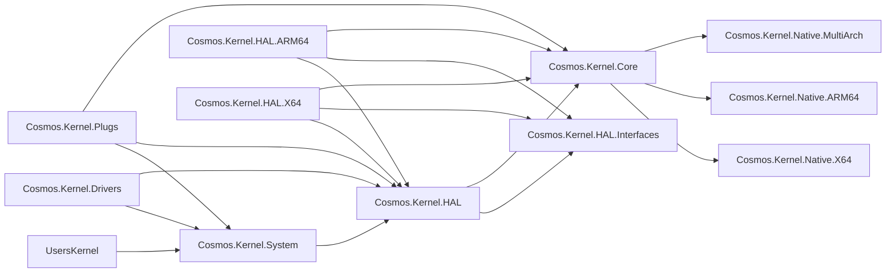

# Kernel Project Layout

The Cosmos kernel is composed of layered projects to enforce a clean dependency graph. Dependencies flow **downward only**: a project must never reference a project above it in the hierarchy.

## Dependency Graph

## Project Descriptions

| Project | Purpose |
|---------|---------|
| **Cosmos.Kernel.System** | High-level OS APIs: Console, Graphics, Network, Timer, Mouse. The layer user kernels interact with. |
| **Cosmos.Kernel.Drivers** | The nineteen drivers Cosmos ships over the driver kit: the PCI host and PCI Express root port drivers, the Intel E1000E driver, the virtio PCI and MMIO transport drivers, the virtio-net and virtio-input drivers, the two display drivers, `VirtioGpuDriver` and `VmwareSvgaDriver` (with its SVGA3D command layer and `Canvas3D`), the three block drivers, `AhciDriver`, `NvmeDriver` and the virtio leaf `VirtioBlkDriver`, whose disks the storage manager consumes, the USB drivers: `XhciDriver` with the hub, HID boot keyboard and mass storage class drivers, and the PS/2 drivers: `I8042Driver` with `Ps2KeyboardDriver` and `Ps2MouseDriver`. Each driver sits in a bus kind / category / driver folder, and its namespace follows the folder ([Driver Folders](coding-guidelines.md#driver-folders)): `Pci/` (`Bus/PcieRootPort`, `Bus/VirtioPci`, `Bus/Xhci`, `Display/VmwareSvga`, `Network/E1000E`, `Storage/Ahci`, `Storage/Nvme`), `Platform/Bus/` (`I8042`, `PciHost`, `VirtioMmio`), `Ps2/Input/` (`Ps2Keyboard`, `Ps2Mouse`), `Usb/` (`Bus/UsbHub`, `Input/UsbKeyboard`, `Storage/UsbMassStorage`) and `Virtio/` (`Display/VirtioGpu`, `Input/VirtioInput`, `Network/VirtioNet`, `Storage/VirtioBlk`), so the xHCI driver is `Cosmos.Kernel.Drivers.Pci.Bus.Xhci.XhciDriver`. A User-layer driver assembly (`CosmosDriverAssembly`), held by the layer analyzer to what a kernel author can name, with no `InternalsVisibleTo` grant from any project; one RID-less `lib/net10.0` package, since it holds no architecture-specific code. Referenced by Cosmos.Kernel, so every kernel carries its drivers in the manifest. |
| **Cosmos.Kernel.HAL** | Hardware Abstraction Layer: shared logic, platform registration (`PlatformHAL`), device managers, the driver kit (`DriverKit/`, with its six bus kinds, synthetic, platform, PCI, virtio, USB and PS/2, and the display kind and its facets under `DriverKit/Devices/`), and the Firmware facility (`Firmware/`: the boot framebuffer the kit publishes as the firmware display, the device tree parser the ARM64 description reads, and the bridge to the ACPI MCFG table the native boot code parses). |
| **Cosmos.Kernel.HAL.Interfaces** | Pure interfaces, no implementations. Public: `IBlockDevice`, which kernels implement and drive directly, `MACAddress`, and `SoftwareTimer` as a read-only handle. Internal: the boot contract `IPlatformInitializer`, the timer and network devices, and `SoftwareTimer`'s construction and tick members. |
| **Cosmos.Kernel.HAL.X64** | x86-64 platform code: the machine description (the 8042 and PCI host nodes), the I/O APIC line routing, the PIT and the CMOS RTC. No device driver. |
| **Cosmos.Kernel.HAL.ARM64** | ARM64 platform code: the machine description (the ECAM host and the virtio-mmio slots, from ACPI's MCFG, the device tree or the virt machine's table), the GIC line routing, the generic timer and the PL031 RTC. No device driver. |
| **Cosmos.Kernel.Core** | Low-level runtime: memory management, GC, scheduler, serial I/O, panic handler. |
| **Cosmos.Kernel.Native.X64** | x86-64 assembly files (`.s`, GAS syntax): interrupt stubs, context switching, SIMD. |
| **Cosmos.Kernel.Native.ARM64** | ARM64 assembly files (`.s`, GAS syntax): exception vectors, context switching. |
| **Cosmos.Kernel.Native.MultiArch** | Cross-platform native C code (ACPI, libc stubs). |
| **Cosmos.Kernel.Plugs** | IL-level method replacements for BCL types (`Console`, `Thread`, `Environment`, etc.). |
| **Cosmos.Kernel.Boot.Limine** | Limine bootloader protocol integration. |
| **Cosmos.Kernel** | The aggregator every kernel references. Pulls in Boot.Limine, Core, Drivers, HAL, HAL.Interfaces, Plugs and System, ships the `kmain` bootstrap C sources, and holds the library initializer that wires up the CPU exception handlers and the scheduler. No public types. |

## Build System Projects

| Project | Purpose |
|---------|---------|
| **Cosmos.Build.Patcher** | IL patcher: applies plugs and patches at build time. |
| **Cosmos.Build.Ilc** | Custom ILC (IL Compiler) integration for NativeAOT. |
| **Cosmos.Build.Asm** | Clang assembly compilation (GAS-syntax `.s` files for both x64 and ARM64). |
| **Cosmos.Build.CC** | Clang cross-compilation for x64 and ARM64 bare-metal targets. |
| **Cosmos.Build.Common** | Shared build props, architecture picker. |
| **Cosmos.Build.API** | Plug attributes (`[Plug]`, `[PlugMember]`) and enums. |
| **Cosmos.Build.Analyzer.Patcher** | Roslyn analyzer for plug correctness. |

## Rules

- **Never** reference upward (Core must not reference HAL or System)
- **Never** reference a platform-specific HAL project from Core
- Cross-cutting concerns (memory, scheduler, serial) go in **Core**
- Platform code (machine descriptions, interrupt line routing, tick sources, firmware clocks) goes in **HAL.X64** / **HAL.ARM64**; device drivers go in **Cosmos.Kernel.Drivers** over the kit
- User-facing APIs go in **System**
- The hardware contracts the ring still shares are defined in **HAL.Interfaces**; device kinds live in the kit
- A driver written over the driver kit for a device the kit's buses reach goes in **Drivers**, which references only System and HAL and never the arch assemblies

For coding style and implementation patterns, see [Coding Guidelines](coding-guidelines.md).
