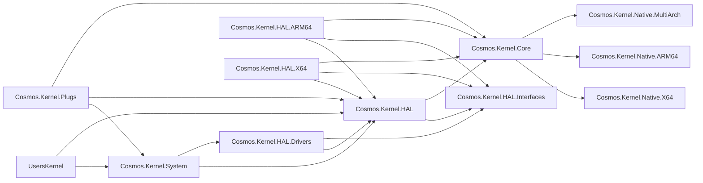

# Kernel Project Layout

The Cosmos kernel is composed of layered projects to enforce a clean dependency graph. Dependencies flow **downward only**: a project must never reference a project above it in the hierarchy. A user kernel programs against `Cosmos.Kernel.System`, and reaches `Cosmos.Kernel.HAL` directly for one thing only: the driver kit, the experimental seam (COSMOS0003) its own PCI and USB drivers are written against.

## Dependency Graph

## Project Descriptions

| Project | Purpose |
|---------|---------|
| **Cosmos.Kernel.System** | High-level OS APIs: Console, Graphics, Network, Timer, Mouse. The layer user kernels interact with. |
| **Cosmos.Kernel.HAL** | Hardware Abstraction Layer: shared logic, platform registration (`PlatformHAL`), device managers, the arch-independent drivers it brings up itself (virtio, xHCI with its hub and keyboard class drivers), and the driver kit (`Drivers/`): the public, experimental seam (COSMOS0003) a kernel writes its PCI and USB drivers against, and the internal engine (`Drivers/Engine/`) that binds the drivers a kernel registers. `UsbManager` offers each USB interface to its `UsbClassDriver`s in order: the hub and keyboard built-ins, then the kit's `KitUsbDriver`, so a driver the kit binds, the built-in mass storage driver included, only ever gets what those two left, at boot and on hot-plug. |
| **Cosmos.Kernel.HAL.Drivers** | The built-in drivers written against the driver kit, one folder per bus and one per driver below it: `Pci/` for the drivers that bind a PCI function, `Usb/` for the USB stack's own. `Pci/Ahci/` holds the driver and its disk at the root, the HBA's registers in `Registers/`, the command list the HBA reads by DMA in `CommandList/`, and the ATA commands and FIS in `Ata/`; `Pci/Nvme/` holds the driver, the controller, its namespace disk and its command slots at the root, the controller's registers in `Registers/`, and the opcodes and queue entries in `Commands/`; `Usb/Xhci/` holds the driver and the host controller it publishes at the root, the register block in `Registers/`, the TRB rings in `Rings/`, the device and endpoint contexts in `Contexts/`, and the open endpoints in `Pipes/`; `Usb/MassStorage/` holds the driver and its logical unit disk at the root, the Bulk-Only Transport with its class requests and command and status wrappers in `BulkOnly/`, and the SCSI opcodes, sense data and inquiry data in `Scsi/`. Each driver exposes a `CreateRegistration()`, and `BuiltInDrivers` is the catalogue, per subsystem, that `Global.StartKernel` registers behind the kernel's feature switches, ahead of the kernel's own drivers. It takes no `InternalsVisibleTo` grant from any Cosmos assembly: it is written exactly as a third-party driver library is, so it compiling proves the kit's public seam is enough for a real driver. Its types live in `Cosmos.Kernel.HAL.Drivers.BuiltIn` and namespaces below it that follow the folders (`.Pci.Ahci`, `.Pci.Nvme`, `.Usb.Xhci` and `.Usb.MassStorage`), since the kit's namespace `Cosmos.Kernel.HAL.Drivers` belongs to `Cosmos.Kernel.HAL`. A plain package: nothing in it is architecture specific. System references it, so every kernel gets it. |
| **Cosmos.Kernel.HAL.Interfaces** | Pure interfaces, no implementations. Public: `IBlockDevice`, which kernels implement and drive directly, `MACAddress`, and `SoftwareTimer` as a read-only handle. Internal: the boot contract `IPlatformInitializer`, `IGraphicDevice`, the input, timer and network devices, and `SoftwareTimer`'s construction and tick members. |
| **Cosmos.Kernel.HAL.X64** | x86-64 HAL implementations (PCI, APIC, PS/2, ACPI, etc.). |
| **Cosmos.Kernel.HAL.ARM64** | ARM64 HAL implementations (GIC, PL011, generic timer, etc.). |
| **Cosmos.Kernel.Core** | Low-level runtime: memory management, GC, scheduler, serial I/O, panic handler. |
| **Cosmos.Kernel.Native.X64** | x86-64 assembly files (`.s`, GAS syntax): interrupt stubs, context switching, SIMD. |
| **Cosmos.Kernel.Native.ARM64** | ARM64 assembly files (`.s`, GAS syntax): exception vectors, context switching. |
| **Cosmos.Kernel.Native.MultiArch** | Cross-platform native C code (ACPI, libc stubs). |
| **Cosmos.Kernel.Plugs** | IL-level method replacements for BCL types (`Console`, `Thread`, `Environment`, etc.). |
| **Cosmos.Kernel.Boot.Limine** | Limine bootloader protocol integration. |
| **Cosmos.Kernel** | The aggregator every kernel references. Pulls in Boot.Limine, Core, HAL, HAL.Interfaces, Plugs and System, ships the `kmain` bootstrap C sources, and holds the library initializer that wires up the CPU exception handlers and the scheduler. No public types. |

### Mechanisms and policies

`Cosmos.Kernel.HAL` keeps the mechanisms: PCI enumeration, MSI-X, BAR mapping, DMA, the USB host stack (xHCI and the hub, since topology is not policy) and the driver kit itself. `Cosmos.Kernel.HAL.Drivers` holds the policies: what to do with one family of device, written against the kit's public seam like any driver a kernel registers. A device family moves there once the kit offers everything its driver needs, as AHCI, NVMe and USB mass storage did. xHCI and the hub stay in HAL for good: the kit's USB class drivers bind behind them, and `UsbManager` hosts the kit's own `KitUsbDriver`.

## Build System Projects

| Project | Purpose |
|---------|---------|
| **Cosmos.Build.Patcher** | IL patcher: applies plugs and patches at build time. |
| **Cosmos.Build.Ilc** | Custom ILC (IL Compiler) integration for NativeAOT. |
| **Cosmos.Build.Asm** | Clang assembly compilation (GAS-syntax `.s` files for both x64 and ARM64). |
| **Cosmos.Build.CC** | Clang cross-compilation for x64 and ARM64 bare-metal targets. |
| **Cosmos.Build.Common** | Shared build props, architecture picker. |
| **Cosmos.Build.API** | Plug attributes (`[Plug]`, `[PlugMember]`) and enums. |
| **Cosmos.Build.Analyzer.Patcher** | Roslyn analyzers for plug correctness and for the layer rules below (`LayerAnalyzer`, warning NAOT0007). |

## Rules

- **Never** reference upward (Core must not reference HAL or System)
- Reference only the layer directly below: User → System, System → HAL, HAL → HAL and Core, Core → Native. The one exception is User → HAL, for the driver kit. `Cosmos.Kernel.HAL.Drivers` is a HAL-layer assembly, so it may not reference System: the disks it drives reach the storage manager through the kit's `PublishBlockDevice`, and System references it to register its catalogue. `LayerAnalyzer` checks every layer assembly a project references, by assembly name, and warns (NAOT0007) on any other edge; `*.Plugs` assemblies and the `Cosmos.*` assemblies outside the layers (the aggregator, Debug, Boot, the `Cosmos.Kernel.Tests.*` kernels) are exempt
- **Never** reference a platform-specific HAL project from Core
- Cross-cutting concerns (memory, scheduler, serial) go in **Core**
- Platform-specific implementations go in **HAL.X64** / **HAL.ARM64**
- User-facing APIs go in **System**
- All hardware interfaces are defined in **HAL.Interfaces**

For coding style and implementation patterns, see [Coding Guidelines](coding-guidelines.md).
