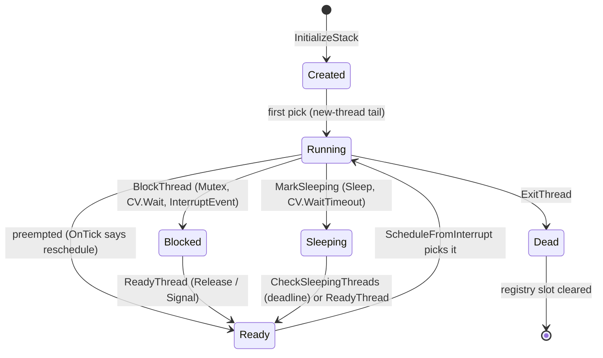
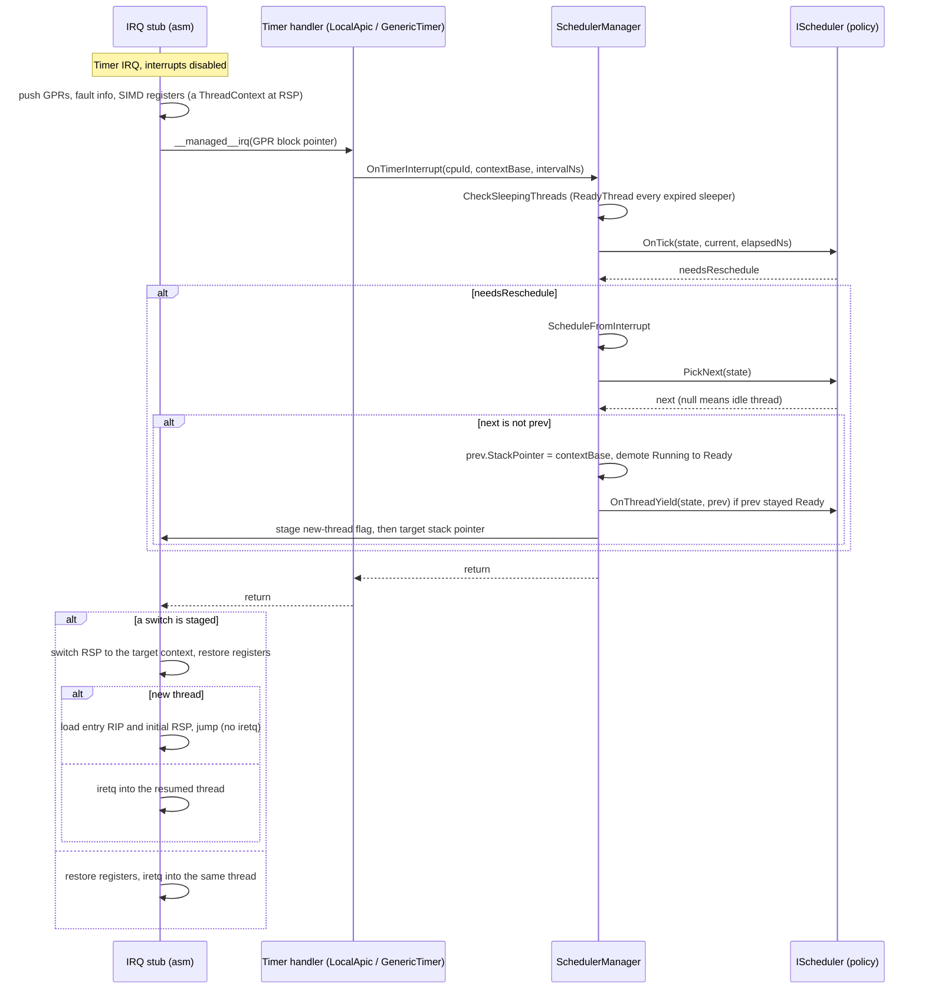
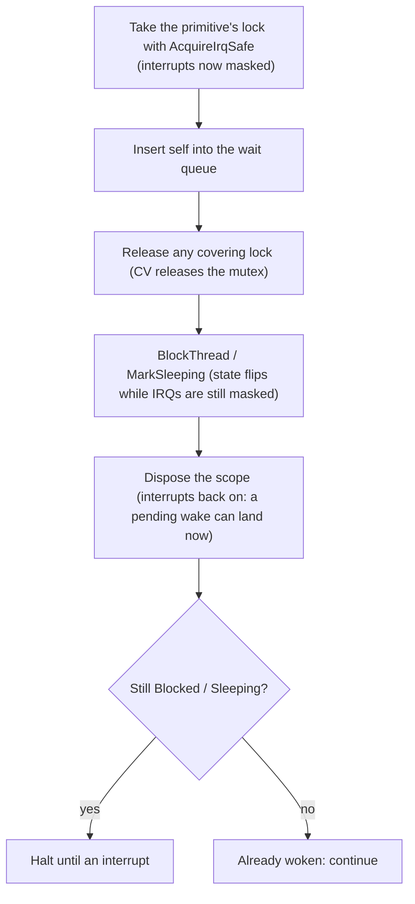

## Overview

The scheduler is **[preemptive](sched-concepts/preemption.md)**, **[pluggable](scheduler-plugging.md)**, and by default **[virtual-time fair-share](sched-concepts/virtual-time-fair-share.md)**. Every context switch happens in interrupt context: the hardware tick lands, the interrupt stub has already saved the current thread's registers on its stack, and the scheduler decides which saved stack the interrupt returns into. There is no dedicated scheduler thread and, today, no working voluntary switch: a thread runs until an interrupt exit switches away from it (the tick, or a device interrupt whose handler woke another thread), until it parks on a blocking primitive, or until it exits. Each linked term has a short background note in the [glossary](scheduler-glossary.md); pluggable links to the how-to instead.

The design splits **policy** from **mechanism**. Mechanism is fixed and shared: the thread registry, the lifecycle transitions, the timer-tick entry, the assembly that saves and restores registers, and the bridge the GC scans threads through. Policy, everything that decides *which* thread runs *when*, is a single interface, [`IScheduler`](https://github.com/CosmosOS/Cosmos/blob/gen3/src/Cosmos.Kernel.Core/Scheduler/IScheduler.cs), that any algorithm can implement. The default implementation is [Stride](#the-stride-policy), a virtual-time fair-share scheduler; [Writing a scheduler](scheduler-plugging.md) shows how to replace it.

At boot, [`LibraryInitializer`](https://github.com/CosmosOS/Cosmos/blob/gen3/src/Cosmos.Kernel/Internal/Runtime/CompilerHelpers/LibraryInitializer.cs) wires the whole thing up when the feature switch is on: it calls `SchedulerManager.Initialize` with the CPU count, creates one idle thread per CPU and makes it that CPU's current thread (the idle thread is the booting kernel itself, so it owns no separate stack), installs a `StrideScheduler` over them, flips `SchedulerManager.IsRunning`, and finally starts the scheduler timer with a 10 ms quantum. The idle threads come first because thread statics live on the current thread and a policy hook may run a class constructor, whose runner takes a lock keyed by a thread static. From that first tick on, the kernel's main flow is just the idle thread, preempted like any other.

Everything the scheduler does is constrained by the two consumers that see its state from the outside: the timer interrupt and the garbage collector. The interrupt can fire at any [instruction boundary](sched-concepts/instruction-boundary.md): after one machine instruction, before the next, anywhere in the stream, splitting any code sequence longer than one instruction. So every state transition runs with interrupts disabled, and the blocking primitives follow a strict [park protocol](#the-park-protocol) so a wake-up arriving mid-transition is never lost. And the [garbage collector](garbage-collector.md) walks the [thread registry](#thread-registry) during collections, so every live thread must be registered and its saved state must be exactly where the registry says it is.

The code lives in `src/Cosmos.Kernel.Core/Scheduler/`. [`SchedulerManager`](https://github.com/CosmosOS/Cosmos/blob/gen3/src/Cosmos.Kernel.Core/Scheduler/SchedulerManager.cs) is the mechanism; `Stride/` holds the default policy; the synchronization primitives and the alarm service sit in their own files next to them. The architecture-specific register save and restore lives in the native projects. The full file map is in [Source files](#source-files) at the end of this article.

---

## Thread model

This section answers what a thread physically is: the control block, the stack it runs on, the register snapshot that preserves it across preemption, and the registry that makes it visible to the scheduler and the GC.

### The Thread control block

A [`SchedulerThread`](https://github.com/CosmosOS/Cosmos/blob/gen3/src/Cosmos.Kernel.Core/Scheduler/SchedulerThread.cs) is a managed class on the GC heap:

| Field | Purpose |
|-------|---------|
| `Id`, `CpuId` | Globally unique id (a bare incrementing counter) and the assigned CPU |
| `State` | One of `Created`, `Ready`, `Running`, `Blocked`, `Sleeping`, `Dead` |
| `Flags` | `IdleThread`, `Pinned`, `Managed`; bits 8 to 15 are reserved for schedulers |
| `StackBase`, `StackSize`, `StackPointer` | The stack allocation and the saved stack pointer (see below) |
| `InstructionPointer` | The entry point, staged into the initial context. Manager bookkeeping, not on the seam |
| `LastScheduledAt`, `WakeupTime` | Accounting kept by the manager, not on the seam; `WakeupTime` is the sleep deadline in `Stopwatch` ticks |
| `TotalRuntime` | Accumulated CPU time, charged to the current thread by the active policy |
| `AllocContext` | The thread's [TLAB](gc-concepts/tlab.md) (see [the GC article](garbage-collector.md#alloccontext-tlab)) |
| `_threadStaticStorage` | The backing store for `[ThreadStatic]` fields, handed to CoreLib by ref |
| `SchedulerData` | A single `object?` slot the active scheduler attaches its bookkeeping to (inherited from `SchedulerExtensible`) |

Two flags change behavior elsewhere:

- `Pinned`: the thread must not migrate between CPUs. Stride's `SelectCpu` and `Balance` honor it.
- `Managed`: the entry parameter is a `GCHandle` of a `System.Threading.Thread`, and the entry trampoline calls into CoreLib's `Thread.StartThread` instead of decoding the parameter as a free `Action`.

### Per-thread stack

`SchedulerThread.InitializeStack` allocates one contiguous block, `DefaultStackSize` = 256 KiB when the creator does not specify a size (explicit requests are honored down to a 64 KiB floor; see [Creation and first run](#creation-and-first-run)). The register context of a thread that has not yet run is fabricated at the bottom (the lowest address, rounded up to 16 bytes), and the usable call stack grows downward from the top toward it:

`StackPointer` always points at the current saved context, so the IRQ stub knows where to restore from and the GC knows where a parked thread's saved state begins. For a `Created` thread that is the fabricated context at the base shown above, which the first run consumes; from then on, every preemption saves a fresh context at whatever stack position the interrupt hit, and `StackPointer` follows it. Two size floors matter (issue [#433](https://github.com/valentinbreiz/nativeaot-patcher/issues/433)):

- `DefaultStackSize` must stay above 128 KiB, CoreLib's `MinExecutionStackSize`: `RuntimeHelpers.EnsureSufficientExecutionStack` compares the live stack pointer against the bounds the runtime reports, and a smaller stack makes it throw on every call.
- The boot stack is separate: the kernel asks Limine for 1 MiB, and [`BootStack`](https://github.com/CosmosOS/Cosmos/blob/gen3/src/Cosmos.Kernel.Core/Runtime/BootStack.cs) captures its top before any managed code runs. Code running before the scheduler starts (and the idle thread, which owns no allocation of its own) reports these bounds instead.

There is no guard page: a thread that recurses past `StackBase` runs straight into whatever the allocator placed below it, and nothing detects the overflow.

### The saved context

[`ThreadContext`](https://github.com/CosmosOS/Cosmos/blob/gen3/src/Cosmos.Kernel.Core/Scheduler/ThreadContext.X64.cs) mirrors, field for field, the frame the IRQ stub pushes when an interrupt fires. That equivalence is the core trick: preempting a thread and creating a thread produce the same structure, so resuming either is the same code path.

| | x64 (448 bytes) | ARM64 (816 bytes) |
|---|---|---|
| SIMD area | `Xmm[256]` (XMM0 to XMM15) | `Neon[512]` (Q0 to Q31) |
| General registers | R15 up to RAX (15 slots in memory order; the stub pushes RAX first) | X0 to X30 |
| Fault info | `Interrupt`, `CpuFlags`, `Cr2`, plus a `TempRcx` relay slot | `Interrupt`, `CpuFlags` (ESR_EL1), `Far` (FAR_EL1) |
| Return frame | `Rip`, `Cs`, `Rflags`, `Rsp`, `Ss` (the `iretq` frame) | `Sp`, `Elr`, `Spsr` |

(The rows follow x64's memory order; on ARM64 the return frame sits before the fault info.)

For a new thread, `ThreadContext.Initialize` fabricates the snapshot a preempted thread would have: every register zeroed except the entry argument (RDI on x64, X0 on ARM64), a zero frame pointer so stack walks terminate, the entry point in the resume slot (`Rip` / `Elr`), and an aligned initial stack pointer (on x64, top aligned to 16 then minus 8, the post-`call` state the ABI expects; on ARM64, just aligned, since AArch64 keeps SP 16-aligned at all times).

### Thread registry

`SchedulerManager` owns a flat, fixed `SchedulerThread?[256]` array (`SchedulerThread.MaxThreadCount`), allocated once at `Initialize` and exposed as `SchedulerManager.Threads`. Every live thread occupies one slot from `CreateThread` until `ExitThread` clears it; blocked and sleeping threads stay registered even though no run queue holds them.

The registry exists for the GC. During a collection the mark phase iterates the array directly, with no interface dispatch (interface dispatch can allocate, and nothing may allocate mid-collection), and scans every registered thread's stack; a thread missing from the registry would keep running while the GC frees the objects its stack points to. That is also the sharp edge of the fixed capacity: on a full registry, `RegisterThread` logs a warning and drops the registration, but the thread is still queued and still runs, unscanned (issue [#444](https://github.com/valentinbreiz/nativeaot-patcher/issues/444)).

---

## Lifecycle

Every transition runs with interrupts masked: the `SchedulerManager` entry points below take `InternalCpu.DisableInterruptsScope()`, and the switch itself (`ScheduleFromInterrupt`) relies on already running in interrupt context. Each entry point notifies the active policy through the matching `IScheduler` hook; the table lists what else it does:

| Entry point | State change | Policy hook | Also |
|-------------|--------------|-------------|------|
| `CreateThread` | none (`InitializeStack` already set `Created`) | `OnThreadCreate` | registers the thread in the registry |
| `ReadyThread` | `Ready`, unless the thread is still `Created` | `OnThreadReady` | sets the per-CPU `_needReschedule` flag |
| `BlockThread` | `Blocked` | `OnThreadBlocked` | sets `_needReschedule` |
| `MarkSleeping` | `Sleeping`, after computing `WakeupTime` | `OnThreadBlocked` | no halt; the caller parks itself (see [the park protocol](#the-park-protocol)) |
| `Sleep` | via `MarkSleeping` | | then halts once, only if still `Sleeping` |
| `YieldThread` | none | `OnThreadYield` | |
| `ExitThread` | `Dead` | `OnThreadExit` | runs the exit callback, returns the TLAB to the GC, clears the registry slot |

Three details are deliberate:

- A `Created` thread keeps that state even after `ReadyThread` queues it. `ScheduleFromInterrupt` uses `State == Created` to detect a first run, which needs the special exit path described below.
- `ReadyThread` and `BlockThread` set `_needReschedule` so the next interrupt exit reschedules immediately. Without it, a thread woken by a device interrupt would sit in the run queue for up to a full quantum, and a thread that just blocked would spin in its halt loop for the rest of its quantum.
- `WakeupTime` is stored in `Stopwatch` ticks, not nanoseconds. The tick check compares against `Stopwatch.GetTimestamp()`, and converting through nanoseconds distorted timeouts by 16x on ARM64's 62.5 MHz timer.

### Creation and first run

Threads are created through one seam: the `SystemNative_CreateThread` export in [`libSystemNative.cs`](https://github.com/CosmosOS/Cosmos/blob/gen3/src/Cosmos.Kernel.Core/Bridge/Interop/libSystemNative.cs), which backs CoreLib's `Interop.Sys.CreateThread` P/Invoke. So `new System.Threading.Thread(...).Start()` in kernel code flows through CoreLib into this export, which rounds the requested stack size up to a page multiple (floor 64 KiB), builds a `SchedulerThread` flagged `Managed`, points its context at the `ThreadNative.EntryPointStub` trampoline, and calls `CreateThread` plus `ReadyThread`. ([`ThreadPlug`](https://github.com/CosmosOS/Cosmos/blob/gen3/src/Cosmos.Kernel.Plugs/System/Threading/ThreadPlug.cs) plugs only `Thread.Yield`, which reports success without yielding; `Thread.CreateThread` itself runs CoreLib's unmodified body.)

The first run of a `Created` thread cannot end in `iretq`, because there is no interrupted frame to return into. Instead the IRQ exit path is told (via a flag staged from C#) to take the new-thread tail: it loads the entry point and the fabricated initial stack pointer from the context, re-enabling interrupts along the way, and jumps. The landing point is always `EntryPointStub`, which forwards to `SchedulerManager.InvokeCurrentThreadStart`: it decodes the parameter (CoreLib `Thread.StartThread` for `Managed` threads, a `GCHandle<Action>` otherwise), runs it inside a catch-all so a throwing thread exits with code 1 instead of taking down the kernel, and ends in `ExitThread` followed by a halt loop. After that first entry, the thread is indistinguishable from any preempted thread.

---

## Preemption

This section answers how the tick becomes a context switch: which hardware fires it, what the interrupt path saves, how the policy's decision is staged, and how the exit path consumes it.

### Timer sources

The scheduler does not own a timer; it exposes `OnTimerInterrupt` and lets the platform call it. The wiring differs per architecture:

| Architecture | Scheduler tick | Software timers ([Timers and alarms](#timers-and-alarms)) |
|--------------|----------------|------------------------------|
| x64 | LAPIC timer, vector 239, periodic, 10 ms | PIT on IRQ 0, one-shot re-armed per interrupt |
| ARM64 | Generic Timer, INTID 30, re-armed per interrupt, 10 ms | same interrupt, dispatched before the scheduler tick |

In both cases the handler passes the *configured* interval as `elapsedNs`, not a measured elapsed time, and computes the saved-context address itself: the managed IRQ entry receives a pointer to the general-register block, and the handler subtracts the SIMD save area (256 bytes on x64, 512 on ARM64) to recover the `ThreadContext` base. That address is what a preempted thread's `StackPointer` will hold.

### The tick

The policy never touches a register. Everything between the stub's save and restore is plain managed C# operating on `SchedulerThread` and `PerCpuState`; the handoff in each direction is one pointer. Two conditions guard the switch-out bookkeeping: `prev` is demoted to `Ready` only if it was `Running`, and `OnThreadYield` (the policy's re-queue hook) runs only if it ended up `Ready`. A thread that blocked or went to sleep just before the tick keeps its parked state and is not re-queued.

The staging itself is two writes into native globals: the new-thread flag first, then the target stack pointer (`_context_switch_target_rsp`; nonzero means switch). Every one of the 256 interrupt vectors checks that global on exit, so any interrupt can carry out a staged switch, not just the timer. The staging variables are single globals, one more thing that pins the kernel to one CPU for now.

### Waking from an interrupt handler

Device interrupt handlers wake threads too: an NVMe completion fires on its MSI-X vector and signals an [`InterruptEvent`](#interruptevent) whose waiter must run. The tick path alone would leave that thread queued for up to a full quantum, so wake-ups take a shortcut. `ReadyThread` (and `BlockThread`) set a per-CPU `_needReschedule` flag, and the interrupt dispatcher calls `ReschedulePendingFromIrq` when a handled hardware interrupt exits: if the flag is set and no switch is already staged for this interrupt, it runs `ScheduleFromInterrupt` right there, on the device interrupt's own exit path. The already-staged check matters: the timer handler may have staged a switch during the same interrupt, and a second `ScheduleFromInterrupt` would save this frame's stack pointer into a thread whose real context lives elsewhere.

### What there is not: a voluntary switch

`SchedulerManager.Schedule` and `ContextSwitch.Switch` exist in the tree but have no callers, and neither can complete a synchronous switch: they only *stage* a target stack pointer, the staged switch is consumed on an interrupt exit, and a voluntary caller has no interrupt-saved register frame for that exit to restore (`Schedule`'s helper does not even save the outgoing stack pointer). The one voluntary-yield entry that works, the runtime's `RhYield`, re-queues the current thread through `OnThreadYield` and then halts; the actual switch happens at the next tick. A true synchronous switch would need its own save path (the equivalent of the IRQ stub's, entered from a call instead of an interrupt), which does not exist yet.

---

## The Stride policy

[Stride scheduling](https://web.eecs.umich.edu/~mosharaf/Readings/Stride.pdf) is proportional-share scheduling with deterministic, virtual-time bookkeeping. Each thread holds `Tickets` (default 100), its share weight. From the tickets follows a `Stride`, the constant `Stride1` (2^20) divided by tickets, and a `Pass`, the thread's virtual time. The run queue stays sorted by `Pass` and `PickNext` always pops the lowest: the thread that has consumed the least of its share runs next. As a thread runs, its `Pass` advances proportionally to runtime (`Stride * elapsed / quantum`, so exactly one stride per full 10 ms quantum), and more tickets mean a smaller stride, a slower-rising `Pass`, and more CPU.

Each CPU carries a `StrideCpuData`: the run queue (a `List<SchedulerThread>` kept sorted ascending by `Pass`), `TotalTickets` (the aggregate share, which doubles as the load metric), and `GlobalPass`, the CPU's own virtual clock, advanced at the aggregate rate (`Stride1 / TotalTickets` per quantum). `GlobalPass` is the reference point that wakeup placement and priority changes are computed against.

What Stride does in each hook:

| Hook | Behavior |
|------|----------|
| `InitializeCpu` / `ShutdownCpu` | Create / drop the per-CPU `StrideCpuData` |
| `OnThreadCreate` | Attach `StrideThreadData` (100 tickets, `Pass = 0`); the thread is not queued yet |
| `OnThreadReady` | Place the thread (see wakeup placement below), insert sorted by `Pass`, add its tickets to `TotalTickets` |
| `OnThreadBlocked` | Save `Remain = Pass - GlobalPass`, remove from the queue, subtract tickets |
| `OnThreadExit` | Remove from the queue, subtract tickets, drop the thread's bookkeeping |
| `OnTick` | Advance the current thread's `Pass` and the CPU's `GlobalPass`; reschedule if the queue head's `Pass` is strictly lower, or the quantum elapsed |
| `OnThreadYield` | Clamp `Pass` up to `GlobalPass` if it fell behind, then re-insert |
| `PickNext` | Pop the head (lowest `Pass`); null on an empty queue, and the manager runs the idle thread |
| `OnPickFailed` | Re-insert a thread the manager could not switch to |
| `SelectCpu` | Honor `Pinned`; otherwise accept a CPU whose load (`TotalTickets`) is under 80% of the best load found so far |
| `Balance` | Only when this CPU's queue is empty: steal the tail thread (highest `Pass`) from the peer with the longest queue, if that queue holds at least two and the tail is not `Pinned` |
| `OnThreadMigrate` | Move the tickets between CPUs and rebase `Pass` on the destination's `GlobalPass + Remain` |
| `SetPriority` / `GetPriority` | Set / read tickets; on a change, the current offset from `GlobalPass` is scaled by the stride ratio so relative position survives |

Wakeup placement is where fairness needs judgment. A woken thread cannot keep its old `Pass`: it fell far behind `GlobalPass` while parked, and running it until it caught up would starve everyone else. The code carries two placements for this:

- a **starvation cap**, `Pass = max(GlobalPass + Remain, GlobalPass - 2 * Stride1)`: `Remain` restores the fraction of its quantum the thread had left when it blocked, and the cap bounds how far behind `GlobalPass` any waker can be placed;
- an **interactive boost**, `Pass = GlobalPass - Stride / 2`, half a quantum of head start for threads classified interactive (sleeps long relative to accumulated runtime), so input-driven threads preempt batch work promptly.

Neither runs today: the placement branch tests for `State == Blocked`, but the manager marks the thread `Ready` before calling the hook, so every wakeup takes the fallback path, `Pass = GlobalPass` (issue [#445](https://github.com/valentinbreiz/nativeaot-patcher/issues/445)). That is still fair (a waker rejoins at the virtual present, with no catch-up advantage and no starvation), just blunter than designed.

Two implementation notes carry over to anyone touching this code. Queue removal runs under `DisableInterruptsScope` and scans with `ReferenceEquals` instead of `List.Remove`, because `EqualityComparer<T>.Default` needs runtime helpers the kernel does not have. And `OnTick` tolerates a thread whose `SchedulerData` is already null (it exited mid-quantum) by rescheduling if anything else is queued.

---

## Synchronization primitives

Blocking synchronization sits on top of three manager calls, `BlockThread`, `ReadyThread`, and `MarkSleeping`, so it works unchanged under any policy. The primitives are: `SpinLock` (non-blocking), `Mutex`, `ConditionVariable`, `Monitor` (their composition), and `InterruptEvent` (interrupt-to-thread completion). All of them live next to the scheduler because their correctness depends on scheduler internals, most of all on the park protocol below.

### SpinLock and the IRQ-safe scope

[`SpinLock`](https://github.com/CosmosOS/Cosmos/blob/gen3/src/Cosmos.Kernel.Core/Scheduler/SpinLock.cs) is a single-word CAS lock with two acquire forms, and choosing the right one is the whole contract. Plain `Acquire`/`Release` is only safe for locks never touched from interrupt context: on one CPU, an interrupt handler that spins on a lock its own interrupted thread holds spins forever. `AcquireIrqSafe` returns a scope that disables interrupts before taking the lock and restores them after releasing it, in that order on both ends, so an interrupt can never fire while the lock is held on this CPU. Every lock in `Mutex`, `ConditionVariable`, and `InterruptEvent` is taken exclusively through `AcquireIrqSafe`: their wait sides hold the lock with interrupts masked, so a plain-acquire holder preempted mid-section would deadlock every other spinner, and `InterruptEvent`'s signal side additionally does run from interrupt handlers.

### The park protocol

A blocking primitive must move a thread from running to parked while a wake-up can arrive at any instruction, from the timer path or from a device interrupt. The failure mode is the lost wakeup: the waiter is readied *before* it finishes blocking, the block then lands on top, and the thread never wakes (issue [#357](https://github.com/valentinbreiz/nativeaot-patcher/issues/357), which was exactly this race in `ConditionVariable.Wait`). Every blocking path in the kernel follows the same three rules:

1. **One atomic section.** Queue insertion, any covering release, and the state flip happen inside a single `AcquireIrqSafe` scope. A wake cannot interleave, because the signal side needs the same lock and interrupts are masked.
2. **State-guarded halt.** The halt after the scope is conditional on the thread still being parked. A wake that lands in the window between scope exit and halt flips the state back to `Ready`, and the guard sees it; an unconditional halt would sleep through it.
3. **Membership-based results.** For timed waits, "was I signaled or did I time out" is answered by wait-queue membership, not by flags: a signal removes the thread from the queue, so after waking, still-in-queue means timeout (and the thread removes its own stale entry so a later signal cannot be spent on it).

`MarkSleeping` exists as a separate entry precisely for rule 1: `Sleep` is `MarkSleeping` plus its own guarded halt, but `ConditionVariable.WaitTimeout` needs the state flip inside *its* lock scope, so it calls `MarkSleeping` there and halts itself afterwards.

### Mutex

[`Mutex`](https://github.com/CosmosOS/Cosmos/blob/gen3/src/Cosmos.Kernel.Core/Scheduler/Mutex.cs) is a recursive blocking lock: an owner reference, a recursion depth, and a FIFO wait list. A contended acquire parks by the protocol above on the first failed attempt; there is no spin-then-park stage. Release at depth zero performs a **direct hand-off**: still under the lock, it dequeues the head waiter and makes it the owner before readying it, so a running thread cannot barge in and retake the mutex during the waiter's wake-up latency. The woken waiter recognizes the hand-off (it owns the mutex it never explicitly acquired) and returns.

Two special cases: the idle thread never parks (blocking it would just get it re-picked as the idle fallback), so it spin-acquires with interrupts enabled between attempts. And with no thread context at all (scheduler off or not yet ready), `Acquire`/`Release` are no-ops and `TryAcquire` succeeds, so early-boot code can run through mutex-protected paths.

### ConditionVariable and Monitor

[`ConditionVariable`](https://github.com/CosmosOS/Cosmos/blob/gen3/src/Cosmos.Kernel.Core/Scheduler/ConditionVariable.cs) is wait/signal with mutex integration. `Wait(mutex)` inserts itself, releases the mutex, and blocks, all in one scope (rule 1; releasing the mutex outside the scope is the #357 bug), then re-acquires the mutex on wake. `WaitTimeout` parks through `MarkSleeping` with the deadline, and reports signaled-vs-timeout by membership (rule 3). `Signal` readies the FIFO head; `SignalAll` readies everyone.

[`Monitor`](https://github.com/CosmosOS/Cosmos/blob/gen3/src/Cosmos.Kernel.Core/Scheduler/Monitor.cs) composes one `Mutex` and one `ConditionVariable` into the classic monitor shape; its `Signal`/`SignalAll` also release the mutex, so signaling exits the monitor.

### InterruptEvent

[`InterruptEvent`](https://github.com/CosmosOS/Cosmos/blob/gen3/src/Cosmos.Kernel.Core/Scheduler/InterruptEvent.cs) is the interrupt-to-thread completion primitive: an interrupt handler signals it, a thread waits on it. The NVMe driver hangs one on every command slot and signals it from the MSI-X completion handler.

Signals are **counted**, not latched: two signals wake two waiters, and signals arriving with no waiter are banked and consumed one per future wait (auto-reset). The signal side is interrupt-safe by construction: it takes the IRQ-safe lock, bumps the count, dequeues one waiter, and calls `ReadyThread`, with no allocation and no interface dispatch on the path (the waiter list is pre-sized to four, so typical waits do not allocate under the lock the interrupt handler spins on either). The `ReadyThread` sets `_needReschedule`, so the woken waiter runs on this same interrupt's exit path (see [Waking from an interrupt handler](#waking-from-an-interrupt-handler)).

The wait side follows the park protocol, with two twists. Callers without park capability (the idle thread, or code running before the scheduler is ready) poll the signal count with interrupts enabled between checks and deliberately never halt: if the signaling interrupt fired just before a halt, no further interrupt might ever arrive to end it. And `Wait(maxIterations)` bounds the wait by loop passes, a hang-breaker for lost device interrupts rather than a clock.

---

## Timers and alarms

Deferred work has two tiers, split by execution context. The rule is in the API docs of both: interrupt context must not block, thread context may.

| | [`TimerManager`](https://github.com/CosmosOS/Cosmos/blob/gen3/src/Cosmos.Kernel.System/Timer/TimerManager.cs) | [`AlarmManager`](https://github.com/CosmosOS/Cosmos/blob/gen3/src/Cosmos.Kernel.System/Timer/AlarmManager.cs) |
|---|---|---|
| Callback runs in | interrupt context (the timer tick) | a dedicated kernel thread |
| May block, take a Mutex | no | yes |
| Resolution | the timer device's tick | the scheduler tick |
| Backed by | `SoftwareTimer` registry on the timer device | [`AlarmSystem`](https://github.com/CosmosOS/Cosmos/blob/gen3/src/Cosmos.Kernel.Core/Scheduler/AlarmSystem.cs): a deadline-sorted list, a `Mutex`, a `ConditionVariable` |
| Scheduled with | `Schedule(Action, TimeSpan)`, `ScheduleRecurring(Action, TimeSpan)` | the same two signatures |
| Handle | a `SoftwareTimer`, null when no timer device is registered | a `ulong` id, 0 when the scheduler is not running |
| Cancelled with | `Cancel(SoftwareTimer?)` | `Cancel(ulong)` |
| Cancel returns | true only when the timer was still pending | true only when the alarm was still pending |
| Callable from | any context, the tick path included: the members mask interrupts | thread context only: every member takes the alarm list's mutex and parks if it is held |
| One-shot / recurring | both (recurring period must be positive) | both (recurring period must be positive) |

The two managers take the same arguments in the same order and report cancellation the same way, so the only thing the call site chooses is the context the *callback* runs in, which is what the manager name says. What does not converge is the context each manager may be called *from*: scheduling or cancelling an alarm parks on a mutex, so doing it from a `TimerManager` callback parks inside the timer interrupt and hangs. The handle types differ too, because an alarm is owned by `AlarmSystem`, which is internal to `Cosmos.Kernel.Core`, while a software timer is a public handle the device registry hands back.

The first tier is hardware-near: `TimerDevice` keeps a registry of `SoftwareTimer` countdowns and drives them from its tick interrupt (`HandleTick`), invoking due callbacks right there in interrupt context. On x64 the PIT provides this tick, separate from the LAPIC scheduler tick; on ARM64 the single Generic Timer interrupt drives both, software timers first.

The second tier is a service built entirely on the primitives above, and doubles as a reference use of them. `AlarmSystem` keeps its alarms in a list sorted by deadline, guarded by a `Mutex`; a lazily started kernel thread waits on a `ConditionVariable` with `WaitTimeout` clamped to the next deadline (or a 1 s heartbeat when idle), fires due alarms outside the lock inside a catch-all, and re-arms recurring alarms from *now* rather than from their nominal due time, so a late wake does not produce a catch-up burst. `Add` signals the condition variable so a new nearest deadline shortens the running wait. Because insertion and waiting share the mutex, no alarm can slip in unseen between the deadline computation and the park (rule 1 again, one level up).

---

## GC integration

The scheduler is the GC's source of truth for stack roots; the full story is in [the GC article](garbage-collector.md#mark-phase). The scheduler-side contract has three parts:

- **The registry is the root set.** The mark phase iterates `SchedulerManager.Threads` directly, a flat array walk with no interface dispatch and no allocation. Every registered, non-`Dead` thread gets scanned; a thread the registry does not hold does not exist for the GC.
- **Parked threads are scanned conservatively from their saved state.** For each thread that is not currently running, the GC reads the saved `ThreadContext` through `SchedulerThread.GetContext()` and treats the saved general registers as root candidates (the SIMD area and the flags are skipped), then scans every pointer-sized word from `StackPointer` to the stack top. Precise scanning of parked threads needs return-address hijacking, tracked in issue [#385](https://github.com/valentinbreiz/nativeaot-patcher/issues/385).
- **The triggering thread is scanned precisely.** The thread that entered `Collect` reached it through a managed call chain, so its stack is walked frame by frame from GCInfo (see [Precise Stack Scanning](garbage-collector-gcinfo.md)); the scheduler contributes the stack bounds.

Conservative scanning is also why `TryMarkRoot` validates aggressively: a stack word is only a candidate if it points into the GC heap, and the `MethodTable` pointer found there must lie outside the heap and above `AddressSpace.KernelSpaceStart` (the kernel higher half) before it is dereferenced.

Collections run with interrupts disabled on the triggering thread, so no tick, no switch, and no interrupt handler can mutate thread state mid-scan. The same discipline protects the other direction: because `AllocObject` is interrupt-atomic too, interrupt handlers (the tick itself, input drivers) may allocate.

---

## Runtime bridge

The runtime and CoreLib see the scheduler through exports in [`Runtime/Thread.cs`](https://github.com/CosmosOS/Cosmos/blob/gen3/src/Cosmos.Kernel.Core/Runtime/Thread.cs):

| Export | Behavior |
|--------|----------|
| `RhGetCurrentThreadStackBounds` | The current thread's real `[StackBase, StackBase + StackSize)`; the boot stack's bounds before the scheduler runs, for the idle thread, and when the switch is off (issue [#433](https://github.com/valentinbreiz/nativeaot-patcher/issues/433)) |
| `RhGetThreadStaticStorage` | Ref to the current thread's `[ThreadStatic]` backing store (a static spine when the switch is off) |
| `RhGetDefaultStackSize` | `SchedulerThread.DefaultStackSize`, 256 KiB |
| `RhSetThreadExitCallback` | Stores the callback `ExitThread` invokes; CoreLib uses it for managed thread cleanup |
| `RhYield` | Re-queues the current thread (`YieldThread`) and halts until the next tick; see [What there is not](#what-there-is-not-a-voluntary-switch) |
| `RhSpinWait` | A counted empty loop |
| `RhGetThreadEntryPointAddress`, `RhSetCurrentThreadName` | Stubs: zero, and a serial log |

The native side of switching is [`ContextSwitchNative`](https://github.com/CosmosOS/Cosmos/blob/gen3/src/Cosmos.Kernel.Core/Bridge/Import/ContextSwitchNative.cs): five tiny `[SuppressGCTransition]` imports, identical on both architectures. The staging pair (`_native_set_context_switch_sp`, `_native_set_context_switch_new_thread`) and the staged-pointer getter (whose nonzero read doubles as the "switch already staged" guard) drive the exit path; `_native_get_sp` reads the live stack pointer for the GC's scan of a running thread; and `_native_capture_regdisplay` bootstraps the GC's precise stack walk.

---

## Feature switch

The scheduler is gated by `CosmosEnableScheduler` in the kernel `.csproj`, surfaced as `CosmosFeatures.SchedulerEnabled` and checked at three levels:

- `SchedulerManager.IsEnabled` (internal) mirrors the switch. The creation entry points (`Initialize`, `CreateThread`, `ReadyThread`) throw when it is off; with the switch off nothing else is reachable, since no thread ever exists. On the ring the same fact is `KernelFeatures.Scheduler` and `SchedulerInfo.IsSupported`.
- `SchedulerManager.IsRunning` (internal) is the runtime arm switch, read on the ring as `SchedulerInfo.IsRunning`. `LibraryInitializer` flips it only after the manager, the policy, and the idle threads are fully wired, and the interrupt-side entries (`OnTimerInterrupt`, `ReschedulePendingFromIrq`) return early until it is set, so the first tick cannot race a half-built scheduler.
- `SchedulerManager.IsReady` (`IsEnabled` plus initialized state) is the guard for touching per-CPU state, and the one of the three the seam publishes. `Mutex` and `InterruptEvent` check it literally; `ConditionVariable` and the runtime exports reach the same effect through the feature check plus null propagation on the CPU state. When the scheduler is not ready they degrade: `Mutex` becomes a no-op, `InterruptEvent` polls instead of parking, the stack bounds fall back to the boot stack.

---

## Limitations and evolution

- **One CPU.** `GetCurrentCpuId()` returns 0, the switch-staging variables are single globals, and nothing ever calls `SelectCpu` or `Balance`. The structures are per-CPU-shaped (that is what `PerCpuState` is for), but SMP needs per-CPU staging, a real CPU id source, and a balancing call site.
- **No voluntary switch.** A yielding or blocking thread waits for the next interrupt to actually switch away; on an idle system that is up to one quantum of latency, mitigated by `_needReschedule` on any interrupt exit. The fix is a synchronous save path symmetrical to the IRQ stub's.
- **The registry caps at 256 threads and fails open.** Registration is dropped with a log line while the thread still runs; the GC then never scans its stack, which is a use-after-free generator, not a graceful degradation (issue [#444](https://github.com/valentinbreiz/nativeaot-patcher/issues/444)).
- **No stack protection.** No guard page, and the saved context sits in the overflow path of the thread's own frames.
- **No priority inheritance.** `Mutex` wakes FIFO and hands off directly, which is fair but inverts priorities: a low-tickets holder is not boosted while a high-tickets thread waits. The `SetPriority` hook is the raw material for an inheritance protocol; no policy implements one.
- **Parked threads pin their referents.** The conservative scan of parked stacks is the GC-side cost of preemption at arbitrary instructions; return-address hijacking ([#385](https://github.com/valentinbreiz/nativeaot-patcher/issues/385)) is the exit.
- **Stride's wakeup placement is inert.** The starvation cap and the interactive boost are coded but unreachable ([#445](https://github.com/valentinbreiz/nativeaot-patcher/issues/445)): the state flip lands before the hook that tests it, so every wakeup rebases to `GlobalPass`. Reviving the branch also means fixing the heuristic's own quirks, catalogued in the issue.
- **The tick is nominal.** `OnTimerInterrupt` receives the configured interval, not a measurement, so time accounting drifts by whatever the hardware does between ticks.

---

## Tests

Two kernel test suites cover this article. [`Cosmos.Kernel.Tests.Threading`](https://github.com/CosmosOS/Cosmos/blob/gen3/tests/Kernels/Cosmos.Kernel.Tests.Threading/Kernel.cs) runs 58 tests (`make test KERNEL=Threading`):

- thread lifecycle and concurrency (`Thread_Start_ExecutesDelegate`, `Thread_Multiple_CanRunConcurrently`),
- stack sizing and the #433 floor (`Thread_MaxStackSize_IsHonored`, `Thread_MaxStackSize_TinyRequestIsFloored`, `Thread_EnsureSufficientExecutionStack_Passes`),
- thread statics (`Thread_ThreadStatics`),
- mutex contention, hand-off, and idle accounting (`Mutex_ThreeContenders_AllAcquire`, `Mutex_ReleaseHandsOffToParkedWaiter`, `Mutex_IdleThreadContention_KeepsTicketAccounting`),
- spinlocks, monitors and the `lock` statement (`SpinLock_*`, `Monitor_*`, `Lock_Statement_*`),
- interrupt events (`InterruptEvent_TwoWaiters_BothWake`),
- the BCL surface above it all: delegates, `Task`, `async`/`await`, `ThreadPool`.

[`Cosmos.Kernel.Tests.Timer`](https://github.com/CosmosOS/Cosmos/blob/gen3/tests/Kernels/Cosmos.Kernel.Tests.Timer/Kernel.cs) runs 24 tests on x64 and 18 on ARM64 (`make test KERNEL=Timer`), covering both deferred-work tiers (`TimerManager_Schedule_*`, `AlarmSystem_*`), the BCL `System.Threading.Timer` on top of them, `Stopwatch`, `DateTime`, and the per-architecture timer hardware (PIT and LAPIC on x64).

---

## Source files

| Area | Path |
|------|------|
| Policy interface | [`src/Cosmos.Kernel.Core/Scheduler/IScheduler.cs`](https://github.com/CosmosOS/Cosmos/blob/gen3/src/Cosmos.Kernel.Core/Scheduler/IScheduler.cs) |
| Mechanism | [`SchedulerManager.cs`](https://github.com/CosmosOS/Cosmos/blob/gen3/src/Cosmos.Kernel.Core/Scheduler/SchedulerManager.cs), [`SchedulerExtensible.cs`](https://github.com/CosmosOS/Cosmos/blob/gen3/src/Cosmos.Kernel.Core/Scheduler/SchedulerExtensible.cs), [`PerCpuState.cs`](https://github.com/CosmosOS/Cosmos/blob/gen3/src/Cosmos.Kernel.Core/Scheduler/PerCpuState.cs) |
| Thread control block | [`SchedulerThread.cs`](https://github.com/CosmosOS/Cosmos/blob/gen3/src/Cosmos.Kernel.Core/Scheduler/SchedulerThread.cs), [`SchedulerThreadState.cs`](https://github.com/CosmosOS/Cosmos/blob/gen3/src/Cosmos.Kernel.Core/Scheduler/SchedulerThreadState.cs) |
| Saved context | [`ThreadContext.X64.cs`](https://github.com/CosmosOS/Cosmos/blob/gen3/src/Cosmos.Kernel.Core/Scheduler/ThreadContext.X64.cs), [`ThreadContext.ARM64.cs`](https://github.com/CosmosOS/Cosmos/blob/gen3/src/Cosmos.Kernel.Core/Scheduler/ThreadContext.ARM64.cs) |
| Stride policy | [`Stride/StrideScheduler.cs`](https://github.com/CosmosOS/Cosmos/blob/gen3/src/Cosmos.Kernel.Core/Scheduler/Stride/StrideScheduler.cs), [`Stride/StrideThreadData.cs`](https://github.com/CosmosOS/Cosmos/blob/gen3/src/Cosmos.Kernel.Core/Scheduler/Stride/StrideThreadData.cs), [`Stride/StrideCpuData.cs`](https://github.com/CosmosOS/Cosmos/blob/gen3/src/Cosmos.Kernel.Core/Scheduler/Stride/StrideCpuData.cs) |
| Synchronization | [`SpinLock.cs`](https://github.com/CosmosOS/Cosmos/blob/gen3/src/Cosmos.Kernel.Core/Scheduler/SpinLock.cs), [`Mutex.cs`](https://github.com/CosmosOS/Cosmos/blob/gen3/src/Cosmos.Kernel.Core/Scheduler/Mutex.cs), [`ConditionVariable.cs`](https://github.com/CosmosOS/Cosmos/blob/gen3/src/Cosmos.Kernel.Core/Scheduler/ConditionVariable.cs), [`Monitor.cs`](https://github.com/CosmosOS/Cosmos/blob/gen3/src/Cosmos.Kernel.Core/Scheduler/Monitor.cs), [`InterruptEvent.cs`](https://github.com/CosmosOS/Cosmos/blob/gen3/src/Cosmos.Kernel.Core/Scheduler/InterruptEvent.cs) |
| Alarms | [`AlarmSystem.cs`](https://github.com/CosmosOS/Cosmos/blob/gen3/src/Cosmos.Kernel.Core/Scheduler/AlarmSystem.cs) |
| Software timers | [`src/Cosmos.Kernel.HAL.Interfaces/Devices/SoftwareTimer.cs`](https://github.com/CosmosOS/Cosmos/blob/gen3/src/Cosmos.Kernel.HAL.Interfaces/Devices/SoftwareTimer.cs), [`src/Cosmos.Kernel.HAL/Devices/Timer/TimerDevice.cs`](https://github.com/CosmosOS/Cosmos/blob/gen3/src/Cosmos.Kernel.HAL/Devices/Timer/TimerDevice.cs), [`src/Cosmos.Kernel.System/Timer/TimerManager.cs`](https://github.com/CosmosOS/Cosmos/blob/gen3/src/Cosmos.Kernel.System/Timer/TimerManager.cs) |
| Boot wiring | [`src/Cosmos.Kernel/Internal/Runtime/CompilerHelpers/LibraryInitializer.cs`](https://github.com/CosmosOS/Cosmos/blob/gen3/src/Cosmos.Kernel/Internal/Runtime/CompilerHelpers/LibraryInitializer.cs) |
| Thread creation seam | [`src/Cosmos.Kernel.Core/Bridge/Interop/libSystemNative.cs`](https://github.com/CosmosOS/Cosmos/blob/gen3/src/Cosmos.Kernel.Core/Bridge/Interop/libSystemNative.cs), [`src/Cosmos.Kernel.Core/Bridge/Export/ThreadNative.cs`](https://github.com/CosmosOS/Cosmos/blob/gen3/src/Cosmos.Kernel.Core/Bridge/Export/ThreadNative.cs) |
| Runtime exports | [`src/Cosmos.Kernel.Core/Runtime/Thread.cs`](https://github.com/CosmosOS/Cosmos/blob/gen3/src/Cosmos.Kernel.Core/Runtime/Thread.cs), [`src/Cosmos.Kernel.Core/Runtime/BootStack.cs`](https://github.com/CosmosOS/Cosmos/blob/gen3/src/Cosmos.Kernel.Core/Runtime/BootStack.cs) |
| Native staging imports | [`src/Cosmos.Kernel.Core/Bridge/Import/ContextSwitchNative.cs`](https://github.com/CosmosOS/Cosmos/blob/gen3/src/Cosmos.Kernel.Core/Bridge/Import/ContextSwitchNative.cs) |
| Managed Thread plug | [`src/Cosmos.Kernel.Plugs/System/Threading/ThreadPlug.cs`](https://github.com/CosmosOS/Cosmos/blob/gen3/src/Cosmos.Kernel.Plugs/System/Threading/ThreadPlug.cs) |
| x64 IRQ stub and exit paths | [`src/Cosmos.Kernel.Native.X64/CPU/Interrupts.s`](https://github.com/CosmosOS/Cosmos/blob/gen3/src/Cosmos.Kernel.Native.X64/CPU/Interrupts.s) |
| ARM64 IRQ stub and exit paths | [`src/Cosmos.Kernel.Native.ARM64/CPU/Interrupts.s`](https://github.com/CosmosOS/Cosmos/blob/gen3/src/Cosmos.Kernel.Native.ARM64/CPU/Interrupts.s), [`src/Cosmos.Kernel.Native.ARM64/CPU/ContextSwitch.s`](https://github.com/CosmosOS/Cosmos/blob/gen3/src/Cosmos.Kernel.Native.ARM64/CPU/ContextSwitch.s) |
| Timer hardware | [`src/Cosmos.Kernel.Core.X64/Cpu/LocalApic.cs`](https://github.com/CosmosOS/Cosmos/blob/gen3/src/Cosmos.Kernel.Core.X64/Cpu/LocalApic.cs), [`src/Cosmos.Kernel.HAL.X64/Devices/Timer/PIT.cs`](https://github.com/CosmosOS/Cosmos/blob/gen3/src/Cosmos.Kernel.HAL.X64/Devices/Timer/PIT.cs), [`src/Cosmos.Kernel.HAL.ARM64/Devices/Timer/GenericTimer.cs`](https://github.com/CosmosOS/Cosmos/blob/gen3/src/Cosmos.Kernel.HAL.ARM64/Devices/Timer/GenericTimer.cs) |
| GC mark integration | [`src/Cosmos.Kernel.Core/Memory/GarbageCollector/GarbageCollector.Mark.cs`](https://github.com/CosmosOS/Cosmos/blob/gen3/src/Cosmos.Kernel.Core/Memory/GarbageCollector/GarbageCollector.Mark.cs) |

---

## References

The scheduler design draws on three primary sources:

1. *Stride Scheduling: Deterministic Proportional-Share Resource Management*, Waldspurger and Weihl (MIT/LCS/TM-528). [PDF](https://web.eecs.umich.edu/~mosharaf/Readings/Stride.pdf). The virtual-time fair-share algorithm in `StrideScheduler` (pass, stride, tickets, the sorted run queue) comes from this paper.
2. *Ekiben: a pluggable scheduler API.* [arXiv:2306.15076](https://arxiv.org/pdf/2306.15076). The shape of `IScheduler` (lifecycle hooks, `PickNext`, `OnTick`, per-CPU state slot, the policy/mechanism split) is modeled on Ekiben's `EkibenScheduler` trait. `IScheduler.cs` notes this inline.
3. *Multithreading in .NET at the CLR Level: What Really Happens Under the Hood*. [codetodeploy on Medium](https://medium.com/codetodeploy/multithreading-in-net-at-the-clr-level-what-really-happens-under-the-hood-5699528b6e55). Background on how the CLR models threads; used while wiring `RhYield`, thread-static storage, and the managed thread creation seam.
