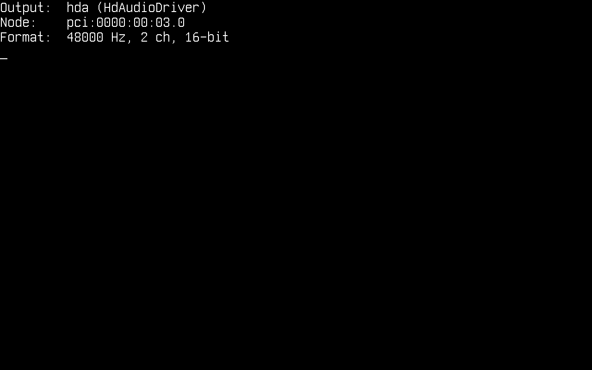

# Audio

In this article, we will discuss audio on Cosmos Gen3: how to find the sound card, play a tone, play a WAV file and generate sound of your own. Sound goes out through an **Intel High Definition Audio** controller, the audio standard of PC chipsets since 2004 and the sound card QEMU emulates as `intel-hda`.

The main differences if you come from Gen2:

| | Gen2 | Gen3 |
|---|---|---|
| Audio API | `Cosmos.System.Audio` | `Cosmos.Kernel.System.Audio` |
| Sound card drivers | AC97 | Intel HD Audio over the driver kit (x64 and ARM64) |
| Setup | An `AudioManager` with a `Stream` and an `Output`, then `Enable()` | None: the driver kit publishes the output at boot, and `AudioManager.Play(stream)` plays through it |
| Mixing | `AudioMixer` over several streams | One stream per output at a time |
| `Console.Beep` | PC speaker | A square wave through the sound card |
| WAV files | `MemoryAudioStream.FromWave` | `MemoryAudioStream.FromWave`, plus `WaveAudioStream`, which streams a file off a volume |
| Playback | In the background once `Enable()` ran | On the calling thread with `AudioManager.Play`, or on a thread of its own with `AudioManager.TryStartPlayback` |

If you find bugs or something abnormal, please [submit an issue](https://github.com/CosmosOS/Cosmos/issues/new/choose) on our repository.

## Enable audio in your kernel

Audio support is behind a feature switch. Make sure your kernel's `.csproj` does not turn it off (it defaults to `true`):

```xml
<PropertyGroup>
  <CosmosEnableAudio>true</CosmosEnableAudio>
</PropertyGroup>
```

The sound card is a PCI function, so turning `CosmosEnablePCI` off, or `CosmosEnableInterrupts`, which turns PCI off with it, turns audio off as well.

At boot a sound card reaches `AudioManager` through the [driver kit](drivers.md), like a NIC reaches `NetworkManager`. `HdAudioDriver`, shipped in `Cosmos.Kernel.Drivers`, binds every PCI function of class `04.03.00`, the HD Audio controller class, so the one driver covers any controller that follows the specification rather than a list of device ids. It finds a converter and an output pin on the codec behind the controller and publishes an output named `hda`, which the manager lists as its primary. QEMU attaches no sound card by default, so ask `cosmos run` for one, on either architecture:

```console
$ cosmos run --audio intel-hda        # the ICH6 HD Audio controller, the one the test suite runs on
$ cosmos run --audio ich9-intel-hda   # the ICH9 one
```

An HD Audio controller is a bus rather than a sound card on its own: the codec that turns samples into sound sits behind it, so `cosmos run` attaches QEMU's `hda-duplex` codec beside the controller. The sound plays on your host through QEMU's default audio backend (PipeWire, PulseAudio, ALSA, CoreAudio or DirectSound, depending on the host).

The serial log shows the driver binding the controller:

```
[Audio] primary: HdAudioDriver "hda"
[Drivers] pci:0000:00:02.0 HdAudioDriver published device "hda" (consumed)
[Drivers] pci:0000:00:02.0 HdAudioDriver: version 1.0, codec 0 converter 2 pin 3, stream 4 (4 in, 4 out), 48 kHz stereo 16-bit, line 11
```

The last field says whether the controller's interrupt line reached the driver. It reads `line 11` above, on an x64 machine with no NIC. It reads `no line` on ARM64, where the kit routes no PCI legacy line, and on x64 next to the default e1000e NIC, which holds the line the controller shares with it. Either way the output plays the same: the player tracks the stream engine's position rather than waiting for the interrupt.

These are the `using`s the snippets below rely on:

```csharp
using System.IO;
using Cosmos.Kernel.HAL.Devices.Audio;   // AudioFormat, for the sound you generate (COSMOS0003)
using Cosmos.Kernel.System.Audio;
using Cosmos.Kernel.System.FileSystem;
using Cosmos.Kernel.System.Timers;
```

## The audio output

`AudioManager` owns the outputs the driver kit published. Check that one is there before playing anything:

```csharp
if (!AudioManager.IsEnabled)
{
    Console.WriteLine("Audio is compiled out (CosmosEnableAudio=false)");
    return;
}

AudioDevice? output = AudioManager.Primary;
if (output is null)
{
    Console.WriteLine("No audio output: attach one with cosmos run --audio intel-hda");
    return;
}

Console.WriteLine("Output:  " + output.Name + " (" + output.DriverName + ")");
Console.WriteLine("Node:    " + output.NodePath);
Console.WriteLine("Format:  " + output.SampleRate + " Hz, " + output.Format.Channels + " ch, "
    + (output.Format.ChannelSize * 8) + "-bit");
```

<!-- screenshot: console showing "Output: hda (HdAudioDriver)", the pci node path and "Format: 48000 Hz, 2 ch, 16-bit" -->


An `AudioDevice` reports the format it is programmed for (48 kHz signed 16-bit stereo until something plays at another rate), whether its stream engine `IsRunning`, and the `Player` feeding it now, `null` while it is idle. Once the kit withdraws the output, `IsWithdrawn` turns true and every call on it does nothing.

With more than one sound card, enumerate them. The list is kept in node-path order, primary first, so the primary does not depend on which driver probed first:

```csharp
for (int i = 0; i < AudioManager.Count; i++)
{
    if (AudioManager.TryGet(i, out AudioDevice? device))
    {
        Console.WriteLine($"[{i}] {device.Name}  {device.NodePath}");
    }
}
```

`AudioManager.Play` and `AudioManager.TryStartPlayback` always use the primary. To play on another output, hand it to an `AudioPlayer` or to `AudioPlayback.TryStart` (both below).

## Playing a tone

The quickest way to make a sound needs no file and no setup: `Console.Beep`, which the kernel plugs onto the primary output.

```csharp
/* The Windows default: 800 Hz for 200 ms */
Console.Beep();

/* A C major scale, a quarter of a second per note */
int[] notes = { 262, 294, 330, 349, 392, 440, 494, 523 };
foreach (int note in notes)
{
    Console.Beep(note, 250);
}
```

The tone is a square wave at a quarter of full scale, and the call returns once it has played, as it does on Windows. It also refuses the same arguments Windows refuses: a pitch below 37 Hz or above 32767 Hz, or a duration of zero or less, throws `ArgumentOutOfRangeException`. When there is nothing to play on (no output published, audio compiled out, or another playback holding the output), it returns at once and plays nothing.

.NET marks `Console.Beep(int, int)` as Windows-only, so the call raises the `CA1416` platform warning. The kernel implements it anyway; suppress the warning around the call, or for the whole project:

```xml
<PropertyGroup>
  <NoWarn>$(NoWarn);CA1416</NoWarn>
</PropertyGroup>
```

## Playing a WAV file

`MemoryAudioStream.FromWave` reads a `.wav` file that is already in memory, and `AudioManager.Play` plays it through the primary output, returning once the last frame has played:

```csharp
/* chime.wav is a 16-bit stereo PCM file on the FAT partition mounted at /mnt */
MemoryAudioStream chime = MemoryAudioStream.FromWave(File.ReadAllBytes("/mnt/chime.wav"));

if (!AudioManager.Play(chime))
{
    Console.WriteLine("No output, or the output refused the file's format");
}
```

`FromWave` throws `ArgumentException` for a file that is not an uncompressed PCM RIFF/WAVE. The reader walks the file's chunk list, so a file carrying `LIST` or `fact` chunks before its samples reads like any other. `Play` returns `false` when no output is published or when the output refuses the stream's format.

That last case matters, because the reader understands more than the sound card plays:

| | The WAV reader accepts | The HD Audio output plays |
|---|---|---|
| Encoding | PCM and `WAVE_FORMAT_EXTENSIBLE` | Signed PCM |
| Bits per sample | 8, 16, 24, 32 | 16 |
| Channels | 1 to 255 | 2 |
| Sample rate | Any | 8, 9.6, 11.025, 12, 16, 22.05, 24, 32, 44.1, 48, 88.2, 96, 144, 176.4 and 192 kHz |

Nothing is converted or resampled on the way: a mono, 8-bit or 24-bit file is refused rather than played at the wrong speed or pitch. Convert it on your host before copying it over, for example with [FFmpeg](https://ffmpeg.org/), which also decodes MP3, OGG and FLAC:

```console
$ ffmpeg -i song.mp3 -ac 2 -ar 48000 -c:a pcm_s16le song.wav
```

A sound is just a file, so the easiest way to ship one is on the FAT disk from the [File System](filesystem.md) article, under a FAT-friendly name. A kernel that runs the FTP server from the [Network](network.md#ftp-server) article can also receive one from the host while it runs: `curl -T song.wav ftp://localhost:2121/`.

## Playing in the background

`FromWave` holds the whole file in memory and `Play` holds the caller for the length of the audio, which suits a short chime. For a song, stream the file off the volume with `WaveAudioStream`, a block at a time in a fixed amount of memory, and play it on a thread of its own with `AudioManager.TryStartPlayback`, so the kernel keeps running while it plays:

```csharp
if (!VfsManager.TryOpenFile("/mnt/song.wav", out IVfsFileHandle? file))
{
    Console.WriteLine("File not found");
    return;
}

if (!WaveAudioStream.TryOpen(file, out WaveAudioStream? song))
{
    Console.WriteLine("Not a PCM .wav file");
    file.Dispose();
    return;
}

uint seconds = song.Length / song.SampleRate;
Console.WriteLine("Playing " + seconds + " s of audio");

/* The playback thread reads the file as it plays, and disposes of it when it is done */
if (!AudioManager.TryStartPlayback(song, file, out AudioPlayback? playback))
{
    Console.WriteLine("No output, the output is busy, or no scheduler to run the playback on");
    file.Dispose();
    return;
}
```

The second argument is whatever the stream reads from: the playback disposes of it once its thread is done, so the file handle goes with the playback and the caller forgets it. When `TryStartPlayback` returns `false`, nothing was started and the handle is still the caller's to close. Pass `null` for a stream that needs nothing released.

`WaveAudioStream` is a `SeekableAudioStream`, so it reports its `Length` and its `Position` in frames, and `Rewind()` or a new `Position` moves it. The `AudioPlayback` reports where the playback has got to, and `Stop()` ends it early:

```csharp
while (playback.IsPlaying)
{
    Console.WriteLine((song.Position / song.SampleRate) + " s of " + seconds + " s");

    if (Console.KeyAvailable && Console.ReadKey(true).Key == ConsoleKey.Escape)
    {
        /* Returns at once; the state turns Stopped shortly after */
        playback.Stop();
    }

    TimerManager.Wait(500);
}

if (playback.State == AudioPlaybackState.Completed)
{
    Console.WriteLine("Played to the end");
}
```

| `State` | Meaning |
|---|---|
| `Playing` | The thread is still feeding the output |
| `Completed` | The stream was played to its end |
| `Stopped` | `Stop()` ended it early; what the output still held was dropped |
| `Failed` | The output refused the stream's format, was withdrawn or stopped taking frames, or reading the stream threw; a thrown exception is written to the serial log as `[Audio] playback failed: ...` |

Three things to know about background playback:

- **It needs the scheduler.** Without `CosmosEnableScheduler` there is no second thread to play on and `TryStartPlayback` returns `false`. `AudioManager.Play(stream)` plays the same stream on the calling thread instead.
- **One playback per output.** A playback claims the output from the moment `TryStartPlayback` returns `true` until it ends, so a second `TryStartPlayback`, a `Play` or a `Console.Beep` meanwhile is refused. Code that does not hold the `AudioPlayback` stops whatever is playing with `AudioManager.Primary?.Player?.RequestStop()`.
- **Leave the volume alone while it plays.** The playback thread reads the file while the rest of the kernel runs, and the filesystem layer has no locking of its own. Writing to the same volume until `IsPlaying` turns false is asking for trouble.

`Position` counts the frames read from the stream, which run ahead of what you hear by the frames already queued in the sound card's buffer, about a tenth of a second at 48 kHz.

## Generating sound

Samples you compute yourself play the same way. The format of a stream is an `AudioFormat`: bits per channel, channels per frame and whether samples are signed, with `AudioFormat.Stereo16` the one the HD Audio output plays. A frame interleaves one sample per channel, left then right, each sample a little-endian signed 16-bit value.

`AudioFormat` and `AudioBitDepth` belong to the driver kit's experimental seam, so naming them is a build error carrying the `COSMOS0003` diagnostic ([Public API Tracking](../dev/public-api.md)) until the kernel project acknowledges the missing compatibility promise. Reading a format, as `output.Format.Channels` does above, needs nothing:

```xml
<PropertyGroup>
  <NoWarn>$(NoWarn);COSMOS0003</NoWarn>
</PropertyGroup>
```

For a short sound, fill a buffer and wrap it in a `MemoryAudioStream`:

```csharp
const uint SampleRate = 48000;
AudioFormat format = AudioFormat.Stereo16;

/* One second of a 440 Hz sine wave, at a quarter of full scale */
int frames = (int)SampleRate;
byte[] data = new byte[frames * format.FrameSize];

for (int i = 0; i < frames; i++)
{
    short sample = (short)(Math.Sin(2 * Math.PI * 440 * i / SampleRate) * 8192);

    Span<byte> frame = data.AsSpan(i * format.FrameSize, format.FrameSize);
    BitConverter.TryWriteBytes(frame, sample);       // left
    BitConverter.TryWriteBytes(frame[2..], sample);  // right
}

AudioManager.Play(new MemoryAudioStream(format, SampleRate, data));
```

A long or endless sound is better computed as it is read, so it costs no memory: derive from `AudioStream` and fill the buffer the player hands to `Read`. The base class carries no length on purpose, so a stream can play forever, as a synthesizer, a mixer of your own or a game's soundtrack does:

```csharp
/* A sine wave worked out as it is read: it costs no memory and never runs out */
internal sealed class SineStream : AudioStream
{
    private const uint Rate = 48000;

    private readonly double _step;
    private double _phase;

    public SineStream(double frequency)
    {
        _step = 2 * Math.PI * frequency / Rate;
    }

    public override AudioFormat Format => AudioFormat.Stereo16;

    public override uint SampleRate => Rate;

    public override bool Depleted => false;

    public override int Read(Span<byte> destination)
    {
        int frameSize = Format.FrameSize;
        int frames = destination.Length / frameSize;

        for (int i = 0; i < frames; i++)
        {
            short sample = (short)(Math.Sin(_phase) * 8192);

            Span<byte> frame = destination.Slice(i * frameSize, frameSize);
            BitConverter.TryWriteBytes(frame, sample);
            BitConverter.TryWriteBytes(frame[2..], sample);

            _phase += _step;
            if (_phase >= 2 * Math.PI)
            {
                _phase -= 2 * Math.PI;
            }
        }

        return frames * frameSize;
    }
}
```

`Read` returns the bytes it wrote, always a whole number of frames, and the player stops reading once `Depleted` turns `true` or `Read` returns `0`. A stream that never runs out has to be stopped, so play it in the background:

```csharp
if (AudioManager.TryStartPlayback(new SineStream(440), null, out AudioPlayback? playback))
{
    TimerManager.Wait(2000);
    playback.Stop();
}
```

## Writing frames yourself

The player is a convenience over `AudioDevice`, which a kernel can also drive directly, for instance from a game loop that mixes its own sound effects. The device takes frames into a cyclic buffer that its stream engine drains on the codec's clock: `Write` copies whatever fits and returns the bytes it took, `0` when the buffer is full, and never blocks.

```csharp
AudioDevice? output = AudioManager.Primary;
if (output is null || output.Player is not null || !output.TrySetFormat(AudioFormat.Stereo16, 48000))
{
    return;
}

SineStream source = new(440);
byte[] chunk = new byte[4096];
output.Start();

/* 500 chunks of 1024 frames: about ten seconds */
for (int pass = 0; pass < 500; pass++)
{
    int length = source.Read(chunk);
    int written = 0;
    while (written < length)
    {
        int took = output.Write(chunk.AsSpan(written, length - written));
        if (took == 0)
        {
            /* The buffer is full: the codec is playing what it has */
            TimerManager.Wait(5);
            continue;
        }

        written += took;
    }
}

output.Stop();
```

The rules the device holds you to:

- `TrySetFormat` works only while the device is stopped; a running device keeps the format it has and returns `false`.
- Keep it fed. Silence plays while the buffer is empty after `Start()`, but the buffer is cyclic, so a writer that falls behind for long hears old frames come round again.
- `Stop()` drops whatever the buffer still holds. To hear the tail of a sound, write a buffer's worth of silence after it first (`WritableBytes` right after `TrySetFormat` tells you how much that is), which is what the player does.
- Writing directly claims nothing. Check `Player` is `null` before you start; a `Play` or `Console.Beep` arriving while you write is refused, because the running device refuses its format change.

## Current limitations

- Intel HD Audio is the only sound card driver: no AC97, Sound Blaster, virtio-sound or USB audio, and no PC speaker. Without an HD Audio controller, `Console.Beep` returns at once and plays nothing.
- Playback only. Nothing records: the codec's inputs, including the line-in of QEMU's `hda-duplex`, are left unused.
- One format: signed 16-bit stereo, at the rates in the table above. Streams in another layout or at another rate are refused rather than converted or resampled.
- No mixer: an output plays one stream at a time, and a second playback, `Play` or `Console.Beep` is refused until it ends.
- No volume control. The driver opens the codec's amplifiers to full gain; scale your samples to play quieter.
- The driver plays through the first converter and the first pin able to output on the first codec that has both. On a machine with several jacks that may not be the one you are listening to, and a computer's HDMI or DisplayPort audio, when it is a separate HD Audio controller, is published as an output of its own that can sort first.
- WAV is the only file format the kernel reads; there is no MP3, OGG or FLAC decoder.

## How it works

At boot the library initializer installs the audio manager's consumer of the [driver kit](drivers.md) before the driver stage runs, so the manager sees every output a driver publishes. `HdAudioDriver` binds the controller's PCI function, resets it, brings up the command and response rings the codecs are spoken to through, and walks each codec's widgets for an output converter and a pin that can drive an output. It points the pin at the converter, opens their amplifiers, turns on the external amplifier many laptops need for their speakers, programs the first output stream over a 16 KiB cyclic DMA buffer split into four 4 KiB periods, and publishes the output as `hda` (any driver can publish one: [Publishing a device](drivers.md#publishing-a-device)).

`AudioPlayer` does the playing, whether `AudioManager.Play`, a background `AudioPlayback` or the `Console.Beep` plug (which plays a generated square wave) started it. It claims the output, programs it for the stream's format and rate, starts the stream engine and reads the stream 1024 frames at a time into a staging buffer, writing each into the device's buffer as room comes free. The device works the room out from the engine's own position, which is why the player needs no interrupt, and keeps the period just ahead of the writer silent, so a writer that falls briefly behind underruns into silence. The completion interrupt, where the line connects, only tells the manager that room came free. When the buffer is full the player waits 5 ms, as a scheduler sleep on a thread the scheduler owns and on the timer otherwise, and gives up once a whole second passes without the device taking anything. At the end of the stream it writes one buffer of silence, so the last frames reach the codec before the engine stops.

```
Console.Beep / AudioManager.Play / AudioManager.TryStartPlayback
        │
AudioStream ── WaveAudioStream (a volume), MemoryAudioStream, your own   (Cosmos.Kernel.System.Audio)
        │  read 1024 frames at a time
AudioPlayer ── claims the output, writes what fits, waits 5 ms when full
        │
AudioManager ── AudioDevice (primary first)
        │
driver kit: IAudioOutput "hda"                                           (HdAudioDriver, Cosmos.Kernel.Drivers)
        │  16 KiB cyclic DMA buffer, drained on the codec's clock
HD Audio controller → codec converter → pin → speakers (or QEMU's audio backend)
```
