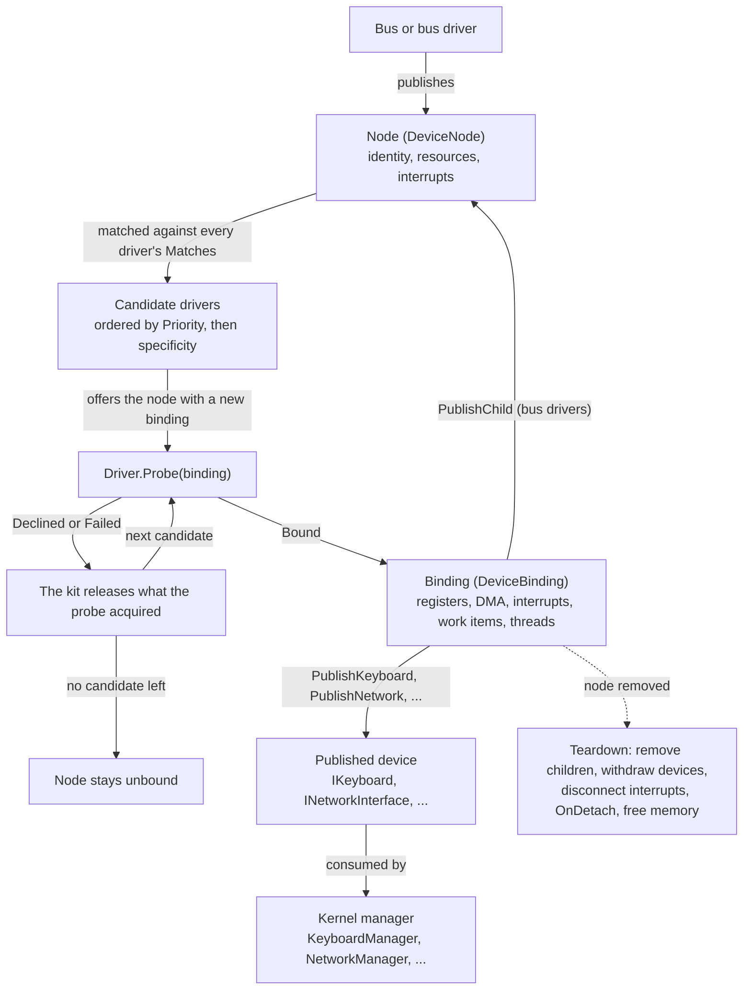

# Writing a driver

In this article, we will discuss how to write a device driver for Cosmos Gen3: how a driver is matched to a device, how it reaches the hardware, how it hands the kernel a device, and how it is tested without hardware.

Every kernel already carries the shipped drivers listed under [What the kit supports](#what-the-kit-supports), so you write a driver when your hardware is not among them. One rule shapes the whole kit: a driver reaches the hardware and the kernel only through its binding, and the binding records everything the driver acquires, so that the kit, not the driver, gives it back. The first half of this page follows one driver from matching to teardown; the second half takes each bus in turn, then the shipped device drivers; the last sections show how to watch drivers at run time, test one without hardware, and ship one as a library. Each linked term has a short background note in the [driver glossary](driver-glossary.md).

If you find bugs or something abnormal, please [submit an issue](https://github.com/CosmosOS/Cosmos/issues/new/choose) on our repository.

---

## Experimental status

The driver kit is experimental: every public type under `Cosmos.Kernel.HAL.DriverKit` and `Cosmos.Kernel.HAL.Devices`, except the stable `IBlockDevice` and `MacAddress`, carries `[Experimental("COSMOS0003")]`. You can use them today, but they may change until they are promoted to the stable API. Referencing one is a build error until your project acknowledges it:

```xml
<PropertyGroup>
  <NoWarn>$(NoWarn);COSMOS0003</NoWarn>
</PropertyGroup>
```

See [Public API Tracking](../dev/public-api.md) for how experimental APIs are promoted.

---

## What the kit supports

The kit supports five buses on real hardware, platform, PCI, virtio, USB and PS/2, plus a synthetic bus for tests ([Testing a driver over the synthetic bus](#testing-a-driver-over-the-synthetic-bus)). A driver hands the kernel one of six kinds of device: a keyboard, a pointer, a network interface, a block device, a display or an audio output. The kernel manager for that kind (`KeyboardManager`, `MouseManager`, `NetworkManager`, `StorageManager`, `DisplayManager` or `AudioManager`) picks up whatever a driver publishes. Every kernel also gets the drivers below through `Cosmos.Kernel.Drivers`. They use the same public API as your drivers, which makes their [sources](https://github.com/CosmosOS/Cosmos/tree/gen3/src/Cosmos.Kernel.Drivers) the best examples to read, and [Excluding and opting in](#excluding-and-opting-in) shows how to drop one:

| Bus | Drivers |
|-----|---------|
| Platform | `PciHostDriver`, `I8042Driver`, `VirtioMmioTransportDriver` |
| PCI | `PcieRootPortDriver`, `VirtioPciTransportDriver`, `XhciDriver`, `E1000EDriver`, `AhciDriver`, `NvmeDriver`, `VmwareSvgaDriver`, `AmdDcnDriver`, `IntelGraphicsDriver`, `HdAudioDriver` |
| Virtio | `VirtioNetDriver`, `VirtioBlkDriver`, `VirtioGpuDriver`, `VirtioInputDriver` |
| USB | `UsbHubDriver`, `UsbKeyboardDriver`, `UsbMouseDriver`, `UsbMassStorageDriver` |
| PS/2 | `Ps2KeyboardDriver`, `Ps2MouseDriver` |

In the source tree, each driver is filed as `<bus>/<category>/<driver>/` (for example `Pci/Network/E1000E/`), and its namespace follows the folder, as in `Cosmos.Kernel.Drivers.Pci.Network.E1000E`; that full type name is what [Excluding and opting in](#excluding-and-opting-in) needs.

---

## What a driver is

The kit is built on five concepts:

| Concept | What it is |
|---------|------------|
| Node (`DeviceNode`) | A piece of hardware the kernel can see: its identity on a bus, its resources and its interrupts. Buses and bus drivers publish nodes. |
| Bus kind | What a node looks like on a given bus (platform, PCI, virtio, USB, PS/2, synthetic) and how a driver matches it. |
| Driver (`Driver`) | Your class: it says which nodes it wants, and takes or declines each one it is offered. |
| Binding (`DeviceBinding`) | The link between one driver and one node. The driver reaches the hardware and the kernel only through it, and it remembers everything the driver acquired. |
| Published device | What the driver hands the kernel: an `IKeyboard`, `IPointer`, `INetworkInterface`, `IBlockDevice`, `IDisplay` or `IAudioOutput`. |

When a node appears, the kit offers it to each matching driver in turn until one returns `ProbeResult.Bound`; whatever a declining driver acquired is released. When the node goes away, the kit tears the binding down for you: child nodes and published devices go first, memory last. The diagram follows one node from publication to teardown:



The driver, the binding and the node tree are in `Cosmos.Kernel.HAL.DriverKit`. What a binding hands out sits one namespace down, by concern: `Cosmos.Kernel.HAL.DriverKit.Resources` (register windows, mapped regions, DMA buffers), `.Interrupts` (interrupt handles, the handler contract) and `.Threading` (locks, events, threads, work items). Each bus kind has its own namespace under `.Buses`, and each device kind its category's under `Cosmos.Kernel.HAL.Devices`.

This is the smallest driver that compiles and binds:

```csharp
using Cosmos.Kernel.HAL.DriverKit;
using Cosmos.Kernel.HAL.DriverKit.Buses.Synthetic;

namespace MyOS.Drivers;

[Driver]
public sealed class SampleDriver : Driver
{
    private readonly DeviceMatch[] _matches = [SyntheticMatch.Key("sample")];

    public override string Name => "sample";

    public override ReadOnlySpan<DeviceMatch> Matches => _matches;

    public override ProbeResult Probe(DeviceBinding binding)
    {
        binding.Log("bound");
        return ProbeResult.Bound;
    }
}
```

`Name` is shown in the log, `Matches` lists the nodes the driver wants, and `Priority` (`0` by default) decides which matching driver is offered a node first. `Probe`, the driver's chance to look at the hardware and decide whether it is one it serves, is required; `OnDetach` is optional.

Each driver class is instantiated once and offered every node it matches, so its fields are shared across devices. Keep per-device state in an object created in `Probe` and stored in `binding.DriverState`.

---

## When drivers are bound

The driver stage runs from `Kernel.Start`, once the heap, the interrupt controller and the scheduler are up and interrupts are enabled. The kit offers every node published so far, including the children a bus driver publishes from its probe, and returns when all of them have been offered. `OnBoot` and `BeforeRun` run after it, so every bound device is usable there.

The serial log shows each node, its candidate drivers and the result of the offer. This excerpt comes from an x64 kernel launched with `cosmos run --nic virtio-net-pci`:

```
[Kernel] Starting drivers...
[Drivers] manifest: PcieRootPortDriver(prio 0) VirtioPciTransportDriver(prio 0) ... VirtioBlkDriver(prio 0)
[Drivers] engine started, worker thread
...
[Drivers] platform:pci@cf8 candidates: PciHostDriver(prio 0, spec 1)
[Drivers] platform:pci@cf8 PciHostDriver: 6 functions on 1 buses
[Drivers] platform:pci@cf8 offer PciHostDriver -> bound
...
[Drivers] pci:0000:00:01.0 no driver
[Drivers] pci:0000:00:02.0 candidates: VirtioPciTransportDriver(prio 0, spec 1)
[Drivers] pci:0000:00:02.0 offer VirtioPciTransportDriver -> bound
...
[Drivers] virtio:pci:0000:00:02.0 candidates: VirtioNetDriver(prio 0, spec 1)
[Drivers] virtio:pci:0000:00:02.0 VirtioNetDriver published network "virtio-net" (consumed)
[Drivers] virtio:pci:0000:00:02.0 offer VirtioNetDriver -> bound
[Kernel] Calling OnBoot()...
```

Each `published` line ends with `(consumed)` when a kernel manager took the device, or `(no consumer)` when none did. A node published after boot, such as a USB device plugged in, takes the same path. See [Kernel Startup](startup.md) for the rest of the boot sequence.

---

## The two execution contexts and the guard

Probes, teardowns and work items run one at a time on the kit's worker thread, so a driver never sees two of them overlap. Only driver threads run concurrently with them.

A kernel built with `CosmosEnableScheduler` off has no worker thread: probing still works, but `WorkItem.Schedule`, `TrySchedulePeriodic` and `TryStartThread` return `false`. A driver that must work in such a kernel checks those results. The engine then runs inline: the thread that publishes or retracts a node drains the queue itself, and the log says `engine started, inline (no worker)`.

Wherever it runs, driver code is in one of two [contexts](driver-concepts/interrupt-context.md): thread or interrupt.

| Entry point | Context | May block | May allocate |
|-------------|---------|-----------|--------------|
| `Probe`, `OnDetach`, work items | thread (the kit worker) | yes | yes |
| Driver threads | thread (their own) | yes | yes |
| Device methods the kernel calls (`Transmit`, `Flush`, ...) | thread (the caller's) | yes, for the I/O they perform | yes |
| Interrupt handlers | interrupt | no | no |

`Transmit` and `IAudioOutput.Write` are the exceptions among device methods: they never wait for room, and report a full queue instead (`false`, or a short write).

**An interrupt handler runs in interrupt context.** It runs on the stack of the thread it interrupted, with interrupts masked, so neither a thread nor the timer can run on that CPU until it returns, and a handler that waits for either waits forever. That is why its `InterruptContext` offers only three calls, `Mask()` its own source, `Signal(DeviceEvent)` a waiting thread, and `Schedule(WorkItem)` work that needs thread context, and why a handler should acknowledge the device and hand the rest to a work item. It may also read and write its registers and DMA buffers, and report through a sink (the object the kit hands back when a driver publishes a device, see [Publishing a device](#publishing-a-device)). It must not block, and it must not allocate (no `new` of a reference type, no string building, no capturing lambda). The kernel's own handlers do allocate, and the garbage collector tolerates it; for driver handlers the kit forbids it as a safety rule, because an allocation can pull in runtime machinery that misbehaves in interrupt context, notably interface dispatch resolution and exception throwing.

Calling a thread-context member of the kit from a handler (a `DeviceBinding` method, or an access-object member such as a `UsbAccess` transfer or `Ps2Access.TryCommand`) stops the kernel with a panic naming the member. Over the synthetic bus it throws instead: the kit records the fault on the node and masks the source, so a test can assert it. Nothing detects an allocation: the guard runs only inside those kit members, never in the driver's own code.

---

## The attribute and the manifest

The build registers every class marked `[Driver]`: a [source generator](driver-concepts/source-generators.md) writes `DriverManifest.g.cs` into the kernel project, which constructs each driver once at boot ([Driver manifest](../dev/build/driver-manifest.md) describes the generator). A driver class must derive from `Driver`, be concrete and non-generic, and have a parameterless constructor. It may be `internal` in the kernel project, but must be `public` in a driver library ([A driver library](#a-driver-library)). A class that breaks one of these rules is left out of the manifest with warning `COSMOSGEN001`, and so does not appear in the boot log's `manifest:` line.

The attribute takes two options:

- `[Driver(Feature = DriverFeature.Keyboard)]` registers the driver only when the matching [feature switch](driver-concepts/trimming.md) (`CosmosEnableKeyboard`) is on; otherwise it is trimmed, left out of the compiled kernel.
- `[Driver(Default = false)]` registers the driver only when the kernel opts into it by name ([Excluding and opting in](#excluding-and-opting-in)).

The manifest order is deterministic (the kernel's own drivers first, then those of referenced libraries) and is printed at boot.

---

## Identity and matches

Every node has a `DeviceIdentity`, set by its bus: `BusName`, `Address`, and `Describe()` for the log. The node's `Path` joins the first two (`pci:0000:00:03.0`) and is how the log names the node.

A driver's `Matches` is a list of `DeviceMatch`. Each one tests an identity and has a `Specificity`: the number of fields it checks. Every bus kind has its own pair of types (`PciIdentity` and `PciMatch`, `UsbIdentity` and `UsbMatch`, ...), described with their buses below. On the synthetic bus, a match names one device or all of them:

```csharp
// This device and no other: specificity 1.
private readonly DeviceMatch[] _matches = [SyntheticMatch.Key("kbd")];

// Every synthetic device: specificity 0.
private readonly DeviceMatch[] _matches = [SyntheticMatch.Any()];
```

When a node appears, the kit [orders the matching drivers](driver-concepts/driver-matching.md) by `Priority`, then by specificity (highest first), then by manifest order, and offers the node to each until one returns `Bound`:

```
[Drivers] synthetic:prio candidates: HighPriorityDriver(prio 10, spec 1) LowPriorityDriver(prio 0, spec 1)
[Drivers] synthetic:prio offer HighPriorityDriver -> bound
```

To replace a shipped driver for the same hardware, give yours a `Priority` above `0`: every shipped driver leaves it at `0`, the default. A node no driver takes is logged `no driver` and stays `Unbound`.

---

## Probe and the binding

`Probe` is the only required entry point, and `DeviceBinding` is the driver's only way to reach the hardware and the kernel. Everything the driver acquires through it (register windows, DMA memory, interrupts, events, work items, threads, published devices, child nodes) is recorded on the binding and released by the kit, so a driver never writes cleanup code.

A probe reads the node (`binding.Node.Resources`, `binding.Node.Interrupts`, and `binding.Node.Access<T>()`, the access object, which the bus provides for talking to the device and which is described with each bus below), acquires what it needs, creates its per-device state, publishes the device and returns. Here is a full driver, for a keyboard on the synthetic bus:

```csharp
using Cosmos.Kernel.HAL.DriverKit;
using Cosmos.Kernel.HAL.DriverKit.Buses.Synthetic;
using Cosmos.Kernel.HAL.DriverKit.Interrupts;
using Cosmos.Kernel.HAL.DriverKit.Resources;
using Cosmos.Kernel.HAL.DriverKit.Threading;

namespace MyOS.Drivers;

[Driver(Feature = DriverFeature.Keyboard)]
public sealed class SyntheticKeyboardDriver : Driver
{
    public const string Key = "kbd";

    private readonly DeviceMatch[] _matches = [SyntheticMatch.Key(Key)];

    public override string Name => "synthetic-keyboard";

    public override ReadOnlySpan<DeviceMatch> Matches => _matches;

    public override ProbeResult Probe(DeviceBinding binding)
    {
        if (binding.Node.Resources.Count == 0 || binding.Node.Interrupts.Count == 0)
        {
            return ProbeResult.Declined("no register window or no interrupt source");
        }

        RegisterWindow window = binding.MapRegisters(0);
        DeviceEvent keyEvent = binding.CreateEvent();
        KeyboardState state = new(binding, window, keyEvent);
        binding.DriverState = state;

        state.Sink = binding.PublishKeyboard(state);

        if (!binding.TryRequestInterrupt(binding.Node.Interrupts[0], state.OnInterrupt, out InterruptHandle? handle))
        {
            return ProbeResult.Failed("interrupt 0 could not be connected");
        }

        state.Handle = handle;

        // The handler is live from here on, so the device is armed last.
        window.Write8(KeyboardState.ControlOffset, KeyboardState.EnableBit);
        return ProbeResult.Bound;
    }

    public override void OnDetach(DeviceBinding binding, DetachReason reason)
    {
        if (reason.HardwarePresent && binding.DriverState is KeyboardState state)
        {
            state.Window.Write8(KeyboardState.ControlOffset, 0);
        }
    }
}
```

The state object is a plain class, not a `Driver`: there is one per device, and it implements the device contract, owns the handler, and holds every kit object the probe acquired:

```csharp
using Cosmos.Kernel.HAL.Devices.Input;
using Cosmos.Kernel.HAL.DriverKit;
using Cosmos.Kernel.HAL.DriverKit.Interrupts;
using Cosmos.Kernel.HAL.DriverKit.Resources;
using Cosmos.Kernel.HAL.DriverKit.Threading;

namespace MyOS.Drivers;

public sealed class KeyboardState : IKeyboard
{
    public const int ControlOffset = 0x00;
    public const int ScanCodeOffset = 0x10;
    public const int FlagsOffset = 0x11;
    public const byte EnableBit = 1;
    public const byte ReleasedFlag = 1;

    private readonly DeviceBinding _binding;
    private KeyboardLeds _leds;

    public KeyboardState(DeviceBinding binding, RegisterWindow window, DeviceEvent keyEvent)
    {
        _binding = binding;
        Window = window;
        KeyEvent = keyEvent;
        KeyWork = binding.CreateWorkItem(OnKeyWork);
    }

    public string Name => "synthetic-kbd";

    public RegisterWindow Window { get; }

    public DeviceEvent KeyEvent { get; }

    public WorkItem KeyWork { get; }

    public KeyboardSink? Sink { get; set; }

    public InterruptHandle? Handle { get; set; }

    public void SetLeds(KeyboardLeds leds)
    {
        _leds = leds;
    }

    // Interrupt context: reads two registers, reports the key, wakes the
    // thread and hands the rest to the work item. Allocates nothing.
    public void OnInterrupt(InterruptContext context)
    {
        byte scanCode = Window.Read8(ScanCodeOffset);
        bool released = (Window.Read8(FlagsOffset) & ReleasedFlag) != 0;
        Sink?.Report(scanCode, released);
        context.Signal(KeyEvent);
        context.Schedule(KeyWork);
    }

    // Thread context, on the kit worker.
    public void OnKeyWork()
    {
        _binding.Log("key work ran");
    }
}
```

Neither class allocates pages, programs an interrupt controller, registers the keyboard with a manager or frees anything: the binding does all of it. The sections below cover its members; their samples are pieces of a driver's `Probe` or of its state object.

### Register windows

A device's [registers](driver-concepts/registers.md) are reached through a register window: `binding.MapRegisters(resourceIndex)` maps one of `Node.Resources` and returns a `RegisterWindow`, with `Read8` to `Read64` and `Write8` to `Write64` at a byte offset. Every access is bounds-checked, and over a memory window it must also be aligned to its width. Every access carries the [barriers](driver-concepts/barriers.md) it needs, so a doorbell write always lands after the DMA stores before it. The same code works over a memory window, a synthetic node's RAM window and an x64 port range, except that a port range has no 64-bit access: `Read64` and `Write64` throw `NotSupportedException` there. The accessors are safe from an interrupt handler, and throw once the binding is torn down.

### Bulk regions

`binding.MapRegion(resourceIndex, RegionCaching)` maps a resource as plain memory, for a framebuffer or a command queue, and returns a `DeviceRegion`. Unlike a register window, its accesses are neither checked nor ordered; a probe maps a framebuffer and draws into it through a span:

```csharp
// In Probe:
DeviceRegion framebuffer = binding.MapRegion(1, RegionCaching.WriteCombining);
framebuffer.Span.Fill(0);
Span<uint> pixels = framebuffer.As<uint>();
pixels[0] = 0x00FF0000;
```

The second argument tells the CPU how to cache the region. Pick it by what the region holds:

- `RegionCaching.Device` for commands the device reads, such as a command queue: every read and write goes straight to the device, in order.
- `RegionCaching.WriteCombining` for a framebuffer: writes are grouped into bursts, which is much faster for drawing pixels.
- `RegionCaching.Normal` for ordinary RAM shared with the device.

On x64, `WriteCombining` is applied to every 2 MiB block the region covers whole; a block it shares with something else stays `Device`. Every other choice, and every choice on ARM64, is mapped as `Device` today; a synthetic node's RAM window keeps the kernel's normal mapping whatever the choice. Pick the right value anyway: the kit records it in `DeviceRegion.Caching` and will apply it once the platform supports it.

### DMA memory

`binding.AllocateDma(length, alignment)` returns a `DmaBuffer`: zeroed, [physically contiguous](driver-concepts/physical-addresses.md) memory, with `PhysicalAddress` for the device and `Span` for the CPU.

[DMA](driver-concepts/dma.md) memory usually holds a [descriptor ring](driver-concepts/descriptor-rings.md): a fixed array of descriptors, each pointing at a data buffer, that the driver and the device pass back and forth as a circular queue. The driver writes a register (the doorbell) when it hands new descriptors over, and the device marks each one done. A network card, for example, has a receive ring the device fills with incoming frames and a transmit ring the driver fills with outgoing ones.

For a device that only addresses 32 bits, `TryAllocateDma` takes a constraint and returns `false` instead of throwing when the buffer does not meet it. The kit has no pool of low memory yet: it allocates as usual and gives the buffer back when it ends above 4 GiB:

```csharp
// In Probe:
if (!binding.TryAllocateDma(RingBytes, 4096, DmaConstraints.Addressable32Bit, out DmaBuffer? ring))
{
    return ProbeResult.Declined("no DMA memory below 4 GiB");
}
```

DMA is coherent, so only ordering matters. Call `DmaBuffer.WriteBarrier()` between filling a descriptor and handing it to the device, and `DmaBuffer.ReadBarrier()` between reading a flag the device wrote and reading the data it guards. Handing one descriptor to the device reads as follows; the doorbell write after it needs no barrier, because register writes carry their own:

```csharp
// When sending, for example in Transmit:
Span<byte> descriptors = ring.Span;
descriptors[8] = 0x01;                   // fill the descriptor
DmaBuffer.WriteBarrier();
descriptors[0] = OwnedByDevice;          // then hand it over

window.Write32(DoorbellOffset, 1);       // no barrier needed
```

Never hand a device a managed array: the garbage collector does not know the device holds it.

### Interrupts

`binding.TryRequestInterrupt(source, handler, out handle)` connects a handler to one of `Node.Interrupts`. It returns `false` when the platform cannot deliver that interrupt, so the driver can decline or poll instead, reading the device's state on a timer rather than waiting for an interrupt. The handler is live as soon as the call returns `true`, which lets a probe send a command and wait for the interrupt; arm the device last, with the register write that lets it start raising interrupts, if it must not interrupt earlier. The probe connects its handler and keeps the handle:

```csharp
// In Probe:
if (!binding.TryRequestInterrupt(binding.Node.Interrupts[0], state.OnInterrupt, out InterruptHandle? handle))
{
    return ProbeResult.Declined("the interrupt cannot be delivered");
}

state.Handle = handle;
```

The handler runs in interrupt context: it [acknowledges the device](driver-concepts/interrupt-delivery.md) and leaves the real work to a work item. Here it is an `OnInterrupt` method on the state object:

```csharp
// In the state object, in interrupt context:
public void OnInterrupt(InterruptContext context)
{
    uint cause = Window.Read32(InterruptCauseOffset);
    Window.Write32(InterruptCauseOffset, cause);   // acknowledge
    context.Schedule(ReceiveWork);
}
```

The `InterruptHandle` masks and unmasks the source (`Mask()`, `Unmask()`) from any context. A handler that throws leaves its source masked.

### Events and waiting

`binding.CreateEvent()` returns a `DeviceEvent`. A handler signals it with `context.Signal(evt)`; a thread waits with `binding.Wait(evt, timeoutMilliseconds)`, which returns `true` on a signal, and `false` on timeout or once teardown has started.

A probe can send a command and wait for the device to answer. The handler calls `context.Signal(CommandDone)`, and the probe waits on the same event:

```csharp
// In Probe:
state.CommandDone = binding.CreateEvent();
// ... connect the interrupt, then send the command
window.Write32(CommandOffset, ResetCommand);

if (!binding.Wait(state.CommandDone, 100))
{
    return ProbeResult.Failed("the device did not answer the reset");
}
```

For short waits in thread context, `binding.Delay(microseconds)` busy-waits, spinning on the CPU, which suits a register that needs a few microseconds after a write, and `binding.Sleep(milliseconds)` gives up the CPU so that other threads run meanwhile:

```csharp
// In Probe or a work item:
window.Write32(ControlOffset, ResetBit);
binding.Delay(10);   // the device needs 10 µs before the next access
```

### Work items

A handler hands its real work to a work item: `binding.CreateWorkItem(callback)` returns a `WorkItem` whose callback runs on the kit worker when scheduled. `context.Schedule(item)` from a handler, or `item.Schedule()` from anywhere, queues it without allocating; it returns `false` when the item is already queued, cancelled by teardown, or the kernel has no worker. Create work items in `Probe` and schedule them later:

```csharp
// In Probe: create the work item once.
state.ReceiveWork = binding.CreateWorkItem(state.DrainReceiveRing);

// In the handler: queue it.
context.Schedule(ReceiveWork);

// On the kit worker, in thread context: may allocate, wait and report.
public void DrainReceiveRing()
{
    // walk the receive ring and hand each frame to Sink.Receive
}
```

### Periodic work

`binding.TrySchedulePeriodic(intervalMilliseconds, item)` runs a work item at an interval until teardown, rounded to the timer's tick. It returns `false` when the kernel has no timer or no scheduler. The kit never polls on a driver's behalf, so a driver that must poll schedules its own work item, here an `OnPoll` method on the state object:

```csharp
// In Probe:
WorkItem poll = binding.CreateWorkItem(state.OnPoll);
if (!binding.TrySchedulePeriodic(20, poll))
{
    return ProbeResult.Failed("no timer to poll with");
}
```

### Driver threads

Work that has to wait in a loop gets a thread of its own: `binding.TryStartThread(name, entry, out thread)` starts one, and returns `false` when the scheduler is not running. The thread loops on the binding's events and returns once `IsDetaching` is true; teardown wakes every waiter, then joins the thread:

```csharp
// In the state object, on the driver thread:
public void ThreadMain()
{
    while (!_binding.IsDetaching)
    {
        if (_binding.Wait(KeyEvent, 50))
        {
            // a key arrived; drain the device in thread context
        }
    }
}
```

Teardown waits half a second for each thread. A thread still running after that keeps the binding's memory from being freed, because it may still touch it: the kit leaks that memory on purpose and logs `thread "name" did not stop in 500 ms; n resources leaked`. The probe starts the thread once its state is in place:

```csharp
// In Probe:
DrainState state = new(binding);
binding.DriverState = state;

if (!binding.TryStartThread("drain", state.ThreadMain, out DriverThread? thread))
{
    return ProbeResult.Failed("no scheduler to run the drain thread on");
}
```

### Device locks

`binding.CreateLock()` returns a `DeviceLock`, for a device entered from several contexts at once, such as a `Transmit` the network stack calls while the driver's work item drains the receive ring. `Acquire()` disables interrupts until the scope is disposed, so a handler can never interrupt a thread that holds the lock and then spin on it, and a handler may take the lock too. The holder must not wait with interrupts off, so the lock is never held across `Sleep`, `Wait` or `Delay`, nor across a sink call or a publish, which can come straight back into the driver: the network stack may answer a received frame by calling `Transmit` before `Receive` returns. The lock is not reentrant, so a holder that acquires it again spins forever. In the state object, `Transmit` takes it around its ring work:

```csharp
// In the state object, called by the network stack:
public bool Transmit(ReadOnlySpan<byte> frame)
{
    using (_lock.Acquire())
    {
        // check the ring, copy the frame, write the descriptor,
        // DmaBuffer.WriteBarrier(), then advance the tail register
    }

    return true;
}
```

### Publishing a device

A device kind is a small interface the driver implements, plus a sink the kit hands back for the driver to report events through:

| Kind | The driver implements | Publish call | The driver reports through |
|------|-----------------------|--------------|----------------------------|
| Keyboard | `IKeyboard` (`Name`, `SetLeds`) | `PublishKeyboard` | `KeyboardSink.Report(scanCode, released)` |
| Pointer | `IPointer` (`Name`) | `PublishPointer` | `PointerSink.ReportRelative(...)`, `ReportAbsolute(...)` |
| Network | `INetworkInterface` (`Name`, `MacAddress`, `LinkUp`, `Transmit`) | `PublishNetwork` | `NetworkSink.Receive(frame)`, `LinkChanged(up)` |
| Block | `IBlockDevice` | `PublishBlockDevice` | nothing |
| Display | `IDisplay` (`Name`, `Mode`, `Framebuffer`, `Flush`) | `PublishDisplay` | `DisplaySink.ModeChanged()` |
| Audio | `IAudioOutput` (`Name`, `Format`, `SampleRate`, `SupportedFormats`, `IsRunning`, `WritableBytes`, `TrySetFormat`, `Start`, `Stop`, `Write`) | `PublishAudio` | `AudioSink.BufferCompleted()`, `FormatChanged()` |

Each kind's types are in its category's namespace under `Cosmos.Kernel.HAL.Devices`, the same categories as the drivers' folders: the keyboard and pointer types in `Cosmos.Kernel.HAL.Devices.Input`; the network ones in `Cosmos.Kernel.HAL.Devices.Network`, beside `MacAddress`, the type `INetworkInterface.MacAddress` returns; the display ones in `Cosmos.Kernel.HAL.Devices.Display`; the audio ones in `Cosmos.Kernel.HAL.Devices.Audio`, beside `AudioFormat`; and `IBlockDevice` in `Cosmos.Kernel.HAL.Devices.Storage`.

The kernel's manager for that kind picks the device up as soon as it is published, and teardown withdraws it before releasing anything else. Sinks never allocate, and drop reports once the device is withdrawn.

With a `NicState` state object implementing `INetworkInterface`, the probe publishes it and keeps the sink it gets back:

```csharp
// In Probe:
NicState state = new(binding);
binding.DriverState = state;
state.Sink = binding.PublishNetwork(state);

// In the receive work item, for each frame the device received:
Sink?.Receive(frame);
```

The log records both ends, here for the keyboard sample above:

```
[Drivers] synthetic:kbd synthetic-keyboard published keyboard "synthetic-kbd" (consumed)
[Drivers] synthetic:kbd synthetic-keyboard withdrew keyboard "synthetic-kbd"
```

Each kind also carries a rule of its own. A keyboard driver reports raw scan codes, the set 1 code for a key going down or up, which `KeyboardManager` turns into keys. A network driver calls `NetworkSink.Receive` from thread context, never from its handler, and hands received frames to a work item: the sink itself does not allocate, but the network stack behind it copies the frame, which needs thread context. An audio driver is the opposite case, since `AudioSink.BufferCompleted` may be called straight from the interrupt handler. Its `Write` copies whole audio frames (one sample for every channel) into the device's buffer, as many as fit, and never blocks; a short write is how the device says it is full.

`PublishBlockDevice` registers the disk with `StorageManager` and scans its partitions before it returns, so the device must be ready to read when the driver publishes it. If the manager refuses the disk (its table is full, or the disk is already registered), `PublishBlockDevice` throws `InvalidOperationException` and the probe fails.

A display driver publishes the display as it found it: `Mode` is empty until something sets one, and `Framebuffer` is `null` when the CPU cannot draw into it. The same object may also implement `IDisplayModes` to switch modes and `IHardwareCursor` for a hardware cursor. The bootloader's framebuffer is published as the firmware display at boot, and withdrawn when a driver binds the PCI function whose memory window holds it.

See [Graphics](graphics.md), [Audio](audio.md) and [File System](filesystem.md) for the consuming side.

### Publishing child nodes

A bus driver publishes the devices it finds as child nodes: `binding.PublishChild(identity, resources, interrupts, access)` adds one beneath its node, to be offered to drivers like any other, and `binding.RetractChild(child, hardwarePresent)` removes it. Children go away with their parent, and their drivers see `DetachCause.ParentRetracted`.

A bus driver either publishes a bus kind the kit already defines, or brings its own identity and match pair. The shipped virtio transport drivers do the first: they publish their device with the kit's `VirtioIdentity`, no resources, the nine interrupt sources of a `VirtioAccess`, and that access as the access object ([Virtio devices](#virtio-devices)). The kit's USB enumeration core does the same beneath the xHCI or hub driver's node, with a `UsbIdentity`, no resources, no interrupt sources and a `UsbAccess` ([USB devices](#usb-devices)). A bus of your own needs an identity and a match:

```csharp
using Cosmos.Kernel.HAL.DriverKit;

namespace MyOS.Drivers;

public sealed class ChildIdentity : DeviceIdentity
{
    public ChildIdentity(string name)
    {
        Name = name;
    }

    public string Name { get; }

    public override string BusName => "mybus";

    public override string Address => Name;

    public override string Describe()
    {
        return string.Concat("child ", Name);
    }
}

public sealed class ChildMatch : DeviceMatch
{
    private readonly string _name;

    public ChildMatch(string name)
    {
        _name = name;
    }

    public override int Specificity => 1;

    public override bool Matches(DeviceIdentity identity)
    {
        return identity is ChildIdentity child && string.Equals(_name, child.Name);
    }
}
```

The bus driver's probe then publishes a child with that identity, its registers as resource 0:

```csharp
// In the bus driver:
public override ProbeResult Probe(DeviceBinding binding)
{
    DeviceResource[] resources =
    [
        DeviceResource.MemoryWindow(0xFEB00000, 0x1000),   // the child's registers, index 0
    ];

    DeviceNode child = binding.PublishChild(new ChildIdentity("port0"), resources, [], null);
    binding.DriverState = child;
    return ProbeResult.Bound;
}
```

Resources are built with `DeviceResource.MemoryWindow`, `PortRange`, `RamWindow` or `None` (an unassigned slot that keeps the indices after it). Interrupts are `InterruptSource` subclasses the bus provides.

### Logging

`binding.Log(message)` writes one line to the serial log from thread context: `[Drivers] synthetic:kbd synthetic-keyboard: message`.

---

## Declining and failing

`Probe` returns one of three results:

| Result | When to return it |
|--------|-------------------|
| `ProbeResult.Bound` | The driver took the device. |
| `ProbeResult.Declined(reason)` | The device is not one the driver serves after all (an unknown revision, a missing feature). |
| `ProbeResult.Failed(reason)` | The device is one the driver serves, but bringing it up did not work. An exception escaping `Probe` counts as a failure. |

On anything but `Bound`, the kit releases everything the probe acquired, then offers the node to the next candidate. The reason is printed in the log:

```
[Drivers] synthetic:decline offer DecliningDriver -> declined: declined on purpose
[Drivers] synthetic:decline offer AnyKeyDriver -> bound
[Drivers] synthetic:throw offer ThrowingDriver -> failed: probe threw on purpose
```

---

## Teardown and OnDetach

When a node goes away (the device is unplugged, its parent is removed, or a test retracts it), the kit tears its binding down in a fixed order:

1. `IsDetaching` turns true, and the binding refuses any new acquisition.
2. Child nodes are removed.
3. Published devices are withdrawn, so the kernel stops using them.
4. Interrupts are disconnected, and work items, periodic work and driver threads are stopped.
5. `OnDetach` runs.
6. Memory is freed: DMA buffers, register windows and regions.

`OnDetach` is optional. It is the place to stop the hardware, because interrupts and threads are already stopped and the registers are still mapped. Check `reason.HardwarePresent` first: it is `false` when the device was [unplugged](driver-concepts/hot-plug.md), and the registers must not be touched then, because a write to a window whose device is gone can fault or reach another device. The keyboard sample's `OnDetach` disables the device only when it is still there:

```csharp
// In the driver:
public override void OnDetach(DeviceBinding binding, DetachReason reason)
{
    if (reason.HardwarePresent && binding.DriverState is KeyboardState state)
    {
        state.Window.Write8(KeyboardState.ControlOffset, 0);   // disable the device
    }
}
```

`reason.Cause` says why: `DetachCause.Retracted` when the node itself was removed, `DetachCause.ParentRetracted` when its parent was. The log shows the withdrawal, then the node leaving the tree:

```
[Drivers] synthetic:kbd synthetic-keyboard withdrew keyboard "synthetic-kbd"
[Drivers] synthetic:kbd retracted
```

---

## Buses

[Buses](driver-concepts/buses.md) nest. The machine description, the platform code that describes the machine's fixed devices at boot, publishes the root nodes, and bus drivers publish the devices they find beneath them. On an x64 machine, for example, the tree looks like this:

```
platform:i8042@60                    I8042Driver
├── ps2:kbd                          Ps2KeyboardDriver
└── ps2:aux                          Ps2MouseDriver
platform:pci@cf8                     PciHostDriver
├── pci:0000:00:02.0                 VirtioPciTransportDriver
│   └── virtio:pci:0000:00:02.0      VirtioNetDriver
└── pci:0000:00:04.0                 XhciDriver
    └── usb:1-1:0                    UsbKeyboardDriver
```

A driver only sees its own node: a virtio driver never learns which transport carries its device, and a USB driver never sees the controller or the hubs above it.

Each bus kind has its own namespace, `Cosmos.Kernel.HAL.DriverKit.Buses.<Bus>` (`Platform`, `Pci`, `Virtio`, `Usb`, `Ps2`, and `Synthetic` for tests), and names its types the same way: `<Bus>Identity` for what a node is, `<Bus>Match` for what a driver binds, and `<Bus>Access` for how the driver reaches the device. The platform bus is the exception: its drivers map the node's resources instead, and only the PCI host node carries an access object, `PciHostAccess`.

Platform nodes and the PCI host driver come first, below; the four sections after them take the buses a driver binds in turn: PCI, virtio, USB and PS/2.

### Platform nodes

Platform nodes are the roots: devices nothing can enumerate, which the machine description publishes at boot. A kernel cannot publish its own.

| Machine | Node | Compatible |
|---------|------|------------|
| x64 | `platform:i8042@60`, the PS/2 controller | `pnp0303` |
| x64 | `platform:pci@cf8`, the PCI host | `pci-host-legacy` |
| ARM64 | `platform:pci@<base>`, the PCI host | `pci-host-ecam-generic` |
| ARM64 | `platform:virtio_mmio@<base>`, one per occupied slot | `virtio,mmio` |

On ARM64 they come from ACPI, the device tree, or the virt machine's fixed layout. The two PCI hosts differ in how they reach configuration space: `pci-host-legacy` through ports `0xCF8` and `0xCFC`, `pci-host-ecam-generic` through a memory window. A driver matches a platform node by one of its compatible strings:

```csharp
// In the driver:
private readonly DeviceMatch[] _matches = [PlatformMatch.Compatible("virtio,mmio")];
```

`PlatformMatch.Any()` matches every platform node.

### The PCI host driver

`PciHostDriver` binds the PCI host node, scans every bus behind it, following bridges, and publishes one `pci:` node per function it finds. The functions behind a PCI Express hot-plug slot are published by `PcieRootPortDriver` instead, at boot for a device already in a powered slot and later when one is plugged in. A function no driver matches is left as the [firmware](driver-concepts/firmware-handoff.md) set it up.

---

## PCI devices

A PCI node is one [function](driver-concepts/pci.md): its identity read from the configuration header, six resources (its base address registers), its interrupt sources (the legacy line, then its MSI-X messages) and a `PciAccess` for its configuration space. The shipped `E1000EDriver` is a good model, and the samples below are its steps.

### PCI identity and match

`PciIdentity` holds the header fields a driver matches on: `VendorId`, `DeviceId`, `SubsystemVendorId`, `SubsystemId`, `ClassCode`, `Subclass`, `ProgIf` and `Revision`, plus the function's address. The node path is `pci:<segment>:<bus>:<device>.<function>`, for example `pci:0000:00:03.0`.

`PciMatch` takes any of those fields; every field given must be equal, and the specificity is the number of fields given:

```csharp
// In the driver:
using Cosmos.Kernel.HAL.DriverKit.Buses.Pci;

private readonly DeviceMatch[] _matches =
[
    new PciMatch(vendorId: 0x8086, deviceId: 0x10D3),   // one chip: specificity 2
    new PciMatch(classCode: 0x02),                      // every network controller: specificity 1
];
```

A match must set at least one field. Prefer the device ids you tested over a class match: a class match binds every function of that class, including chips whose registers differ from the one you tested. A class match is right only where a specification fixes the register layout, as the HD Audio specification does for `HdAudioDriver`; the shipped E1000E matches eight Intel device ids and nothing else.

### The PCI access object

`binding.Node.Access<PciAccess>()` reaches the function's configuration space:

- `ReadConfig8/16/32` and `WriteConfig8/16/32` read and write a register at an offset aligned to its width. An offset past the configuration space the host reaches throws `ArgumentOutOfRangeException`: that space is 256 bytes on x64, whose host uses the legacy ports, and 4 KiB over ECAM.
- `FindCapability(id)` returns the offset of a capability, or 0.
- `EnableMemorySpace`, `EnableIoSpace` and `EnableBusMastering` turn on what the driver uses: decoding makes the registers answer, [bus mastering](driver-concepts/dma.md) lets the device reach DMA memory.
- `Bars` describes the six base address registers (next section).

Before the first probe, the kit turns bus mastering and interrupts off on the function, so a probe turns on what it needs itself. It does so again after each probe that did not bind, before that probe's memory is freed, so the device stops writing into it, and once more after a binding is torn down while the device is still present. If every driver declines, the kit restores what the firmware had set.

### BAR resources

`Node.Resources` of a PCI node always has six entries, one per base address register: a `MemoryWindow`, a `PortRange`, or `None` for a register that is not assigned (or is the upper half of a 64-bit one). Mapping a `None` entry throws, so check `pci.Bars[i]` first:

```csharp
// In Probe:
PciAccess pci = binding.Node.Access<PciAccess>();
PciBar bar0 = pci.Bars[0];
if (!bar0.IsAssigned || bar0.IsIo || bar0.Length < 0x20000)
{
    return ProbeResult.Declined("BAR0 is not a memory window of 128 KiB");
}

RegisterWindow registers = binding.MapRegisters(0);
pci.EnableMemorySpace(true);
pci.EnableBusMastering(true);
```

### The legacy line

`Node.Interrupts[0]` is the function's [legacy interrupt line](driver-concepts/interrupt-delivery.md). The kit routes it on x64 only, for lines 3 to 15, and gives each line to one function rather than share it, so `TryRequestInterrupt` returns `false` on ARM64, for any other line, and for a line another driver holds. Even when it connects, the kit programs the line edge-triggered, which QEMU delivers but a real chipset, whose PCI lines are level-triggered and shared, may not. Pair it with a periodic drain that keeps the device working if the line never fires:

```csharp
// In Probe:
WorkItem drain = binding.CreateWorkItem(state.Drain);
state.DrainWork = drain;

bool hasLine = binding.TryRequestInterrupt(binding.Node.Interrupts[0], state.OnInterrupt, out _);
bool polling = binding.TrySchedulePeriodic(50, drain);
if (!hasLine && !polling)
{
    return ProbeResult.Declined("no interrupt and no timer to poll with");
}
```

The handler acknowledges the device and schedules the same drain, which must therefore be safe to run at any time.

### Message interrupts

When the function supports MSI-X, `Node.Interrupts[1]` onwards are its messages, up to 32. They need memory decoding on, because the MSI-X table lives in a BAR, and they return `false` where the platform cannot route messages (ARM64 without a GICv3 ITS, the ARM interrupt controller's translation service for message interrupts; QEMU's virt machine defaults to GICv2, which has none). Connecting a message turns the legacy line off, so the two are never live together:

```csharp
// In Probe:
pci.EnableMemorySpace(true);   // before requesting a message

bool hasMessage = binding.Node.Interrupts.Count > 1
    && binding.TryRequestInterrupt(binding.Node.Interrupts[1], state.OnInterrupt, out _);
```

### Hot-plug slots

A function behind a PCI Express [hot-plug](driver-concepts/hot-plug.md) slot is published when its device is plugged in (or at boot, when the slot already holds a powered device), and retracted when it is removed; `PcieRootPortDriver` handles the slot. If the firmware left the function's registers unassigned, the kit places them before the function is offered, and a register that does not fit the slot's address windows stays unassigned. A driver therefore needs nothing special: it checks `Bars` as usual, and leaves the registers alone in `OnDetach` when `reason.HardwarePresent` is `false`.

---

## Virtio devices

A virtio node is one [virtio](driver-concepts/virtio.md) device, published by a transport driver over PCI or MMIO. It has no resources, nine interrupt sources and a `VirtioAccess` that speaks the virtio protocol, so a driver works the same over both transports. The shipped `VirtioNetDriver` is a good model, and the samples below are its steps.

### Virtio identity and match

`VirtioIdentity` carries the `DeviceType` (`VirtioDeviceType.Network`, `Block`, `Gpu`, `Input`, ...) and the transport, which shows in the node path (`virtio:pci:0000:00:02.0`, `virtio:mmio:a003e00`) but never matters to the driver. A driver matches on the device type:

```csharp
// In the driver:
using Cosmos.Kernel.HAL.DriverKit.Buses.Virtio;

private readonly DeviceMatch[] _matches = [VirtioMatch.DeviceType(VirtioDeviceType.Network)];
```

### The virtio access object

`binding.Node.Access<VirtioAccess>()` is the device. A probe uses it in this order:

1. `NegotiateFeatures(requestedLow, out negotiatedLow)` with the feature bits the driver understands, among the low 32; the kit adds `VIRTIO_F_VERSION_1` itself when the device offers it. It returns `false` when the device rejects them.
2. `TryCreateQueue` for each queue ([Queues](#queues)).
3. `ReadConfig8/16/32` and `WriteConfig8` for the device's own configuration, such as a network card's MAC address.
4. `TryRequestInterrupt` on the queue and configuration sources ([Virtio interrupt sources](#virtio-interrupt-sources)).
5. `SetDriverOk()`, after which the device is live.

The kit resets the device before every probe, so a probe starts at the negotiation:

```csharp
// In Probe:
VirtioAccess dev = binding.Node.Access<VirtioAccess>();
if (!dev.NegotiateFeatures(FeatureMac | FeatureStatus, out uint features))
{
    return ProbeResult.Failed("the device rejected the feature set");
}
```

`Reset()` stops the device; a driver calls it in `OnDetach`.

### Queues

A virtqueue is a ring ([DMA memory](#dma-memory)) the driver and the device share. `dev.TryCreateQueue(binding, index, preferredSize, out Virtqueue? queue)` allocates one and activates it on the device. A `Virtqueue` offers:

- `TryAllocateDescriptor(out index)` and `FreeDescriptor(index)`.
- `SetDescriptor(index, physicalAddress, length, flags, next)`: `VirtqueueDescriptorFlags.Write` for a buffer the device fills, `Next` with the index of the following descriptor in `next` to chain them (`next` defaults to 0).
- `Submit(head)` hands a descriptor chain to the device, and `Notify()` rings the doorbell.
- `TryTakeUsed(out id, out length)` takes back what the device finished.

A queue is not thread-safe: guard it with a `DeviceLock` when `Transmit` and a work item share it. Buffers may be submitted before `SetDriverOk`, but `Notify` only after:

```csharp
// In Probe:
if (!dev.TryCreateQueue(binding, ReceiveQueue, 128, out Virtqueue? receiveQueue))
{
    return ProbeResult.Failed("no receive queue");
}

// One buffer per descriptor, for the device to write received frames into.
DmaBuffer receiveBuffers = binding.AllocateDma(receiveQueue.Size * BufferBytes, 4096);
for (int i = 0; i < receiveQueue.Size; i++)
{
    receiveQueue.TryAllocateDescriptor(out ushort slot);
    ulong physical = receiveBuffers.PhysicalAddress + (ulong)(slot * BufferBytes);
    receiveQueue.SetDescriptor(slot, physical, BufferBytes, VirtqueueDescriptorFlags.Write);
    receiveQueue.Submit(slot);
}

// ... connect the interrupts ...

dev.SetDriverOk();
receiveQueue.Notify();
state.Sink = binding.PublishNetwork(state);
```

### Virtio interrupt sources

`dev.QueueInterrupt(n)` is the interrupt of queue `n`, and `dev.ConfigInterrupt` fires when the device's configuration changes. When the transport could not route them (ARM64 without a GICv3 ITS, for example), `TryRequestInterrupt` returns `false` and the driver polls instead:

```csharp
// In Probe:
WorkItem drain = binding.CreateWorkItem(state.Drain);
bool hasInterrupt = binding.TryRequestInterrupt(dev.QueueInterrupt(ReceiveQueue), state.OnInterrupt, out _);
if (!hasInterrupt && !binding.TrySchedulePeriodic(50, drain))
{
    return ProbeResult.Declined("no interrupt and no timer to poll with");
}
```

In `OnDetach`, reset the device so it stops writing into memory the kit is about to free, then give DMA in flight a moment to land:

```csharp
// In the driver:
public override void OnDetach(DeviceBinding binding, DetachReason reason)
{
    if (reason.HardwarePresent)
    {
        binding.Node.Access<VirtioAccess>().Reset();
        binding.Delay(100);
    }
}
```

### The transport drivers

`VirtioPciTransportDriver` binds every virtio PCI function (vendor `0x1AF4`), using the modern interface and MSI-X messages only. `VirtioMmioTransportDriver` binds the `virtio,mmio` platform nodes on ARM64. A leaf driver never deals with either.

### The shipped leaf drivers

| Driver | Device type | Publishes |
|--------|-------------|-----------|
| `VirtioNetDriver` | `Network` | a network interface, `virtio-net` |
| `VirtioInputDriver` | `Input` | a keyboard, `virtio-keyboard`, or a pointer, `virtio-mouse` |
| `VirtioBlkDriver` | `Block` | a block device, `vblk<n>` |
| `VirtioGpuDriver` | `Gpu` | a display, `virtio-gpu` (2D only) |

---

## USB devices

A USB node is one [interface](driver-concepts/usb.md) of a USB device, published by the host controller driver for a device on a root port, or by the hub driver for a device behind a hub. It has no resources, no interrupt sources and a `UsbAccess` for everything a class driver does. A device with several interfaces gives several nodes. A class driver never sees the controller or the hubs above it; the shipped `UsbKeyboardDriver`, `UsbMouseDriver` and `UsbMassStorageDriver` are good models.

### USB identity and match

`UsbIdentity` holds the device's `VendorId`, `ProductId` and class, and the interface's class, subclass and protocol. The node path is the port chain and the interface number: `usb:1-1:0` is interface 0 of the device on root port 1 of the first controller, and `usb:1-2.1:0` a device on port 1 of a hub plugged into root port 2.

`UsbMatch` works like `PciMatch`: every field given must be equal, and the specificity is the number of fields given. A class driver usually matches the interface class, subclass and protocol. The shipped keyboard and mouse drivers match the HID boot interface, which every PC keyboard and mouse declares so that firmware can use it:

```csharp
// In the driver:
using Cosmos.Kernel.HAL.DriverKit.Buses.Usb;

private readonly DeviceMatch[] _matches =
[
    new UsbMatch(interfaceClass: UsbClassCode.Hid, interfaceSubclass: 0x01, interfaceProtocol: 0x01),   // a HID boot keyboard: specificity 3
];
```

### The USB access object

`binding.Node.Access<UsbAccess>()` is the interface. Its members run in thread context:

- `Endpoints` lists the interface's endpoints, and `FindEndpoint(type, isIn)` finds one.
- `ControlIn`, `ControlOut` and `GetDescriptor` send control requests to the device. Each returns a `UsbTransferStatus`: `Success`, `Stall`, `Timeout`, `Error` or `Disconnected`.
- `OpenInterruptPipe(binding, endpoint, handler, out pipe)` opens an [interrupt IN endpoint](driver-concepts/usb.md) and calls the handler with every report the device sends.
- `OpenBulkPipe(binding, endpoint, out pipe)` opens a bulk endpoint, and `BulkIn` and `BulkOut` move data through it and wait for the transfer.
- `IsDisconnected` turns true once the device is unplugged; every transfer then returns `Disconnected`, so check it rather than retrying.

Pipes are recorded on the binding, so the kit closes them when the probe declines or the device goes away. The mass storage driver opens two bulk pipes; if the second fails, the kit still closes the first:

```csharp
// In Probe:
UsbAccess usb = binding.Node.Access<UsbAccess>();
UsbEndpoint? bulkIn = usb.FindEndpoint(UsbEndpointType.Bulk, isIn: true);
UsbEndpoint? bulkOut = usb.FindEndpoint(UsbEndpointType.Bulk, isIn: false);
if (bulkIn is null || bulkOut is null)
{
    return ProbeResult.Declined("no bulk endpoints");
}

if (!usb.OpenBulkPipe(binding, bulkIn, out UsbPipe? inPipe) || !usb.OpenBulkPipe(binding, bulkOut, out UsbPipe? outPipe))
{
    return ProbeResult.Failed("could not open the bulk pipes");
}
```

A report handler may run in interrupt context, so it follows the rules of an interrupt handler: no blocking, no allocation, and no call to `UsbAccess` or `DeviceBinding`. It may call a sink, `DeviceEvent.Signal` and `Interlocked`. The keyboard driver publishes its keyboard first, so the handler always has a sink, then opens the report pipe:

```csharp
// In Probe:
UsbEndpoint? reports = usb.FindEndpoint(UsbEndpointType.Interrupt, isIn: true);
if (reports is null)
{
    return ProbeResult.Declined("no interrupt IN endpoint");
}

state.Sink = binding.PublishKeyboard(state);
if (!usb.OpenInterruptPipe(binding, reports, state.OnReport, out UsbPipe? pipe))
{
    return ProbeResult.Failed("could not open the report pipe");
}

// In the state object, for every report:
public void OnReport(ReadOnlySpan<byte> report)
{
    // compare with the previous report and hand each key change to Sink.Report
}
```

### The host controller contract

A host controller driver binds the controller's own node and implements `UsbHostController` and `UsbDevice`, with its pipes derived from `UsbPipe`. It creates a `UsbBus`, whose `Attach(port, speed)` and `Detach(port)` enumerate a device and publish or retract its interface nodes. `XhciDriver` is the reference implementation; a class driver never deals with any of this.

### Hubs

`UsbHubDriver` binds every hub interface. It hands the devices on the hub's ports to the same enumeration through `ConfigureAsHub`, `AttachChild` and `DetachChild`, and watches the ports from a thread, so a device behind a hub is offered like any other, as `usb:1-2.1:0`.

### The xHCI driver

`XhciDriver` binds every xHCI controller. It enumerates the devices already plugged in during its probe, so a USB stick is ready before `OnBoot`, and handles hot-plug from a thread. It uses an MSI-X message where the platform routes one and polls every 20 ms otherwise. Isochronous endpoints, interrupt OUT endpoints and streams are not supported.

### The USB class drivers

| Driver | Matches | Publishes |
|--------|---------|-----------|
| `UsbKeyboardDriver` | HID boot keyboards | a keyboard, `usb-keyboard` |
| `UsbMouseDriver` | HID boot mice | a pointer, `usb-mouse` |
| `UsbMassStorageDriver` | Mass storage over bulk-only transport (sticks, card readers, USB disks) | a block device per unit, `usb<n>` |
| `UsbHubDriver` | Hubs | the devices behind the hub, as child nodes |

A unit is one logical disk behind a mass storage device, such as one slot of a card reader. A USB stick present at boot shows in the log like this:

```
[Drivers] pci:0000:00:03.0 XhciDriver: usb 1-1: 46f4:0001 SuperSpeed, 1 interface(s)
[Drivers] pci:0000:00:03.0 offer XhciDriver -> bound
[Drivers] usb:1-1:0 candidates: UsbMassStorageDriver(prio 0, spec 3)
[StorageManager] usb0 registered by UsbMassStorageDriver (primary)
[Drivers] usb:1-1:0 UsbMassStorageDriver published block "usb0" (consumed)
[Drivers] usb:1-1:0 offer UsbMassStorageDriver -> bound
```

---

## PS/2 devices

A PS/2 node is one port of the [8042 controller](driver-concepts/ps2.md), published by `I8042Driver`: `ps2:kbd` for the keyboard port and `ps2:aux` for the mouse port. It has no resources, one interrupt source and a `Ps2Access` to talk to the device. The class driver finds out what is plugged in. PS/2 exists on x64 only.

### PS/2 identity and match

A driver matches one port, never both, since a keyboard and a mouse speak different protocols:

```csharp
// In the driver:
using Cosmos.Kernel.HAL.DriverKit.Buses.Ps2;

private readonly DeviceMatch[] _matches = [Ps2Match.Port(Ps2Port.Keyboard)];
```

### The PS/2 access object

`binding.Node.Access<Ps2Access>()` is the port:

- `TryCommand(command, arguments, reply, out replyLength, timeoutMilliseconds)` sends a command and its arguments, waits for the device to acknowledge each byte, and collects the reply. Thread context.
- `TryReceive(out value)` takes the next byte the device sent on its own, such as a scan code. Any context, so the handler uses it.
- `DeliversUnattended` is `false` when the controller can neither interrupt nor be polled; decline the port then.

Bytes that answer a command go to `TryCommand`, never to `TryReceive`. A mouse probe publishes its pointer before it enables data reporting, and a keyboard probe resets the device, publishes the keyboard, connects the port's interrupt, then starts scanning:

```csharp
// In Probe:
Ps2Access ps2 = binding.Node.Access<Ps2Access>();
if (!ps2.DeliversUnattended)
{
    return ProbeResult.Declined("no interrupt and no timer to poll with");
}

Span<byte> reply = stackalloc byte[1];
if (!ps2.TryCommand(Reset, [], reply, out int count, 1000) || count == 0 || reply[0] != SelfTestPassed)
{
    return ProbeResult.Declined("no keyboard on the port");
}

state.Sink = binding.PublishKeyboard(state);   // before scanning starts
if (!binding.TryRequestInterrupt(binding.Node.Interrupts[0], state.OnInterrupt, out _))
{
    return ProbeResult.Failed("the port's interrupt could not be connected");
}

if (!ps2.TryCommand(EnableScanning, [], [], out _, 100))
{
    return ProbeResult.Failed("enable scanning was not acknowledged");
}

// In the state object, in interrupt context:
public void OnInterrupt(InterruptContext context)
{
    while (_ps2.TryReceive(out byte value))
    {
        // decode the scan code and hand it to Sink.Report
    }
}
```

### The controller contract

`Ps2Controller` is what a controller driver implements to send bytes to a port and hand back the bytes it reads. `I8042Driver` holds the only implementation, and a class driver never uses it.

### The 8042 driver

`I8042Driver` binds `platform:i8042@60`. It tests the controller and its two ports, connects IRQ 1 and IRQ 12 (or polls every 20 ms when it cannot), and publishes one node per working port. It is the only driver that touches ports `0x60` and `0x64`; the kernel's x64 reboot also writes `0xFE` to `0x64`.

### The PS/2 class drivers

| Driver | Port | Publishes |
|--------|------|-----------|
| `Ps2KeyboardDriver` | `ps2:kbd` | a keyboard, `ps2-keyboard` (AT and MF2 keyboards, with their indicators) |
| `Ps2MouseDriver` | `ps2:aux` | a pointer, `ps2-mouse` (standard and wheel mice) |

Both are published during the driver stage, so a kernel finds them in `OnBoot`. PS/2 has no hot-plug. The boot log shows both ports bound:

```
[Drivers] ps2:kbd Ps2KeyboardDriver published keyboard "ps2-keyboard" (consumed)
[Drivers] ps2:kbd Ps2KeyboardDriver: MF2 keyboard (id ab 41), scanning
[Drivers] ps2:kbd offer Ps2KeyboardDriver -> bound
[Drivers] ps2:aux Ps2MouseDriver published pointer "ps2-mouse" (consumed)
[Drivers] ps2:aux Ps2MouseDriver: wheel mouse (id 03), 4-byte packets, reporting
[Drivers] ps2:aux offer Ps2MouseDriver -> bound
```

---

## Shipped device drivers

The buses above also carry the shipped drivers for displays, disks and sound. They publish through the same calls as yours, and are listed here by the kind of device they publish.

### The display drivers

| Driver | Hardware | Notes |
|--------|----------|-------|
| `VirtioGpuDriver` | virtio-gpu, over PCI or MMIO | 2D: the guest draws, the host composites |
| `VmwareSvgaDriver` | VMware SVGA II, PCI, x64 only | Switches modes and draws a hardware cursor; replaces the firmware framebuffer, which lives in its VRAM |
| `AmdDcnDriver` | AMD DCN 3.1.5, the integrated Radeon graphics of Ryzen 7000 (Raphael, Dragon Range) and Ryzen 9000 (Granite Ridge) processors, PCI | Keeps the UEFI mode; tear-free flipping; hardware cursor; replaces the firmware framebuffer, which lives in its VRAM |
| `IntelGraphicsDriver` | The integrated graphics of Intel Core processors from the 2nd generation (Sandy Bridge, HD Graphics 2000 and 3000) to the 14th (Raptor Lake, UHD and Iris Xe Graphics), PCI | Keeps the UEFI mode; tear-free flipping; hardware cursor; replaces the firmware framebuffer, which it reaches through the GPU's aperture |

`AmdDcnDriver` and `IntelGraphicsDriver` keep the mode the UEFI firmware set rather than switching modes. They flip between three frames, in VRAM at the vertical update for AMD and in stolen memory at the vertical blank for Intel, so nothing tears, and both draw a hardware cursor. Both decline after a legacy (CSM) boot, CSM being the firmware's BIOS compatibility mode, or on a surface they cannot draw into. `AmdDcnDriver` also declines on a laptop in discrete-GPU-only mode, and `IntelGraphicsDriver` on a device id outside the table it shares with Linux's i915. A decline records its reason on the offer, where `DriverDiagnostics` reports it. With too little stolen memory left after the firmware's surface, `IntelGraphicsDriver` draws without flipping or without a cursor, and the bind log says which.

### The storage drivers

| Driver | Hardware | Disk names |
|--------|----------|------------|
| `AhciDriver` | SATA controllers in AHCI mode (disks only, no CD-ROM) | `sata<n>` |
| `NvmeDriver` | NVMe controllers | `nvme<controller>n<namespace>` |
| `VirtioBlkDriver` | virtio-blk, over PCI or MMIO | `vblk<n>` |

An NVMe namespace is one of the disks a controller exposes, hence the second number in an NVMe disk's name. A USB stick is handled by `UsbMassStorageDriver` ([The USB class drivers](#the-usb-class-drivers)). Every disk is registered with `StorageManager` when it is published.

### The audio driver

`HdAudioDriver` binds any PCI controller that reports the HD Audio programming interface, matching by class rather than by device id because the specification fixes the register layout, and publishes one audio output to `AudioManager` ([Audio](audio.md)). It is registered only when `CosmosEnableAudio` is on.

---

## Observing drivers

The kit reports what it does in two places. The serial log has one line per event, prefixed `[Drivers]`, so you can follow a boot. The `DriverDiagnostics` class in `Cosmos.Kernel.System.Diagnostics` gives code the same facts, for a test or a shell command.

The lines you will see most, in the order a device's life produces them:

| Line | Meaning |
|------|---------|
| `manifest: A(prio 0) B(prio 10)` | The registered drivers, once at the start of the driver stage |
| `synthetic:k candidates: A(prio 10, spec 1) B(prio 0, spec 1)` | A node is offered to these drivers, in this order |
| `synthetic:k offer A -> bound` / `-> declined: reason` / `-> failed: message` | What each probe returned |
| `synthetic:k no driver` | No driver matched the node |
| `synthetic:k A published keyboard "name" (consumed)` / `(no consumer)` | A device was published, and whether a kernel manager took it |
| `synthetic:k A: message` | The driver called `binding.Log` |
| `synthetic:k A interrupt handler threw: message` | A handler threw; its interrupt is masked |
| `synthetic:k A work item threw: message` | A work item threw; it is cancelled |
| `synthetic:k A withdrew keyboard "name"` | Teardown withdrew a device |
| `synthetic:k retracted` | The node was removed |

Bus drivers add their own lines through `binding.Log`: the xHCI driver logs each USB device it finds, the root port driver each hot-plug event. The storage manager adds `[StorageManager]` lines when it registers or drops a disk.

`DriverDiagnostics` only reads, so it never changes the kit and never throws:

- `DriverCount`, `NodeCount` and `DeviceCount`, with `TryGetDriver`, `TryGetNode` and `TryGetDevice` to read one entry by index.
- `TryGetOffer(nodeIndex, offerIndex, out DeviceOfferInfo)` replays the offers a node received: the driver, its priority and specificity, the `Outcome` (`Bound`, `Declined`, `Failed`) and the `Reason`.
- A node (`DeviceNodeInfo`) gives its `Path`, `DriverName`, `State` (`Pending`, `Bound`, `Unbound`, `Retracted`) and counters such as `HeldResourceCount`, `FaultCount` and `LastFault`.

This prints every node with the driver that took it, and the offers that led there:

```csharp
// In the kernel:
using Cosmos.Kernel.System.Diagnostics;

for (int i = 0; i < DriverDiagnostics.NodeCount; i++)
{
    if (!DriverDiagnostics.TryGetNode(i, out DeviceNodeInfo node))
    {
        continue;
    }

    Console.WriteLine($"{node.Path}: {node.DriverName ?? "no driver"} ({node.State})");
    for (int j = 0; j < node.OfferCount; j++)
    {
        if (DriverDiagnostics.TryGetOffer(i, j, out DeviceOfferInfo offer))
        {
            Console.WriteLine($"  {offer.DriverName} -> {offer.Outcome} {offer.Reason}");
        }
    }
}
```

The snapshots are taken without locking, so a node that is being offered or torn down at that moment may read one step behind.

---

## Testing a driver over the synthetic bus

The synthetic bus lets you test a driver with no hardware. A test kernel publishes a fake node, the kit offers it to your driver as it would a real device, and the test plays the hardware's side. It behaves the same on x64 and ARM64.

`SyntheticBus` has four members:

| Member | What it does |
|--------|--------------|
| `Publish(key, data, interruptCount, windowBytes)` | Publishes a node at `synthetic:key` with `interruptCount` interrupt sources and, when `windowBytes` is set, a RAM-backed register window of up to one page as resource 0. Returns once the node was offered |
| `RaiseInterrupt(node, index)` | Runs the handler connected to that source, as a real interrupt would. Returns `false` when nothing is connected or the source is masked |
| `WaitForQueuedJobs()` | Waits until every work item queued so far has run, so the test can check what it did |
| `Retract(node, hardwarePresent)` | Removes the node and returns once the binding was torn down. `hardwarePresent` is what `OnDetach` sees; it defaults to `false`, a hot-unplug |

The test sees the device through the node's `SyntheticAccess`: `Window` is the register window's memory, so the test writes what the driver will read and reads what the driver wrote.

A test of the keyboard driver above publishes its node, plays a key press and unplugs it, and writes a `FAIL:` line to the serial log for every check that does not hold:

```csharp
// In the test kernel:
using Cosmos.Kernel.HAL.DriverKit;
using Cosmos.Kernel.HAL.DriverKit.Buses.Synthetic;
using Cosmos.Kernel.System.Diagnostics;
using MyOS.Drivers;

// In BeforeRun:
DeviceNode node = SyntheticBus.Publish(SyntheticKeyboardDriver.Key, [], interruptCount: 1, windowBytes: 64);
SyntheticAccess access = node.Access<SyntheticAccess>();
if (access.Window[KeyboardState.ControlOffset] != KeyboardState.EnableBit)
{
    Log.WriteString("FAIL: the probe should arm the device\n");
}

// Play a key press: fill the registers, then raise the interrupt.
access.Window[KeyboardState.ScanCodeOffset] = 0x1E;
access.Window[KeyboardState.FlagsOffset] = 0;
if (!SyntheticBus.RaiseInterrupt(node, 0))
{
    Log.WriteString("FAIL: the handler should run\n");
}
SyntheticBus.WaitForQueuedJobs();   // the work item the handler scheduled has run too

// Unplug: the kit releases everything the probe acquired.
int heldBefore = DriverDiagnostics.GetTotalHeldResourceCount();
SyntheticBus.Retract(node);
if (DriverDiagnostics.GetTotalHeldResourceCount() >= heldBefore)
{
    Log.WriteString("FAIL: teardown should release the binding\n");
}
if (SyntheticBus.RaiseInterrupt(node, 0))
{
    Log.WriteString("FAIL: nothing is connected any more\n");
}
```

Reach the driver's own state through `node.Binding.DriverState` to check what the handler did, and use `DriverDiagnostics` (see [Observing drivers](#observing-drivers)) to check the node's state and offers. A node published in the kernel's constructor, before the driver stage, tests the boot path; one published in `BeforeRun` tests hot-plug. `cosmos run` connects the serial port to your terminal, so the `FAIL:` lines appear there next to the kit's own `[Drivers]` lines ([Writing to the serial log](debugging.md#writing-to-the-serial-log)).

---

## Project settings

A driver inside a kernel project built with `Cosmos.Sdk` needs nothing beyond the `NoWarn` line from [Experimental status](#experimental-status) in the kernel's `.csproj`, and its class may be `internal`.

### A driver library

To ship drivers on their own, put them in a class library. It references `Cosmos.Kernel.HAL` for the kit and `Cosmos.Kernel.System` for the kernel API. Its `[Driver]` classes must be `public`, so the kernel's manifest generator can see them:

```xml
<!-- The library's .csproj: -->
<Project Sdk="Microsoft.NET.Sdk">

  <PropertyGroup>
    <TargetFramework>net10.0</TargetFramework>
    <CosmosDriverAssembly>true</CosmosDriverAssembly>
    <NoWarn>$(NoWarn);COSMOS0003</NoWarn>
  </PropertyGroup>

  <ItemGroup>
    <PackageReference Include="Cosmos.Kernel.HAL" />
    <PackageReference Include="Cosmos.Kernel.System" />
    <PackageReference Include="Cosmos.Build.Analyzer.Patcher" />
  </ItemGroup>

</Project>
```

The versions are left to central package management. Without a `Directory.Packages.props`, give each reference the version your kernel uses.

`CosmosDriverAssembly`, with the analyzer package, checks at build time that the library only uses the public API:

- `NAOT0007`: it names nothing from `Cosmos.Kernel.Core`, only what `Cosmos.Kernel.HAL` and `Cosmos.Kernel.System` offer.
- `NAOT0008`: it uses no `[UnsafeAccessor]` to reach internals.
- `NAOT0009`: no Cosmos assembly grants it `InternalsVisibleTo`.

The shipped drivers in `Cosmos.Kernel.Drivers` are built the same way, so they use nothing your own driver can't.

The kernel references the library with a `ProjectReference` or `PackageReference` and adds its own `NoWarn` line. The library's drivers join the manifest after the kernel's own.

### Excluding and opting in

Which drivers a kernel carries is set in its `.csproj`, by full type name:

```xml
<!-- In the kernel's .csproj: -->
<ItemGroup>
  <!-- Drop a driver the build would otherwise register, here the shipped Intel network driver. -->
  <CosmosDriverExclude Include="Cosmos.Kernel.Drivers.Pci.Network.E1000E.E1000EDriver" />
  <!-- Register a driver declared [Driver(Default = false)]. -->
  <CosmosDriverInclude Include="Acme.Drivers.ExperimentalGpu" />
</ItemGroup>
```

Excluding a bus driver also leaves the devices behind it unbound: without `PciHostDriver`, no PCI node is published, so no PCI driver binds. To drop a whole kind of device, turn its feature switch off instead; `CosmosEnableNetwork` set to `false` keeps every network driver out. A name that matches no driver is reported as warning `COSMOSGEN002`, and the generated `DriverManifest.g.cs` under `obj/` shows what the kernel carries.

---

## Summary

| Task | Call |
|---|---|
| Declare a driver | `[Driver]` on a class deriving from `Driver`, with `Name`, `Matches` and `Probe` |
| Map registers | `binding.MapRegisters(index)` |
| Map a framebuffer or a queue | `binding.MapRegion(index, caching)` |
| Allocate DMA memory | `binding.AllocateDma(length, alignment)`, `binding.TryAllocateDma(length, alignment, constraints, out buffer)` |
| Connect an interrupt | `binding.TryRequestInterrupt(source, handler, out handle)` |
| Defer work to a thread | `binding.CreateWorkItem(callback)`, then `context.Schedule(item)` |
| Poll on a timer | `binding.TrySchedulePeriodic(ms, item)` |
| Run a thread | `binding.TryStartThread(name, entry, out thread)` |
| Wait for the device | `binding.CreateEvent()`, `context.Signal(evt)`, `binding.Wait(evt, ms)` |
| Share a device between contexts | `binding.CreateLock()`, `using (lock.Acquire())` |
| Hand the kernel a device | `PublishKeyboard`, `PublishPointer`, `PublishNetwork`, `PublishBlockDevice`, `PublishDisplay`, `PublishAudio` |
| Publish a child node | `binding.PublishChild(identity, resources, interrupts, access)` |
| Stop the hardware on the way out | `OnDetach`, after checking `reason.HardwarePresent` |
| Test without hardware | `SyntheticBus.Publish`, `RaiseInterrupt`, `WaitForQueuedJobs`, `Retract` |
| Inspect drivers at run time | `DriverDiagnostics` |
