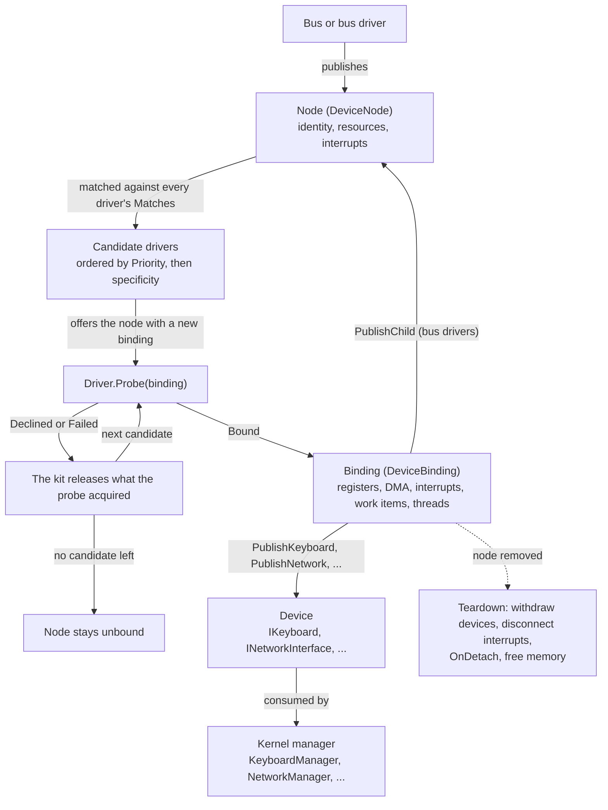

# Writing a Driver

In this article, we will discuss how to write a device driver for Cosmos Gen3: how a driver is matched to a device, how it reaches the hardware, how it hands the kernel a device, and how it is tested without hardware.

If you find bugs or something abnormal, please [submit an issue](https://github.com/CosmosOS/Cosmos/issues/new/choose) on our repository.

## Experimental status

The driver kit is experimental: every public type under `Cosmos.Kernel.HAL.DriverKit` carries `[Experimental("COSMOS0003")]`. You can use them today, but they may change until they are promoted to the stable API. Referencing one is a build error until your project acknowledges it:

```xml
<PropertyGroup>
  <NoWarn>$(NoWarn);COSMOS0003</NoWarn>
</PropertyGroup>
```

See [Public API Tracking](../dev/public-api.md) for how experimental APIs are promoted.

What the kit supports today:

- **Bus kinds**: platform, PCI, virtio, USB and PS/2 for real hardware, plus the synthetic bus for tests ([Testing a driver over the synthetic bus](#testing-a-driver-over-the-synthetic-bus)).
- **Device kinds**: keyboard, pointer, network interface, block device and display. The kernel managers (`KeyboardManager`, `MouseManager`, `NetworkManager`, `StorageManager`, `DisplayManager`) pick up whatever a driver publishes.
- **Shipped drivers**: every kernel gets the drivers below through `Cosmos.Kernel.Drivers`. They use the same public API as your drivers, so they are the best examples to read. [Excluding and opting in](#excluding-and-opting-in) shows how to drop one.

| Bus | Drivers |
|-----|---------|
| Platform | `PciHostDriver`, `I8042Driver`, `VirtioMmioTransportDriver` |
| PCI | `PcieRootPortDriver`, `VirtioPciTransportDriver`, `XhciDriver`, `E1000EDriver`, `AhciDriver`, `NvmeDriver`, `VmwareSvgaDriver` |
| Virtio | `VirtioNetDriver`, `VirtioBlkDriver`, `VirtioGpuDriver`, `VirtioInputDriver` |
| USB | `UsbHubDriver`, `UsbKeyboardDriver`, `UsbMassStorageDriver` |
| PS/2 | `Ps2KeyboardDriver`, `Ps2MouseDriver` |

Their sources are filed as `<bus>/<category>/<driver>/` (for example `Pci/Network/E1000E/`), and the namespace follows the folder.

## What a driver is

The kit is built on five concepts:

| Concept | What it is |
|---------|------------|
| **Node** (`DeviceNode`) | A piece of hardware the kernel can see: its identity on a bus, its resources and its interrupts. Buses and bus drivers publish nodes. |
| **Bus kind** | What a node looks like on a given bus (platform, PCI, virtio, USB, PS/2, synthetic) and how a driver matches it. |
| **Driver** (`Driver`) | Your class: it says which nodes it wants, and takes or declines each one it is offered. |
| **Binding** (`DeviceBinding`) | The link between one driver and one node. The driver reaches the hardware and the kernel only through it, and it remembers everything the driver acquired. |
| **Device** | What the driver hands the kernel: an `IKeyboard`, `IPointer`, `INetworkInterface`, `IBlockDevice` or `IDisplay`. |

When a node appears, the kit offers it to each matching driver in turn until one returns `ProbeResult.Bound`; whatever a declining driver acquired is released. When the node goes away, the kit tears the binding down for you: devices are withdrawn first, memory is freed last.



The smallest driver that compiles and binds:

```csharp
using Cosmos.Kernel.HAL.DriverKit;
using Cosmos.Kernel.HAL.DriverKit.Synthetic;

namespace MyOS.Drivers;

[Driver]
public sealed class SampleDriver : Driver
{
    private readonly DeviceMatch[] _matches = [SyntheticMatch.Key("sample")];

    public override string Name => "sample";

    public override ReadOnlySpan<DeviceMatch> Matches => _matches;

    public override ProbeResult Probe(DeviceBinding binding)
    {
        binding.Log("bound");
        return ProbeResult.Bound;
    }
}
```

`Name` is shown in the log, `Matches` lists the nodes the driver wants, and `Priority` (`0` by default) decides which matching driver is offered a node first. `Probe` is required; `OnDetach` is optional.

Each driver class is instantiated once and offered every node it matches, so its fields are shared across devices. Keep per-device state in an object created in `Probe` and stored in `binding.DriverState`.

## Where a driver runs

The driver stage runs from `Kernel.Start`, once the heap, the interrupt controller and the scheduler are up and interrupts are enabled. The kit offers every node published so far, including the children a bus driver publishes from its probe, and returns when all of them have been offered. `OnBoot` and `BeforeRun` run after it, so every bound device is usable there.

The serial log shows each node, its candidate drivers and the result of the offer. An excerpt from an x64 kernel launched with `cosmos run --nic virtio-net-pci`:

```
[Kernel] Starting drivers...
[Drivers] manifest: PcieRootPortDriver(prio 0) VirtioPciTransportDriver(prio 0) ... VirtioBlkDriver(prio 0)
[Drivers] engine started, worker thread
...
[Drivers] platform:pci@cf8 candidates: PciHostDriver(prio 0, spec 1)
[Drivers] platform:pci@cf8 PciHostDriver: 6 functions on 1 buses
[Drivers] platform:pci@cf8 offer PciHostDriver -> bound
...
[Drivers] pci:0000:00:01.0 no driver
[Drivers] pci:0000:00:02.0 candidates: VirtioPciTransportDriver(prio 0, spec 1)
[Drivers] pci:0000:00:02.0 offer VirtioPciTransportDriver -> bound
...
[Drivers] virtio:pci:0000:00:02.0 candidates: VirtioNetDriver(prio 0, spec 1)
[Drivers] virtio:pci:0000:00:02.0 VirtioNetDriver published network "virtio-net" (consumed)
[Drivers] virtio:pci:0000:00:02.0 offer VirtioNetDriver -> bound
[Kernel] Calling OnBoot()...
```

A node published after boot, such as a USB device plugged in, takes the same path. See [Kernel Startup](startup.md) for the rest of the boot sequence.

Probes, teardowns and work items run one at a time on the kit's worker thread, so a driver never sees two of them overlap. Only driver threads run concurrently.

A kernel built with `CosmosEnableScheduler` off has no worker thread: probing still works, but `WorkItem.Schedule`, `TrySchedulePeriodic` and `TryStartThread` return `false`. A driver that must work in such a kernel checks those results. The engine then runs inline: the thread that publishes or retracts a node drains the queue itself, and the log says `engine started, inline (no worker)`.

## The two execution contexts and the guard

Driver code runs in one of two contexts: thread or interrupt.

| Entry point | Context | May block | May allocate |
|-------------|---------|-----------|--------------|
| `Probe`, `OnDetach`, work items | thread (the kit worker) | yes | yes |
| Driver threads | thread (their own) | yes | yes |
| Device methods the kernel calls (`Transmit`, `Flush`, ...) | thread (the caller's) | briefly | yes |
| Interrupt handlers | interrupt | **no** | **no** |

An interrupt handler should acknowledge the device and hand the rest to a work item. Its `InterruptContext` offers three calls: `Mask()` its own source, `Signal(DeviceEvent)` a waiting thread, and `Schedule(WorkItem)` work that needs thread context. It may also read and write its registers and DMA buffers and report through a sink, but it must not allocate (no `new` of a reference type, no string building, no capturing lambda) and must not block.

Calling a `DeviceBinding` method from a handler stops the kernel with a panic naming the member. Over the synthetic bus it throws instead: the kit records the fault on the node and masks the source, so a test can assert it.

## The attribute and the manifest

The build registers every class marked `[Driver]`: a source generator writes `DriverManifest.g.cs` into the kernel project, which constructs each driver once at boot ([Driver Manifest](../dev/build/driver-manifest.md) describes the generator). A driver class must derive from `Driver`, be concrete and non-generic, and have a parameterless constructor. It may be `internal` in the kernel project, but must be `public` in a driver library ([A driver library](#a-driver-library)).

The attribute takes two options:

- `[Driver(Feature = DriverFeature.Keyboard)]` registers the driver only when the matching feature switch (`CosmosEnableKeyboard`) is on; otherwise it is trimmed from the kernel.
- `[Driver(Default = false)]` registers the driver only when the kernel opts into it by name ([Excluding and opting in](#excluding-and-opting-in)).

The manifest order is deterministic (the kernel's own drivers first, then those of referenced libraries) and is printed at boot.

## Identity and matches

Every node has a `DeviceIdentity`, set by its bus: `BusName`, `Address`, and `Describe()` for the log. The node's `Path` joins the first two (`pci:0000:00:03.0`) and is how the log names the node.

A driver's `Matches` is a list of `DeviceMatch`. Each one tests an identity and has a `Specificity`: the number of fields it checks. Every bus kind has its own pair of types (`PciIdentity` and `PciMatch`, `UsbIdentity` and `UsbMatch`, ...), described with their buses below. On the synthetic bus:

```csharp
// This device and no other: specificity 1.
private readonly DeviceMatch[] _matches = [SyntheticMatch.Key("kbd")];

// Every synthetic device: specificity 0.
private readonly DeviceMatch[] _matches = [SyntheticMatch.Any()];
```

When a node appears, the kit orders the matching drivers by `Priority`, then by specificity (highest first), then by manifest order, and offers the node to each until one returns `Bound`:

```
[Drivers] synthetic:prio candidates: HighPriorityDriver(prio 10, spec 1) LowPriorityDriver(prio 0, spec 1)
[Drivers] synthetic:prio offer HighPriorityDriver -> bound
```

To replace a shipped driver for the same hardware, give yours a `Priority` above `0`. A node no driver takes is logged `no driver` and stays `Unbound`.

## Probe and the binding

`Probe` is the only required entry point, and `DeviceBinding` is the driver's only way to reach the hardware and the kernel. Everything the driver acquires through it (register windows, DMA memory, interrupts, events, work items, threads, published devices, child nodes) is recorded on the binding and released by the kit, so a driver never writes cleanup code.

A probe reads the node (`binding.Node.Resources`, `binding.Node.Interrupts`, `binding.Node.Access<T>()`), acquires what it needs, creates its per-device state, publishes the device and returns. A full driver, modelled on the keyboard driver of the Drivers suite:

```csharp
using Cosmos.Kernel.HAL.DriverKit;
using Cosmos.Kernel.HAL.DriverKit.Synthetic;

namespace MyOS.Drivers;

[Driver(Feature = DriverFeature.Keyboard)]
public sealed class SyntheticKeyboardDriver : Driver
{
    public const string Key = "kbd";

    private readonly DeviceMatch[] _matches = [SyntheticMatch.Key(Key)];

    public override string Name => "synthetic-keyboard";

    public override ReadOnlySpan<DeviceMatch> Matches => _matches;

    public override ProbeResult Probe(DeviceBinding binding)
    {
        if (binding.Node.Resources.Count == 0 || binding.Node.Interrupts.Count == 0)
        {
            return ProbeResult.Declined("no register window or no interrupt source");
        }

        RegisterWindow window = binding.MapRegisters(0);
        DeviceEvent keyEvent = binding.CreateEvent();
        KeyboardState state = new(binding, window, keyEvent);
        binding.DriverState = state;

        state.Sink = binding.PublishKeyboard(state);

        if (!binding.TryRequestInterrupt(binding.Node.Interrupts[0], state.OnInterrupt, out InterruptHandle? handle))
        {
            return ProbeResult.Failed("interrupt 0 could not be connected");
        }

        state.Handle = handle;

        // The handler is live from here on, so the device is armed last.
        window.Write8(KeyboardState.ControlOffset, KeyboardState.EnableBit);
        return ProbeResult.Bound;
    }

    public override void OnDetach(DeviceBinding binding, DetachReason reason)
    {
        if (reason.HardwarePresent && binding.DriverState is KeyboardState state)
        {
            state.Window.Write8(KeyboardState.ControlOffset, 0);
        }
    }
}
```

The state object is a plain class, not a `Driver`: there is one per device, and it implements the device contract, owns the handler, and holds every kit object the probe acquired:

```csharp
using Cosmos.Kernel.HAL.DriverKit;
using Cosmos.Kernel.HAL.DriverKit.Devices;

namespace MyOS.Drivers;

public sealed class KeyboardState : IKeyboard
{
    public const int ControlOffset = 0x00;
    public const int ScanCodeOffset = 0x10;
    public const int FlagsOffset = 0x11;
    public const byte EnableBit = 1;
    public const byte ReleasedFlag = 1;

    private readonly DeviceBinding _binding;
    private KeyboardLeds _leds;

    public KeyboardState(DeviceBinding binding, RegisterWindow window, DeviceEvent keyEvent)
    {
        _binding = binding;
        Window = window;
        KeyEvent = keyEvent;
        KeyWork = binding.CreateWorkItem(OnKeyWork);
    }

    public string Name => "synthetic-kbd";

    public RegisterWindow Window { get; }

    public DeviceEvent KeyEvent { get; }

    public WorkItem KeyWork { get; }

    public KeyboardSink? Sink { get; set; }

    public InterruptHandle? Handle { get; set; }

    public void SetLeds(KeyboardLeds leds) => _leds = leds;

    // Interrupt context: reads two registers, reports the key, wakes the
    // thread and hands the rest to the work item. Allocates nothing.
    public void OnInterrupt(InterruptContext context)
    {
        byte scanCode = Window.Read8(ScanCodeOffset);
        bool released = (Window.Read8(FlagsOffset) & ReleasedFlag) != 0;
        Sink?.Report(scanCode, released);
        context.Signal(KeyEvent);
        context.Schedule(KeyWork);
    }

    // Thread context, on the kit worker.
    public void OnKeyWork()
    {
        _binding.Log("key work ran");
    }
}
```

Neither class allocates pages, programs an interrupt controller, registers the keyboard with a manager or frees anything: the binding does all of it. The sections below cover its members; their samples are pieces of a driver's `Probe` or of its state object.

### Register windows

`binding.MapRegisters(resourceIndex)` maps one of `Node.Resources` and returns a `RegisterWindow`, with `Read8` to `Read64` and `Write8` to `Write64` at a byte offset. Every access is bounds-checked and carries the barriers it needs, so a doorbell write always lands after the DMA stores before it. The same code works over a memory window, a synthetic node's RAM window and an x64 port range. The accessors are safe from an interrupt handler, and throw once the binding is torn down.

### Bulk regions

`binding.MapRegion(resourceIndex, RegionCaching)` maps a resource as plain memory, for a framebuffer or a command queue, and returns a `DeviceRegion`. Unlike a register window, its accesses are neither checked nor ordered:

```csharp
// In Probe:
DeviceRegion framebuffer = binding.MapRegion(1, RegionCaching.WriteCombining);
framebuffer.Span.Fill(0);
Span<uint> pixels = framebuffer.As<uint>();
pixels[0] = 0x00FF0000;
```

The second argument tells the CPU how to cache the region. Pick it by what the region holds:

- `RegionCaching.Device` for commands the device reads, such as a command queue: every read and write goes straight to the device, in order.
- `RegionCaching.WriteCombining` for a framebuffer: writes are grouped into bursts, which is much faster for drawing pixels.
- `RegionCaching.Normal` for ordinary RAM shared with the device.

Today every memory window is mapped as `Device`, whatever you ask. Pick the right value anyway: the kit records it and will apply it once the platform supports it.

### DMA memory

`binding.AllocateDma(length, alignment)` returns a `DmaBuffer`: zeroed, physically contiguous memory, with `PhysicalAddress` for the device and `Span` for the CPU.

DMA memory usually holds a **ring**: a fixed array of descriptors that the driver and the device use as a circular queue. Each descriptor points at a data buffer and says who owns it. The driver fills descriptors, hands them to the device and writes a register (the doorbell) to say new ones are ready; the device processes them in order, marks each one done, and wraps back to the first after the last. A network card, for example, has a receive ring the device fills with incoming frames and a transmit ring the driver fills with outgoing ones.

For a device that only addresses 32 bits, `TryAllocateDma` takes a constraint and returns `false` instead of throwing:

```csharp
// In Probe:
if (!binding.TryAllocateDma(RingBytes, 4096, DmaConstraints.Addressable32Bit, out DmaBuffer? ring))
{
    return ProbeResult.Declined("no DMA memory below 4 GiB");
}
```

DMA is coherent, so only ordering matters. Call `DmaBuffer.WriteBarrier()` between filling a descriptor and handing it to the device, and `DmaBuffer.ReadBarrier()` between reading a flag the device wrote and reading the data it guards. Register writes carry their own barrier:

```csharp
// When sending, for example in Transmit:
Span<byte> descriptors = ring.Span;
descriptors[8] = 0x01;                   // fill the descriptor
DmaBuffer.WriteBarrier();
descriptors[0] = OwnedByDevice;          // then hand it over

window.Write32(DoorbellOffset, 1);       // no barrier needed
```

Never hand a device a managed array: the garbage collector does not know the device holds it.

### Interrupts

`binding.TryRequestInterrupt(source, handler, out handle)` connects a handler to one of `Node.Interrupts`. It returns `false` when the platform cannot deliver that interrupt, so the driver can decline or poll instead. The handler is live as soon as the call returns `true`, which lets a probe send a command and wait for the interrupt; arm the device last if it must not interrupt earlier.

```csharp
// In Probe:
if (!binding.TryRequestInterrupt(binding.Node.Interrupts[0], state.OnInterrupt, out InterruptHandle? handle))
{
    return ProbeResult.Declined("the interrupt cannot be delivered");
}

state.Handle = handle;
```

The handler runs in interrupt context: it acknowledges the device and leaves the real work to a work item. With an `OnInterrupt` method on the state object:

```csharp
// In the state object, in interrupt context:
public void OnInterrupt(InterruptContext context)
{
    uint cause = Window.Read32(InterruptCauseOffset);
    Window.Write32(InterruptCauseOffset, cause);   // acknowledge
    context.Schedule(ReceiveWork);
}
```

The `InterruptHandle` masks and unmasks the source (`Mask()`, `Unmask()`) from any context. A handler that throws leaves its source masked.

### Events and waiting

`binding.CreateEvent()` returns a `DeviceEvent`. A handler signals it with `context.Signal(evt)`; a thread waits with `binding.Wait(evt, timeoutMilliseconds)`, which returns `true` on a signal, and `false` on timeout or once teardown has started.

A probe can send a command and wait for the device to answer. The handler calls `context.Signal(CommandDone)`, and the probe waits on the same event:

```csharp
// In Probe:
state.CommandDone = binding.CreateEvent();
// ... connect the interrupt, then send the command
window.Write32(CommandOffset, ResetCommand);

if (!binding.Wait(state.CommandDone, 100))
{
    return ProbeResult.Failed("the device did not answer the reset");
}
```

For short waits in thread context, `binding.Delay(microseconds)` busy-waits and `binding.Sleep(milliseconds)` gives up the CPU:

```csharp
// In Probe or a work item:
window.Write32(ControlOffset, ResetBit);
binding.Delay(10);   // the device needs 10 µs before the next access
```

### Work items

`binding.CreateWorkItem(callback)` returns a `WorkItem` whose callback runs on the kit worker when scheduled. `context.Schedule(item)` from a handler, or `item.Schedule()` from anywhere, queues it without allocating; it returns `false` when the item is already queued, cancelled by teardown, or the kernel has no worker. Create work items in `Probe` and schedule them later:

```csharp
// In Probe: create the work item once.
state.ReceiveWork = binding.CreateWorkItem(state.DrainReceiveRing);

// In the handler: queue it.
context.Schedule(ReceiveWork);

// On the kit worker, in thread context: may allocate, wait and report.
public void DrainReceiveRing()
{
    // walk the receive ring and hand each frame to Sink.Receive
}
```

### Periodic work

`binding.TrySchedulePeriodic(intervalMilliseconds, item)` runs a work item at an interval until teardown, rounded to the timer's tick. It returns `false` when the kernel has no timer or no scheduler. The kit never polls on a driver's behalf. With an `OnPoll` method on the state object:

```csharp
// In Probe:
WorkItem poll = binding.CreateWorkItem(state.OnPoll);
if (!binding.TrySchedulePeriodic(20, poll))
{
    return ProbeResult.Failed("no timer to poll with");
}
```

### Driver threads

`binding.TryStartThread(name, entry, out thread)` starts a thread for work that has to wait, and returns `false` when the scheduler is not running. The thread loops on the binding's events and returns once `IsDetaching` is true; teardown wakes every waiter, then joins the thread:

```csharp
// In the state object, on the driver thread:
public void ThreadMain()
{
    while (!_binding.IsDetaching)
    {
        if (_binding.Wait(KeyEvent, 50))
        {
            // a key arrived; drain the device in thread context
        }
    }
}
```

```csharp
// In Probe:
DrainState state = new(binding);
binding.DriverState = state;

if (!binding.TryStartThread("drain", state.ThreadMain, out DriverThread? thread))
{
    return ProbeResult.Failed("no scheduler to run the drain thread on");
}
```

### Device locks

`binding.CreateLock()` returns a `DeviceLock`, for a device entered from several contexts at once, such as a `Transmit` the network stack calls while the driver's work item drains the receive ring. `Acquire()` disables interrupts until the scope is disposed. The lock is not reentrant, and must never be held across `Sleep`, `Wait`, `Delay`, a sink call or a publish:

```csharp
// In the state object, called by the network stack:
public bool Transmit(ReadOnlySpan<byte> frame)
{
    using (_lock.Acquire())
    {
        // check the ring, copy the frame, write the descriptor,
        // DmaBuffer.WriteBarrier(), then advance the tail register
    }

    return true;
}
```

### Publishing a device

A device kind is a small interface the driver implements, plus a **sink** the kit hands back for the driver to report events through:

| Kind | The driver implements | Publish call | The driver reports through |
|------|-----------------------|--------------|----------------------------|
| Keyboard | `IKeyboard` (`Name`, `SetLeds`) | `PublishKeyboard` | `KeyboardSink.Report(scanCode, released)` |
| Pointer | `IPointer` (`Name`) | `PublishPointer` | `PointerSink.ReportRelative(...)`, `ReportAbsolute(...)` |
| Network | `INetworkInterface` (`Name`, `MacAddress`, `LinkUp`, `Transmit`) | `PublishNetwork` | `NetworkSink.Receive(frame)`, `LinkChanged(up)` |
| Block | `IBlockDevice` | `PublishBlockDevice` | nothing |
| Display | `IDisplay` (`Name`, `Mode`, `Framebuffer`, `Flush`) | `PublishDisplay` | `DisplaySink.ModeChanged()` |

The kernel's manager for that kind picks the device up as soon as it is published, and teardown withdraws it before releasing anything else. Sinks never allocate, and drop reports once the device is withdrawn.

With a `NicState` state object implementing `INetworkInterface`, the probe publishes it and keeps the sink it gets back:

```csharp
// In Probe:
NicState state = new(binding);
binding.DriverState = state;
state.Sink = binding.PublishNetwork(state);

// In the receive work item, for each frame the device received:
Sink?.Receive(frame);
```

The log records both ends, here for the keyboard sample above:

```
[Drivers] synthetic:kbd synthetic-keyboard published keyboard "synthetic-kbd" (consumed)
[Drivers] synthetic:kbd synthetic-keyboard withdrew keyboard "synthetic-kbd"
```

A few rules per kind:

- **Network**: call `NetworkSink.Receive` from thread context, never from the handler; hand received frames to a work item.
- **Block**: `PublishBlockDevice` registers the disk with `StorageManager` and scans its partitions before returning, so the device must be ready. If the manager refuses it, the probe fails.
- **Display**: publish the display as you found it; `Mode` is empty until something sets one, and `Framebuffer` is `null` when the CPU cannot draw into it. The same object may also implement `IDisplayModes` to switch modes and `IHardwareCursor` for a hardware cursor. The bootloader's framebuffer is published as the firmware display at boot, and withdrawn when a driver binds the PCI function it lives in.

See [Graphics](graphics.md) and [File System](filesystem.md) for the consuming side.

### Publishing child nodes

A bus driver publishes the devices it finds as child nodes: `binding.PublishChild(identity, resources, interrupts, access)` adds one beneath its node, to be offered to drivers like any other, and `binding.RetractChild(child, hardwarePresent)` removes it. Children go away with their parent, and their drivers see `DetachCause.ParentRetracted`.

A bus driver either uses a bus kind the kit defines (the virtio transports publish `VirtioIdentity` nodes) or brings its own identity and match pair:

```csharp
using Cosmos.Kernel.HAL.DriverKit;

namespace MyOS.Drivers;

public sealed class ChildIdentity : DeviceIdentity
{
    public ChildIdentity(string name)
    {
        Name = name;
    }

    public string Name { get; }

    public override string BusName => "mybus";

    public override string Address => Name;

    public override string Describe() => string.Concat("child ", Name);
}

public sealed class ChildMatch : DeviceMatch
{
    private readonly string _name;

    public ChildMatch(string name)
    {
        _name = name;
    }

    public override int Specificity => 1;

    public override bool Matches(DeviceIdentity identity) =>
        identity is ChildIdentity child && string.Equals(_name, child.Name);
}
```

```csharp
// In the bus driver:
public override ProbeResult Probe(DeviceBinding binding)
{
    DeviceResource[] resources =
    [
        DeviceResource.MemoryWindow(0xFEB00000, 0x1000),   // the child's registers, index 0
    ];

    DeviceNode child = binding.PublishChild(new ChildIdentity("port0"), resources, [], null);
    binding.DriverState = child;
    return ProbeResult.Bound;
}
```

A bus driver may also publish a child of a bus kind the kit already defines: the shipped virtio transport drivers publish their device with the kit's `VirtioIdentity`, no resources, the nine interrupt sources of a `VirtioAccess` and that access as the access object ([Virtio devices](#virtio-devices)), and the kit's USB enumeration core publishes a device's interfaces beneath the xHCI or hub driver's node with a `UsbIdentity`, no resources, no interrupt sources and a `UsbAccess` ([USB devices](#usb-devices)).

Resources are built with `DeviceResource.MemoryWindow`, `PortRange`, `RamWindow` or `None` (an unassigned slot that keeps the indices after it). Interrupts are `InterruptSource` subclasses the bus provides.

### Logging

`binding.Log(message)` writes one line to the serial log from thread context: `[Drivers] synthetic:kbd synthetic-keyboard: message`.

## Declining and failing

`Probe` returns one of three results:

| Result | When to return it |
|--------|-------------------|
| `ProbeResult.Bound` | The driver took the device. |
| `ProbeResult.Declined(reason)` | The device is not one the driver serves after all (an unknown revision, a missing feature). |
| `ProbeResult.Failed(reason)` | The device is one the driver serves, but bringing it up did not work. An exception escaping `Probe` counts as a failure. |

On anything but `Bound`, the kit releases everything the probe acquired, then offers the node to the next candidate. The reason is printed in the log:

```
[Drivers] synthetic:decline offer DecliningDriver -> declined: declined on purpose
[Drivers] synthetic:decline offer AnyKeyDriver -> bound
[Drivers] synthetic:throw offer ThrowingDriver -> failed: probe threw on purpose
```

## Teardown and OnDetach

When a node goes away (the device is unplugged, its parent is removed, or a test retracts it), the kit tears its binding down in a fixed order:

1. `IsDetaching` turns true, and the binding refuses any new acquisition.
2. Child nodes are removed.
3. Published devices are withdrawn, so the kernel stops using them.
4. Interrupts are disconnected, and work items, periodic work and driver threads are stopped.
5. `OnDetach` runs.
6. Memory is freed: DMA buffers, register windows and regions.

`OnDetach` is optional. It is the place to stop the hardware, because interrupts and threads are already stopped and the registers are still mapped. Check `reason.HardwarePresent` first: it is `false` when the device was unplugged, and the registers must not be touched then.

```csharp
// In the driver:
public override void OnDetach(DeviceBinding binding, DetachReason reason)
{
    if (reason.HardwarePresent && binding.DriverState is KeyboardState state)
    {
        state.Window.Write8(KeyboardState.ControlOffset, 0);   // disable the device
    }
}
```

`reason.Cause` says why: `DetachCause.Retracted` when the node itself was removed, `DetachCause.ParentRetracted` when its parent was.

```
[Drivers] synthetic:kbd synthetic-keyboard withdrew keyboard "synthetic-kbd"
[Drivers] synthetic:kbd retracted
```

## Buses

Buses nest. The machine description publishes the root nodes, and bus drivers publish the devices they find beneath them. On an x64 machine, for example:

```
platform:i8042@60                    I8042Driver
├── ps2:kbd                          Ps2KeyboardDriver
└── ps2:aux                          Ps2MouseDriver
platform:pci@cf8                     PciHostDriver
├── pci:0000:00:02.0                 VirtioPciTransportDriver
│   └── virtio:pci:0000:00:02.0      VirtioNetDriver
└── pci:0000:00:04.0                 XhciDriver
    └── usb:1-1:0                    UsbKeyboardDriver
```

A driver only sees its own node: a virtio driver never learns which transport carries its device, and a USB driver never sees the controller or the hubs above it.

### Platform nodes

Platform nodes are the roots: devices nothing can enumerate, which the machine description publishes at boot. A kernel cannot publish its own.

| Machine | Node | Compatible |
|---------|------|------------|
| x64 | `platform:i8042@60`, the PS/2 controller | `pnp0303` |
| x64 | `platform:pci@cf8`, the PCI host | `pci-host-legacy` |
| ARM64 | `platform:pci@<base>`, the PCI host | `pci-host-ecam-generic` |
| ARM64 | `platform:virtio_mmio@<base>`, one per occupied slot | `virtio,mmio` |

On ARM64 they come from ACPI, the device tree, or the virt machine's fixed layout. A driver matches a platform node by one of its compatible strings:

```csharp
// In the driver:
private readonly DeviceMatch[] _matches = [PlatformMatch.Compatible("virtio,mmio")];
```

`PlatformMatch.Any()` matches every platform node.

### The PCI host driver

`PciHostDriver` binds the PCI host node, scans every bus behind it, following bridges, and publishes one `pci:` node per function it finds. The functions behind a PCI Express hot-plug slot are published by `PcieRootPortDriver` instead, when a device is plugged in. A function no driver matches is left as the firmware set it up.

## PCI devices

A PCI node is one function: its identity read from the configuration header, six resources (its base address registers), its interrupt sources (the legacy line, then its MSI-X messages) and a `PciAccess` for its configuration space. The shipped `E1000EDriver` is a good model, and the samples below are its steps.

### Identity and match

`PciIdentity` holds the header fields a driver matches on: `VendorId`, `DeviceId`, `SubsystemVendorId`, `SubsystemId`, `ClassCode`, `Subclass`, `ProgIf` and `Revision`, plus the function's address. The node path is `pci:<segment>:<bus>:<device>.<function>`, for example `pci:0000:00:03.0`.

`PciMatch` takes any of those fields; every field given must be equal, and the specificity is the number of fields given:

```csharp
// In the driver:
using Cosmos.Kernel.HAL.DriverKit.Pci;

private readonly DeviceMatch[] _matches =
[
    new PciMatch(vendorId: 0x8086, deviceId: 0x10D3),   // one chip: specificity 2
    new PciMatch(classCode: 0x02),                      // every network controller: specificity 1
];
```

A match must set at least one field. Prefer the device ids you tested over a class match: the shipped E1000E matches six Intel device ids and nothing else.

### The access object

`binding.Node.Access<PciAccess>()` reaches the function's configuration space:

- `ReadConfig8/16/32` and `WriteConfig8/16/32` read and write a register at an offset.
- `FindCapability(id)` returns the offset of a capability, or 0.
- `EnableMemorySpace`, `EnableIoSpace` and `EnableBusMastering` turn on what the driver uses: decoding makes the registers answer, bus mastering lets the device reach DMA memory.
- `Bars` describes the six base address registers (next section).

Before the first probe, the kit turns bus mastering and interrupts off on the function, so a probe turns on what it needs itself. If every driver declines, the kit restores what the firmware had set.

### BAR resources

`Node.Resources` of a PCI node always has six entries, one per base address register: a `MemoryWindow`, a `PortRange`, or `None` for a register that is not assigned (or is the upper half of a 64-bit one). Mapping a `None` entry throws, so check `pci.Bars[i]` first:

```csharp
// In Probe:
PciAccess pci = binding.Node.Access<PciAccess>();
PciBar bar0 = pci.Bars[0];
if (!bar0.IsAssigned || bar0.IsIo || bar0.Length < 0x20000)
{
    return ProbeResult.Declined("BAR0 is not a memory window of 128 KiB");
}

RegisterWindow registers = binding.MapRegisters(0);
pci.EnableMemorySpace(true);
pci.EnableBusMastering(true);
```

### The legacy line

`Node.Interrupts[0]` is the function's legacy interrupt line. It is only routed on x64, and never shared with another device, so `TryRequestInterrupt` often returns `false`. Even when it connects, the routing has only been validated on QEMU, so pair it with a periodic drain that keeps the device working if the line never fires:

```csharp
// In Probe:
WorkItem drain = binding.CreateWorkItem(state.Drain);
state.DrainWork = drain;

bool hasLine = binding.TryRequestInterrupt(binding.Node.Interrupts[0], state.OnInterrupt, out _);
bool polling = binding.TrySchedulePeriodic(50, drain);
if (!hasLine && !polling)
{
    return ProbeResult.Declined("no interrupt and no timer to poll with");
}
```

The handler acknowledges the device and schedules the same drain, which must therefore be safe to run at any time.

### Message interrupts

When the function supports MSI-X, `Node.Interrupts[1]` onwards are its messages, up to 32. They need memory decoding on, because the MSI-X table lives in a BAR, and they return `false` where the platform cannot route messages (ARM64 without a GICv3 ITS). Connecting a message turns the legacy line off, so the two are never live together:

```csharp
// In Probe:
pci.EnableMemorySpace(true);   // before requesting a message

bool hasMessage = binding.Node.Interrupts.Count > 1
    && binding.TryRequestInterrupt(binding.Node.Interrupts[1], state.OnInterrupt, out _);
```

### Hot-plug slots

A function behind a PCI Express hot-plug slot is published when a device is plugged in, and retracted when it is removed; `PcieRootPortDriver` handles the slot. If the firmware left the function's registers unassigned, the kit places them before the function is offered, so a driver needs nothing special: it checks `Bars` as usual, and leaves the registers alone in `OnDetach` when `reason.HardwarePresent` is `false`.

## Virtio devices

A virtio node is one virtio device, published by a transport driver over PCI or MMIO. It has no resources, nine interrupt sources and a `VirtioAccess` that speaks the virtio protocol, so a driver works the same over both transports. The shipped `VirtioNetDriver` is a good model, and the samples below are its steps.

### Virtio identity and match

`VirtioIdentity` carries the `DeviceType` (`VirtioDeviceType.Network`, `Block`, `Gpu`, `Input`, ...) and the transport, which shows in the node path (`virtio:pci:0000:00:02.0`, `virtio:mmio:a003e00`) but never matters to the driver. A driver matches on the device type:

```csharp
// In the driver:
using Cosmos.Kernel.HAL.DriverKit.Virtio;

private readonly DeviceMatch[] _matches = [VirtioMatch.DeviceType(VirtioDeviceType.Network)];
```

### The virtio access object

`binding.Node.Access<VirtioAccess>()` is the device. A probe uses it in this order:

1. `NegotiateFeatures(requested, out negotiated)` with the feature bits the driver understands. It returns `false` when the device rejects them.
2. `TryCreateQueue` for each queue ([Queues](#queues)).
3. `ReadConfig8/16/32` and `WriteConfig8` for the device's own configuration, such as a network card's MAC address.
4. `TryRequestInterrupt` on the queue and configuration sources ([Virtio interrupt sources](#virtio-interrupt-sources)).
5. `SetDriverOk()`, after which the device is live.

The kit resets the device before every probe, so a probe starts at the negotiation:

```csharp
// In Probe:
VirtioAccess dev = binding.Node.Access<VirtioAccess>();
if (!dev.NegotiateFeatures(FeatureMac | FeatureStatus, out uint features))
{
    return ProbeResult.Failed("the device rejected the feature set");
}
```

`Reset()` stops the device; a driver calls it in `OnDetach`.

### Queues

A virtqueue is a ring ([DMA memory](#dma-memory)) the driver and the device share. `dev.TryCreateQueue(binding, index, preferredSize, out Virtqueue? queue)` allocates one and activates it on the device. A `Virtqueue` offers:

- `TryAllocateDescriptor(out index)` and `FreeDescriptor(index)`.
- `SetDescriptor(index, physicalAddress, length, flags)`: `VirtqueueDescriptorFlags.Write` for a buffer the device fills, `Next` to chain descriptors.
- `Submit(head)` hands a descriptor chain to the device, and `Notify()` rings the doorbell.
- `TryTakeUsed(out id, out length)` takes back what the device finished.

A queue is not thread-safe: guard it with a `DeviceLock` when `Transmit` and a work item share it. Buffers may be submitted before `SetDriverOk`, but `Notify` only after:

```csharp
// In Probe:
if (!dev.TryCreateQueue(binding, ReceiveQueue, 128, out Virtqueue? receiveQueue))
{
    return ProbeResult.Failed("no receive queue");
}

// One buffer per descriptor, for the device to write received frames into.
DmaBuffer receiveBuffers = binding.AllocateDma(receiveQueue.Size * BufferBytes, 4096);
for (int i = 0; i < receiveQueue.Size; i++)
{
    receiveQueue.TryAllocateDescriptor(out ushort slot);
    ulong physical = receiveBuffers.PhysicalAddress + (ulong)(slot * BufferBytes);
    receiveQueue.SetDescriptor(slot, physical, BufferBytes, VirtqueueDescriptorFlags.Write);
    receiveQueue.Submit(slot);
}

// ... connect the interrupts ...

dev.SetDriverOk();
receiveQueue.Notify();
state.Sink = binding.PublishNetwork(state);
```

### Virtio interrupt sources

`dev.QueueInterrupt(n)` is the interrupt of queue `n`, and `dev.ConfigInterrupt` fires when the device's configuration changes. When the transport could not route them (ARM64 without a GICv3 ITS, for example), `TryRequestInterrupt` returns `false` and the driver polls instead:

```csharp
// In Probe:
WorkItem drain = binding.CreateWorkItem(state.Drain);
bool hasInterrupt = binding.TryRequestInterrupt(dev.QueueInterrupt(ReceiveQueue), state.OnInterrupt, out _);
if (!hasInterrupt && !binding.TrySchedulePeriodic(50, drain))
{
    return ProbeResult.Declined("no interrupt and no timer to poll with");
}
```

In `OnDetach`, reset the device so it stops writing into memory the kit is about to free, then give DMA in flight a moment to land:

```csharp
// In the driver:
public override void OnDetach(DeviceBinding binding, DetachReason reason)
{
    if (reason.HardwarePresent)
    {
        binding.Node.Access<VirtioAccess>().Reset();
        binding.Delay(100);
    }
}
```

### The transport drivers

`VirtioPciTransportDriver` binds every virtio PCI function (vendor `0x1AF4`), using the modern interface and MSI-X messages only. `VirtioMmioTransportDriver` binds the `virtio,mmio` platform nodes on ARM64. A leaf driver never deals with either.

### The shipped leaf drivers

| Driver | Device type | Publishes |
|--------|-------------|-----------|
| `VirtioNetDriver` | `Network` | a network interface, `virtio-net` |
| `VirtioInputDriver` | `Input` | a keyboard, `virtio-keyboard`, or a pointer, `virtio-mouse` |
| `VirtioBlkDriver` | `Block` | a block device, `vblk<n>` |
| `VirtioGpuDriver` | `Gpu` | a display, `virtio-gpu` (2D only) |

### The display drivers

| Driver | Hardware | Notes |
|--------|----------|-------|
| `VirtioGpuDriver` | virtio-gpu, over PCI or MMIO | 2D: the guest draws, the host composites |
| `VmwareSvgaDriver` | VMware SVGA II, PCI, x64 only | Switches modes and draws a hardware cursor; replaces the firmware framebuffer, which lives in its VRAM |

### The storage drivers

| Driver | Hardware | Disk names |
|--------|----------|------------|
| `AhciDriver` | SATA controllers in AHCI mode (disks only, no CD-ROM) | `sata<n>` |
| `NvmeDriver` | NVMe controllers | `nvme<controller>n<namespace>` |
| `VirtioBlkDriver` | virtio-blk, over PCI or MMIO | `vblk<n>` |

A USB stick is handled by `UsbMassStorageDriver` ([The USB class drivers](#the-usb-class-drivers)). Every disk is registered with `StorageManager` when it is published.

## USB devices

A USB node is what the kit's enumeration core publishes for one interface of a USB device, beneath the node of the driver that found it: the xHCI driver's PCI function for a device on a root port, a hub's interface node for a device behind the hub. It has an identity read once from the device's descriptors, no resources, no interrupt sources, and a `UsbAccess` for everything a class driver does: control transfers on the device's default pipe, the pipes it opens on its endpoints and the bulk transfers through them. A composite device is several nodes sharing one device. A class driver such as the shipped `UsbKeyboardDriver` sees only the access and never a controller register or a transfer ring; the host controller side is the xHCI driver, described [below](#the-xhci-driver), and the snippets in this section are the shipped class drivers' steps.

### USB identity and match

`UsbIdentity` is one interface of one device: `PortPath`, the dotted port chain from the host controller down (`1-2` is root port 2 of controller 1, `1-2.1` port 1 of the hub on that root port), `InterfaceNumber`, `VendorId` and `ProductId`, the device's class triplet `DeviceClass`, `DeviceSubclass` and `DeviceProtocol`, the interface's `InterfaceClass`, `InterfaceSubclass` and `InterfaceProtocol`, the `Speed` the device was attached at and the `ConfigurationValue` the kit selected, the first configuration. `BusName` is `usb` and `Address` is the port path and the interface number joined with a colon, so a stick on root port 1 of the first controller is `usb:1-1:0` and a device on port 1 of a hub on root port 2 is `usb:1-2.1:0`. `Describe()` prints `46f4:0001 class 00.00.00 interface 0 class 08.06.50`: vendor and product, the device class triplet, the interface number and its class triplet, which is what `DeviceNodeInfo.Description` shows for the node.

`UsbMatch` has one constructor with eight optional fields, `vendorId`, `productId`, `deviceClass`, `deviceSubclass`, `deviceProtocol`, `interfaceClass`, `interfaceSubclass` and `interfaceProtocol`: every field given must equal the identity's, every field left `null` is not looked at, and the specificity is the number of fields given, so a vendor and product match (2) outranks a class-only match (1) and a full interface triplet (3) outranks both. The port path and the speed are identity, not match fields, and a match with no field set throws `ArgumentException` (`a USB match constrains at least one field`). The shipped hub driver matches `new UsbMatch(interfaceClass: UsbClassCode.Hub)`; the keyboard and mass storage drivers match their interface triplets:

```csharp
using Cosmos.Kernel.HAL.DriverKit.Usb;

private readonly DeviceMatch[] _matches =
[
    new UsbMatch(interfaceClass: UsbClassCode.Hid, interfaceSubclass: 0x01, interfaceProtocol: 0x01),   // a HID boot keyboard: specificity 3
];
```

Two drivers matching one interface at the same specificity are ordered by priority, as everywhere: the Drivers suite's `UsbDeclineDriver` claims priority 1 over the shipped keyboard driver's 0 and is offered the keyboard first.

### The USB access object

`binding.Node.Access<UsbAccess>()` is the interface. Every member is thread context (a probe, a work item, a driver thread or a ring caller) unless said otherwise, and one called from an interrupt handler stops the way a binding member does:

- The interface's identity: `InterfaceNumber`, `InterfaceClass`, `InterfaceSubclass` and `InterfaceProtocol`; `Endpoints`, those of alternate setting 0 in descriptor order, each a `UsbEndpoint` with `Address`, `Number`, `IsIn`, `Type`, `MaxPacketSize`, `AdditionalTransactions`, `Interval` and `MaxBurst`; `FindEndpoint(type, isIn)`, the first of that type and direction, or `null`; `Speed`, `MaxPacketSize0`, `HubDepth` and `PortPath`; `Configuration`, the whole configuration descriptor as read, for a class driver that parses more than the kit does; and `IsDisconnected`, any context, true once the device left the bus.
- `ControlTransfer(setup, data)` runs a `UsbSetupPacket` on the device's default pipe and waits for it: `ArgumentOutOfRangeException` when `data` is shorter than the setup's `Length` or the length exceeds `MaxControlTransferLength` (4096, one host DMA page); `UsbTransferStatus.Disconnected` at once on a disconnected device; otherwise serialized with the device's other interfaces and run by the host. `ControlIn(requestType, request, value, index, data)`, `ControlOut(requestType, request, value, index)` with no data stage and `ControlOut(..., data)`, whose data is copied into a buffer the kit owns for the call (a probe may allocate), build the setup packet for the three shapes, and `GetDescriptor(type, index, buffer)` is GET_DESCRIPTOR of a standard descriptor. A `UsbTransferStatus` is `Success`, `Stall` (the device refused the request, or the endpoint is halted), `Timeout`, `Error` or `Disconnected`.
- `OpenInterruptPipe(binding, endpoint, handler, out pipe)` configures an interrupt IN endpoint on the host, which keeps transfers queued on it and hands every completed one to the `UsbReportHandler` until the pipe is closed; `OpenBulkPipe(binding, endpoint, out pipe)` configures a bulk endpoint of either direction. Both take the driver's own binding (`ArgumentException` for one bound to another node, as `VirtioAccess.TryCreateQueue` does, and for an endpoint that is not one of this interface's or not of that kind), return `false` with `pipe` null when the device is disconnected or the host refused, and record the `UsbPipe` on the binding's ledger, where it counts in `HeldResourceCount`. A pipe opened once the binding is being torn down is closed again and the call throws the kit's `InvalidOperationException`.
- `ClosePipe(binding, pipe)` closes a pipe before the unwind would: off the ledger, then stopped on the host (`ArgumentException` for a pipe this binding did not open; one the host already closed is only taken off the ledger). `BulkIn(pipe, data, out transferred)` and `BulkOut(pipe, data, out transferred)` move data through a bulk pipe and wait, ending early on a short packet: `Error` with 0 transferred on a closed pipe, `Disconnected` on a disconnected device, the host's status otherwise; one caller per pipe at a time is the driver's rule. `ClearHalt(pipe)` clears a halted endpoint on both sides, CLEAR_FEATURE(ENDPOINT_HALT) to the device and the host's reset of its half, so both data toggles agree again.
- `ConfigureAsHub(portCount, thinkTime)`, `AttachChild(binding, port, speed)` and `DetachChild(binding, port)` are the hub driver's, described under [Hubs](#hubs).

The pipe rule is the one this section rests on: anything a driver can open, the access object can close. A pipe is on the ledger of the binding that opened it and is closed before the binding's deferred work stops, so a probe that opens a pipe and declines hands a clean endpoint to the next candidate, and a driver torn down because its device was pulled out writes nothing to hardware that is gone. The mass storage driver opens two bulk pipes and, when the second does not open, fails and lets the unwind close the first:

```csharp
UsbAccess usb = binding.Node.Access<UsbAccess>();
UsbEndpoint? bulkIn = usb.FindEndpoint(UsbEndpointType.Bulk, isIn: true);
if (bulkIn is null)
{
    return ProbeResult.Declined("no bulk IN endpoint");
}

UsbEndpoint? bulkOut = usb.FindEndpoint(UsbEndpointType.Bulk, isIn: false);
if (bulkOut is null)
{
    return ProbeResult.Declined("no bulk OUT endpoint");
}

if (!usb.OpenBulkPipe(binding, bulkIn, out UsbPipe? inPipe) || !usb.OpenBulkPipe(binding, bulkOut, out UsbPipe? outPipe))
{
    return ProbeResult.Failed("could not open the bulk pipes");
}
```

A `UsbReportHandler` receives one completed transfer of an interrupt IN pipe, `(ReadOnlySpan<byte> report)`, valid for the call only. Its context depends on the controller: interrupt context, under no lock, on a controller with a message interrupt; on a polled one, thread context on whichever thread drains the controller's events (its hot-plug thread, or any thread waiting on one of its commands or transfers), under the host's own `DeviceLock`. So the handler keeps an interrupt handler's rules whichever it is: it must not block, allocate, or call any `UsbAccess` or `DeviceBinding` member; it may call a sink, `DeviceEvent.Signal` and `Interlocked` on its own fields. The keyboard driver's handler diffs the report against the previous one and reports scan codes through its `KeyboardSink`; the hub driver's ORs the change bitmap into a field with `Interlocked.Or` and signals the event its thread waits on.

### The host controller contract

A host controller driver is an ordinary kit driver that binds the controller's own node (a PCI function for xHCI) and owns every register, ring, context and DMA page; the kit never publishes a node for the controller itself. It implements two abstract classes and derives its pipes from a third, each with protected members the host implements and internal forwarders the kit calls, the `InterruptSource` pattern, so a class driver holding a reference reaches none of them:

- `UsbHostController`: `Name`, a short name for logs (`xHCI`); `AddressDeviceCore(parentHub, port, speed)`, thread context, which gives the device on a port of a hub (null: a root port) its address and default control pipe, reads the 8-byte head of its device descriptor, sets `MaxPacketSize0` and returns the `UsbDevice`, or null when any step failed, the host having logged why and released what it allocated; and `ReleaseDeviceCore(device, hostPresent)`, thread context, which frees the host's state for a device the kit no longer tracks: with `hostPresent` the host first waits out any transfer still running on the device and tells the controller the slot is free; without it (the controller's own hardware is gone) nothing is written and the state is only dropped. The kit calls it only after every interface node of the device was torn down.
- `UsbDevice`: the kit half of a device the host addressed: `Host`, `Parent`, `PortNumber`, `RootPortNumber`, `HubDepth`, `Speed`, `MaxPacketSize0`, the identity fields the enumeration core writes (`VendorId`, `ProductId`, the device class triplet, `ConfigurationValue`), `IsDisconnected`, and `MarkDisconnected()`, any context and allocation-free: every transfer to the device returns `Disconnected` from then on and one already waiting stops waiting, through the host's `OnDisconnectedCore` hook, which signals every waiter of the device, so a bulk transfer in flight when a stick is pulled does not hold its pipe for its whole 10 s budget. The host calls it from its port change handler when a root port loses its connection, the kit for a whole subtree at detach. The transfer primitives are the protected `*Core` members, all thread context: `ControlTransferCore`, `OpenInterruptPipeCore`, `OpenBulkPipeCore`, `ClosePipeCore` (stops the endpoint, drops its context and marks the pipe closed; on a disconnected device only the state is dropped), `BulkInCore`, `BulkOutCore`, `ResetEndpointCore` (the host half of CLEAR_FEATURE(ENDPOINT_HALT)) and `ConfigureAsHubCore`.
- `UsbPipe`: `Endpoint` and `IsClosed`, which the host alone sets, once, and the kit only reads. A derived pipe is a new object per open, so a stale reference a driver kept looks closed forever and never names another driver's endpoint.

`UsbBus` ties them together. The host's probe creates one with `new UsbBus(binding, host)`, which takes the next 1-based `Ordinal` (the first controller bound is 1, a second xHCI function 2, a controller unbound and rebound a new number), the first part of every port path below it. `Attach(port, speed)` and `Detach(port)` are the enumeration core's entry points for root ports, thread context on the host's probe or hot-plug thread; the hub driver reaches the same core for its ports through `AttachChild` and `DetachChild`. Attach addresses the device through the host, reads the device descriptor and the first configuration, parses alternate setting 0 of each interface, sends SET_CONFIGURATION, logs `usb 1-1: 46f4:0001 SuperSpeed, 1 interface(s)` through the owner's binding and publishes one node per interface with `PublishChild` beneath the owner's node (from a probe the offers are queued behind it, from a driver thread they complete before the publish returns); a failed step is logged (`usb 1-1: the host could not address the device`, `could not read the device descriptor`, `could not read the configuration descriptor`, `SET_CONFIGURATION failed`) and the device released. Detach marks the device and every device below it disconnected first, so a thread waiting on a transfer anywhere in the branch stops now, retracts every interface node with `RetractChild(node, hardwarePresent: false)`, the hub nodes' own children first inside their teardown, releases the devices through the host deepest first and logs `usb 1-1: disconnected`. `ReleaseAll(hostPresent)`, from the host's `OnDetach`, releases every device still on the bus without a retraction, the kit's child step having torn the nodes down before the hook ran. `DeviceCount`, any context, is the devices attached, hubs included; the Drivers suite reads it off `XhciState.Bus` to see the keyboard's device leave and come back.

### Hubs

`UsbHubDriver` (`[Driver(Feature = DriverFeature.Usb)]`, `new UsbMatch(interfaceClass: UsbClassCode.Hub)`) binds every hub interface, USB 2 and SuperSpeed alike, and runs the hub's half of the protocol over the access object with the numbers of `UsbHubProtocol` (the descriptor offsets, the port features, the status and change bits, the change feature tables, the timings). Its probe declines `no status change endpoint` without an interrupt IN endpoint, reads the hub descriptor (failed `could not read the hub descriptor`), hands the port count and the TT think time to the host through `usb.ConfigureAsHub` (failed `the host controller refused the hub configuration`), tells a SuperSpeed hub its depth (failed `SET_HUB_DEPTH failed`), hangs a `UsbHubState` off `binding.DriverState` (`PortCount`, `IsSuperSpeed`, `ChildrenAttached`, `ChildrenDetached`, `HotPlugRunning`) and logs `4 port(s)`, powers the ports and waits the descriptor's power-good time plus the connect debounce, then probes ports 1 to 15 at most: a connected port is reset (`port 1: port reset timed out` and `port 1: port did not enable after reset` skip it), its speed read and `usb.AttachChild(binding, port, speed)` called, the enumeration core with this hub's device as the parent and the hub's binding as the owner of the nodes, so a device behind the hub is `usb:1-2.1:0`, a child of the hub's node. Only then does it open the status change pipe (failed `could not open the status change pipe`), so the scan's own resets do not come back as reports, and starts the `usb-hub` thread (`hot-plug off (no scheduler)` without a scheduler: the boot-time scan only).

The handler ORs the hub's change bitmap into a field with `Interlocked.Or` and signals the thread. The thread, until `IsDetaching`, takes the bitmap, clears the hub's own change bits (local power, over-current) when bit 0 is set, the hub being port 0 of its own status requests, so a failure there is logged `port 0: message`; clears each changed port's change bits with CLEAR_FEATURE, calls `usb.DetachChild(binding, port)` for a port whose connection changed or that the hub disabled on its own and, when a device is connected and still is after the 100 ms debounce, resets the port and attaches it again; every step of a port is inside a `try`/`catch` logging `port 1: message`, and the thread waits on its event for a second between passes. `DetachChild` returns once every interface node of the device and of its subtree was torn down and every device released, so a hub behind a hub unwinds leaf first. Children live and die with the hub node: tearing the hub's binding down retracts every node it published (the kit's child step), its pipe is closed by the ledger and its own device's slot is freed by the host, so `OnDetach` has nothing to do. A hub probe that attached its children and then failed leaves their nodes retracted by the unwind and their device states under the hub's until the next probe of the hub node attaches the same port and releases the stale state first (`usb 1-2.1: released a stale device`).

### The xHCI driver

`XhciDriver` (`[Driver(Feature = DriverFeature.Usb)]`, `new PciMatch(classCode: 0x0C, subclass: 0x03, progIf: 0x30)`: every xHCI function) is a PCI driver for an xHCI 1.2 host controller and the kit's host controller contract, both on an `XhciState` hung off `binding.DriverState`. Its probe checks BAR0 (declined `BAR0 is not a memory window` when it is unassigned, I/O or shorter than the capability registers), maps it, turns on memory space (before any message request, since the kit refuses a message while decoding is off) and bus mastering, reads the capability registers (failed `the register block runs past BAR0` or `the controller does not support 4 KiB pages`), allocates the command ring, the event ring, the device context base address array and the scratchpad pages in DMA memory (below 4 GiB on a controller without 64-bit addressing, failed `no DMA memory below 4 GiB for a 32-bit controller` when there is none), creates its lock and its events, takes the controller from the firmware (`firmware did not release the controller, taking it over` after a second), resets it (failed `the controller stayed not ready`, `the controller did not halt`, `the controller reset did not complete` or `the controller is not ready after reset`), programs the registers, requests message 0 when the function has an MSI-X table and polls when it has none or the platform cannot route it (ARM64 without an ITS, the virt machine's default GICv2); the legacy line is never requested. It starts the controller (failed `the controller did not start`), creates the `UsbBus`, and scans the root ports inside the probe: a connected port is reset, debounced and handed to `Bus.Attach`, so every boot-time device's interface nodes are published from the probe, queued behind it, and offered during the driver stage, which is how a USB stick is registered with the storage manager before `OnBoot`. Then it starts the `xhci-hotplug` thread (`hot-plug off (no scheduler)` without a scheduler: boot-time enumeration only, and on a polled controller interrupt pipes then never drain) and logs `version 0x100, 64 slots, 8 ports, 32-byte contexts, 0 scratchpad buffers, events via message interrupt, 1 device(s)`, or `events polled`. A controller with no device still binds. The root port scan waits up to 500 ms per port reset, 200 ms for the connect settle and up to 5 s per command, so the driver stage lengthens by that.

The hot-plug thread, until `IsDetaching`, reads every root port's status, writes the change bits back, detaches whatever was on a port whose connection changed and, when a device is connected and still is after a 100 ms debounce, resets the port and attaches it; then it waits on the port change event for up to a second with a message interrupt, or sleeps 20 ms and drains the event ring under the lock without one, the periodic drain that delivers interrupt pipe reports and port events on a polled controller (a keyboard on such a controller reports within 20 ms). Every port step is inside a `try`/`catch` logging `root port 5: message`, and every wait is a 1 ms step that gives up when the binding detaches, so the thread leaves within one step of the teardown flag. The interrupt handler's share of hot-plug is small: it marks every device of a root port that lost its connection disconnected and signals the thread.

Memory is pooled, objects are not: the four pages of an addressed device (its output and input contexts, its control ring and its control bounce page), the two pages of an interrupt pipe (its ring and its buffer) and the 64 KiB bounce plus ring page of a bulk pipe are allocated once on the host's binding and returned to free lists on release or close, never freed early, since the kit frees DMA memory only in the binding's teardown; the `UsbDevice` and `UsbPipe` objects over them are constructed per Address Device or per open and dropped when released or closed. The pools never shrink; their size is bounded by the most devices and pipes ever open at once on the controller. Commands, control transfers and bulk transfers are synchronous: one `DeviceLock` per controller guards the command ring, every transfer ring, the event ring consumer, the slot table and the pools, is held around ring and table work only and never across a wait, and the message interrupt handler takes no lock, since a lock holder runs with interrupts disabled; a waiter parks on a `DeviceEvent` with an interrupt and drains the event ring itself under the lock on a polled controller, which is where a report handler runs under the lock. A stick pulled out mid-transfer wakes its waiter at once through `MarkDisconnected`.

`ClosePipeCore` is the controller command the old stack lacked: it stops the endpoint (Stop Endpoint, Reset Endpoint on a halted one, Set TR Dequeue Pointer), drops its context with a Configure Endpoint, marks the pipe closed, clears the slot's entry and returns the pipe's memory to its pool; the pipe object stays closed forever, so a driver still holding it gets `Error` from `BulkIn` and `BulkOut` and a no-op from `ClosePipe`. On a disconnected device, or a halted controller, only the state is dropped: the Disable Slot of the device's release ends every endpoint of the slot, and the pipe's memory is held until then. `OnDetach` releases every device the bus still holds through `Bus.ReleaseAll(reason.HardwarePresent)` (the slots disabled when the hardware is present; the commands complete through the polled wait, since the kit cancelled the binding's events and disconnected its interrupt before the hook), then, with the hardware present, stops the controller and turns bus mastering off; the kit frees every DMA page afterwards. The state carries the facts the suites read: `Index`, `Version`, `MaxSlots`, `MaxPorts`, `ContextSize`, `ScratchpadBuffers`, `HasInterrupt`, `IsPolling`, `HotPlugRunning`, `Bus`, and the counters `CommandsIssued`, `Timeouts`, `DevicesAddressed`, `PipesClosed`, `InterruptCount`, `PipeRecoveries`, `HostControllerEvents` and `LastHostControllerEventCode`. Not implemented: isochronous endpoints, interrupt OUT endpoints and streams.

### The USB class drivers

`UsbKeyboardDriver` (`[Driver(Feature = DriverFeature.Usb)]`, `new UsbMatch(interfaceClass: UsbClassCode.Hid, interfaceSubclass: 0x01, interfaceProtocol: 0x01)`: every HID interface declaring the boot keyboard protocol, which every PC keyboard does so firmware can use it) declines `keyboard support is compiled out` when `CosmosEnableKeyboard` is off, the `VirtioInputDriver` pattern, and `no interrupt IN endpoint` without a report endpoint, switches the interface to the boot protocol with SET_PROTOCOL (failed `SET_PROTOCOL(boot) failed`), asks for reports on change only with SET_IDLE (unchecked: a keyboard may stall it and still work), publishes a `UsbKeyboardState` named `usb-keyboard` before the pipe opens, so a report never finds a null sink, opens the report pipe (failed `could not open the report pipe`, and the unwind withdraws the keyboard) and logs `ready`. The handler diffs each 8-byte boot report against the previous one, modifiers first, then releases, then presses, into set 1 scan codes (the right Alt as `0x60`, as every driver reports it) and hands them to the `KeyboardSink`; a roll-over report is dropped. `SetLeds`, thread context on the kit worker when a lock key toggles on any keyboard, writes one SET_REPORT output report with the HID indicator bits through `ControlOut`, and the state keeps `LedWrites`, `LastLedReport` and `LastLedStatus` for the Drivers suite, beside `ReportCount` and `KeyEvents`. `OnDetach` has nothing to do: the pipe is closed by the ledger and the keyboard withdrawn by the kit, which takes it out of the keyboard manager's list.

`UsbMassStorageDriver` (`[Driver(Feature = DriverFeature.Usb)]`, `new UsbMatch(interfaceClass: UsbClassCode.MassStorage, interfaceSubclass: 0x06, interfaceProtocol: 0x50)`: SCSI commands over the Bulk-Only Transport, which USB sticks, card readers and USB disks all speak) declines `storage support is compiled out` when `CosmosEnableStorage` is off and `no bulk IN endpoint` or `no bulk OUT endpoint`, opens the two bulk pipes as shown above, asks the device for its highest LUN (a STALL means 0) and, for each LUN, builds a `UsbMassStorageUnit` (`IBlockDevice`, with `Index`, `Lun`, `Vendor`, `Product` and `IsDisconnected`) named `usb{N}`, where `N` is the lowest number no unit present uses, so a stick plugged back in gets its name back and two units never share one: INQUIRY (`usb0 (LUN 0): INQUIRY failed`, or `not a disk (peripheral 0x05), skipped` for anything but a disk), TEST UNIT READY up to 50 times 100 ms apart (`no medium`, `does not answer`, `never became ready`), READ CAPACITY, then the log line `usb0 (LUN 0): QEMU QEMU HARDDISK, 524288 blocks of 512 bytes` and `PublishBlockDevice`, inside which the storage manager registers and scans it; a registration the manager refuses throws out of the probe as `Failed` with the consumer's reason, and the unit never holds its name. It hangs a `UsbMassStorageState` off `binding.DriverState` (`UnitCount`, `MaxLun`, `Units`, `Detached`) and logs `1 unit(s), max LUN 0`, binding even with no unit ready, since the interface is this driver's. A unit moves every transfer through the transport one SCSI command at a time, 64 KiB at most each, under a `DeviceLock` held only around the busy flag, READ(10) and WRITE(10) below 2^32 blocks and the 16-byte forms above, three attempts on a transport error; a command that fails is `IOException("USB mass storage READ failed on usb0.")` and the like, and a unit whose device is gone throws `IOException("USB device detached")` from every read, write and flush, which is what a file still open on a pulled stick gets. `OnDetach` marks the state detached and frees the units' names, so the replugged stick's probe, which runs after this teardown completed, is `usb0` again.

The usb cell of the Storage suite, whose stick hangs off a qemu-xhci added at `00:03.0`, logs in this order:

```
[Drivers] pci:0000:00:03.0 candidates: XhciDriver(prio 0, spec 3)
[Drivers] pci:0000:00:03.0 XhciDriver: usb 1-1: 46f4:0001 SuperSpeed, 1 interface(s)
[Drivers] pci:0000:00:03.0 XhciDriver: version 0x100, 64 slots, 8 ports, 32-byte contexts, 0 scratchpad buffers, events via message interrupt, 1 device(s)
[Drivers] pci:0000:00:03.0 offer XhciDriver -> bound
[Drivers] usb:1-1:0 candidates: UsbMassStorageDriver(prio 0, spec 3)
[Drivers] usb:1-1:0 UsbMassStorageDriver: usb0 (LUN 0): QEMU QEMU HARDDISK, 524288 blocks of 512 bytes
[StorageManager] usb0 registered by UsbMassStorageDriver (primary)
[Drivers] usb:1-1:0 UsbMassStorageDriver published block "usb0" (consumed)
[Drivers] usb:1-1:0 UsbMassStorageDriver: 1 unit(s), max LUN 0
[Drivers] usb:1-1:0 offer UsbMassStorageDriver -> bound
```

The device line comes before the controller line because the root port scan runs inside the probe, and the interface node is offered after the probe that published it. When the suite pulls the stick out and plugs it back in, the teardown and the new enumeration read:

```
[StorageManager] usb0 unregistered (no primary)
[Drivers] usb:1-1:0 UsbMassStorageDriver withdrew block "usb0"
[Drivers] usb:1-1:0 retracted
[Drivers] pci:0000:00:03.0 XhciDriver: usb 1-1: disconnected
[Drivers] pci:0000:00:03.0 XhciDriver: usb 1-2: 46f4:0001 SuperSpeed, 1 interface(s)
[Drivers] usb:1-2:0 candidates: UsbMassStorageDriver(prio 0, spec 3)
[Drivers] usb:1-2:0 UsbMassStorageDriver: usb0 (LUN 0): QEMU QEMU HARDDISK, 524288 blocks of 512 bytes
[StorageManager] usb0 registered by UsbMassStorageDriver (primary)
[Drivers] usb:1-2:0 UsbMassStorageDriver published block "usb0" (consumed)
```

QEMU plugs the stick back into its next free root port, so the node is new (`usb:1-2:0`, then `usb:1-3:0`) and the disk is `usb0` again. The usb-kbd cell of the Drivers suite shows the decline-after-open path on a keyboard, with the suite's `UsbDeclineDriver` offered first at priority 1 and the kit closing the pipe it opened before the shipped driver's probe opens the same endpoint:

```
[Drivers] pci:0000:00:03.0 XhciDriver: usb 1-5: 0627:0001 high-speed, 1 interface(s)
[Drivers] usb:1-5:0 candidates: UsbDeclineDriver(prio 1, spec 3) UsbKeyboardDriver(prio 0, spec 3)
[Drivers] usb:1-5:0 offer UsbDeclineDriver -> declined: declined after opening a pipe
[KeyboardManager] Registered keyboard, total: 2
[Drivers] usb:1-5:0 UsbKeyboardDriver published keyboard "usb-keyboard" (consumed)
[Drivers] usb:1-5:0 UsbKeyboardDriver: ready
[Drivers] usb:1-5:0 offer UsbKeyboardDriver -> bound
```

The suites read the drivers through the ring, never the log: `Manager_DeviceListedInDriverInfo` finds the stick in `DriverInfo` as a consumed block device under `UsbMassStorageDriver`, the hot-plug tests watch the node leave and rejoin the tree, and the Drivers suite reads the offers, the keyboard's state object and the host's counters.

## PS/2 devices

A PS/2 node is what the shipped 8042 driver publishes for one port of the keyboard controller, beneath the controller's platform node: `ps2:kbd` for the first port and `ps2:aux` for the second. It has an identity that is the port and nothing else, no resources, one interrupt source the kit owns, and a `Ps2Access` for everything a class driver does: the byte stream from the port and the command exchange with the device behind it. The device is identified by the class driver, which resets it anyway: the keyboard driver bound to `ps2:kbd` finds out whether a keyboard answers. A class driver such as the shipped `Ps2KeyboardDriver` sees only the access and never a port or a configuration byte; the controller side is the 8042 driver, described [below](#the-8042-driver), and the snippets in this section are the shipped drivers' steps. The bus exists on x64 only, where the machine description publishes the controller node; the virt machine has no 8042 and the ARM64 description publishes none ([Platform nodes](#platform-nodes)).

### PS/2 identity and match

`Ps2Identity(port)` takes a `Ps2Port`, `Keyboard` (the first port: IRQ 1, the 8042 commands 0xAB, 0xAD and 0xAE, configuration bit 0) or `Auxiliary` (the second port: IRQ 12, the commands 0xA9, 0xA7 and 0xA8, the 0xD4 write prefix, configuration bit 1), and throws `ArgumentOutOfRangeException` for any other value. `BusName` is `ps2` and `Address` is `kbd` or `aux`, so the paths are `ps2:kbd` and `ps2:aux`; `Describe()` prints `port kbd` or `port aux`, which is what `DeviceNodeInfo.Description` shows for the node. The constructor is public, as `PlatformIdentity`'s is: the 8042 driver in `Cosmos.Kernel.Drivers` builds one, and so can a test.

`Ps2Match.Port(port)` matches the node of that port at specificity 1, and it is the only shape: there is no match for any port, because the bus has two ports of different kinds and a driver matching both would be offered a mouse's port as a keyboard. Each shipped class driver matches one port:

```csharp
using Cosmos.Kernel.HAL.DriverKit.Ps2;

private readonly DeviceMatch[] _matches = [Ps2Match.Port(Ps2Port.Keyboard)];
```

### The PS/2 access object

`binding.Node.Access<Ps2Access>()` is the interface. The access is one per port, constructed by the 8042 driver over its `Ps2Controller`; the kit holds the protocol (the exchange, the receive ring, the port's source) and nothing of the hardware, which the controller driver maps and connects. Its members, with their contexts:

- `Port` and `DeliversUnattended`, any context: the second is true when bytes reach the access after the probe returns, because the controller's lines are connected or its driver drains it periodically. A class driver declines a port that is neither (`no interrupt and no timer to poll with`): a keyboard bound on such a controller would never deliver a key after its probe.
- `OverrunCount`, any context: how many stream bytes the full ring dropped. The ring holds `ReceiveRingBytes` (16) bytes and, when full, drops its oldest byte and counts the overrun.
- `InterruptsForPublish()`, thread context: the node's one interrupt source, the port's, in a fresh array for the controller driver to hand to `PublishChild` exactly once.
- `Deliver(value)`, any context (the controller driver's interrupt handler, its periodic drain, or a poll inside an exchange), allocation-free, under no kit lock but the access's own spin lock: a byte the status register attributed to this port. It completes the step of the exchange in flight (an acknowledgement, a resend request or a reply byte) and signals the exchange's waiter, or appends the byte to the receive ring and raises the port's source; a byte does one or the other, never both. The source is raised with interrupts disabled, so the class driver's handler gets the masked context every source promises even when the delivery came from a poll in thread context, and the handler runs under its own trampoline: an exception there is counted on the PS/2 node and masks that node's handle, never the 8042's line.
- `TryReceive(out value)`, any context, allocation-free: takes the oldest byte off the receive ring, `false` when it is empty. The class driver's handler drains the ring with it.
- `TryCommand(command, arguments, reply, out replyLength, timeoutMilliseconds)`, thread context (a probe, `OnDetach` or the ring's indicator work item on the kit worker; from an interrupt handler it stops the way a binding member does): sends `command` and then each of `arguments` to the device, each acknowledged by 0xFA (`Acknowledge`) within the remaining time, where 0xFE (`Resend`) makes the access send that byte again, up to `MaxResends` (3) times; then it collects up to `reply.Length` reply bytes, ending at `reply.Length`, at the first gap of `ReplyGapMilliseconds` (20) once one byte arrived, or at the deadline with what arrived, so an AT keyboard's empty answer to Identify is `replyLength` 0 and `true`. It returns `false` when a byte is not acknowledged within `timeoutMilliseconds` counted from the call, when the resends ran out, when the controller could not accept a byte, or when another exchange is in flight on this port. The access does not judge a reply: a Reset's failure code (0xFC or 0xFD) comes back as `reply[0]` and the driver reads it. A `reply` longer than `MaxReplyBytes` (8) is an `ArgumentOutOfRangeException`. One exchange runs at a time per port, and the exchanges of the two ports are serialized by their callers, all on the worker. The exchange waits on the access's own `DeviceEvent`, which `Deliver` signals for every step it completes, so on an interrupt driven controller every acknowledgement wakes the waiter at once; on a controller that is not interrupt driven each wait polls the controller first and then sleeps 1 ms.

A byte that arrives while no exchange is in flight is a stream byte; an exchange's acknowledgements and reply bytes are consumed by the exchange and never reach the ring, which is how the two 0xFA a keyboard answers to an indicator write are never parsed as scan codes.

### The controller contract

`Ps2Controller` is the abstract class the 8042 driver's state object implements, in the `UsbHostController` shape: two public state properties, two protected members the controller driver implements and the internal forwarders the access calls, so a class driver holding a reference can read the state but reach neither core. `InterruptDriven`, any context, is true once the controller's lines are connected, so a byte reaches `Deliver` from the controller driver's interrupt handler without anyone polling; `PolledPeriodically`, any context, is true when the controller driver drains the status register from a periodic work item on the kit worker because a line could not be routed; `TrySendCore(port, value)`, thread context, writes one byte to the port's device (the 0xD4 prefix for the auxiliary port, then the byte, each after the controller's input buffer emptied) and returns `false` when the input buffer did not empty within the controller driver's bound; `PollCore()`, thread context, reads the status register and, while the output buffer is full, up to 16 bytes per call, hands each byte to the `Deliver` of the port the status attributes it to. `DeliversUnattended` on the access is `InterruptDriven || PolledPeriodically`. The shipped `I8042State` is the one implementation.

### The 8042 driver

`I8042Driver` (`[Driver]` with no feature, since the controller serves two; `PlatformMatch.Compatible("pnp0303")`) is a bus driver over the x64 machine description's `platform:i8042@60` node, with everything for one controller on an `I8042State` hung off `binding.DriverState`. Its probe declines `keyboard and mouse support are off` when both switches are off, maps the two one-port windows (resource 0 the data port, resource 1 the status and command port), creates its lock and brings the controller up with controller commands, every status read paired with a data read or a command write under the lock and every wait bounded in time (10 ms for the input buffer to empty or a reply to land, the status read every 10 microseconds through `binding.Delay` outside the lock): both ports disabled (failed `the controller does not accept commands`), the output buffer flushed, the configuration byte read (failed `the controller did not answer the configuration read`) and written back with both interrupt enables clear and translation on, so the keyboard port delivers set 1 scan codes whatever firmware left; the self test (failed `self test failed` unless it answers 0x55), then the configuration written again, since some controllers reset it on 0xAA; the dual channel probe (the second port exists when its clock bit clears once the port is enabled); and the interface tests, 0xAB for the keyboard port and 0xA9 for the auxiliary one, logged `port kbd test failed: 0x..` or `port aux test failed: 0x..` when the reply is not 0x00 (failed `no port passed its interface test` when neither passed). It then flushes again, creates a `Ps2Access` per port that passed, and requests the node's two line sources, line 1 and line 12, with one handler for both: the status register's bit 5 picks the port, not the vector that fired. The controller is interrupt driven only when every line a passed port needs connected; otherwise a work item drains it every 20 ms through `TrySchedulePeriodic`, and a handle connected for one line while the other was refused stays connected and harmless. The configuration is written once more with the interrupt enables of the connected lines, the ports that passed are enabled, the buffer is drained once (a byte that landed before the enables produced no edge on an edge-triggered line), and the children are published, keyboard first, with `PublishChild(new Ps2Identity(port), [], access.InterruptsForPublish(), access)`; from the worker their offers queue behind the probe. The log line is `dual channel, translation on, lines 1 and 12` on q35, `single channel` for a controller without a second port, `line 1` or `line 12` when one port failed its interface test, `polled every 20 ms` when the lines could not be routed and `no interrupt and no timer` when the drain could not be scheduled either, which makes the class drivers decline. The handler drains up to 16 bytes per run and hands each to its port's access through `Deliver` (counted in `BytesDelivered`, or in `StrayBytes` for a port with no access), counting a run that found the buffer empty in `SpuriousInterrupts`; `Deliver` is always called outside the lock, since it reaches the class driver's handler and its sink. The state also carries `IsDualChannel`, `InterruptDriven`, `PolledPeriodically`, `KeyboardNode` and `AuxiliaryNode` for the Drivers suite. `OnDetach`, with the hardware present, disables both ports, flushes the output buffer and writes the configuration back with both interrupt enables clear; the kit tore the two children down and disconnected the two line handles before it runs, and the windows are still valid. The 8042 node is a root the machine description publishes and is never retracted: a PS/2 controller has no hot-plug slot. The driver is the only code that touches ports 0x60 and 0x64 while the kernel runs; `X64PowerOps.Reboot` writes 0xFE to 0x64 behind it on the way out, which no driver can claim against.

Sends to the two ports are serialized by their callers, not by the controller: the 0xD4 prefix and its data byte are two writes with a wait between them that the lock cannot make atomic, and every `TryCommand` of the shipped drivers runs on the kit worker (a probe, an `OnDetach`, the ring's indicator item), one job at a time. A caller from another thread would need a controller-wide send flag taken under the lock around the pair; none exists today.

### The PS/2 class drivers

`Ps2KeyboardDriver` (`[Driver(Feature = DriverFeature.Keyboard)]`, `Ps2Match.Port(Ps2Port.Keyboard)`) declines `no interrupt and no timer to poll with` on a port whose access does not deliver unattended, resets the device with a 1 s bound (declined `no keyboard on the port` when nothing acknowledges the reset; failed `the keyboard did not pass its self test` unless the completion byte is 0xAA, so 0xFC, 0xFD and a missing byte all fail), disables scanning (0xF5, unchecked: a key held during boot would otherwise put a scan code in the identify reply), identifies the device (0xF2, failed `identify was not acknowledged`; no reply is an AT keyboard, accepted; `ab 41`, `ab c1` or `ab 83` is an MF2 keyboard; anything else, a mouse's id among them, is declined `not a keyboard` and the port left unbound), turns the indicators off (0xED 0x00, unchecked), hangs a `Ps2KeyboardState` off `binding.DriverState`, empties the ring of whatever the exchanges did not consume, connects the port's source (failed `the port's interrupt source could not be connected`, which the kit's source refuses only when already connected), publishes the keyboard as `ps2-keyboard` before scanning is enabled, so a scan code never finds a null sink, enables scanning (0xF4, failed `enable scanning was not acknowledged`, and the unwind withdraws the keyboard) and logs `MF2 keyboard (id ab 41), scanning` or `AT keyboard (no identify reply), scanning`. The handler drains the ring and decodes each byte: 0x00 and 0xFF are ignored, the 0xE0 prefix is remembered for the code that follows, the release bit is folded out, and the extended Alt (E0 38) becomes the right Alt's code 0x60, which the ring's layouts expect and every keyboard driver reports; every other extended key keeps its bare code. `SetLeds`, thread context on the kit worker when a lock key toggles on any keyboard, sends 0xED and the indicator byte (scroll lock in bit 0, num lock in bit 1, caps lock in bit 2, `KeyboardLeds`' own order), which lights the PS/2 keyboard's indicators for the first time: the old driver never did. The state keeps `IsAtKeyboard`, `IdentityByte`, `BytesReceived`, `KeyEvents`, `LedWrites`, `LastLedByte` and `LastLedAcknowledged` for the Drivers suite. `OnDetach` disables scanning when the hardware is present; the handle is already disconnected, so the acknowledgement reaches the exchange and nothing is raised.

`Ps2MouseDriver` (`[Driver(Feature = DriverFeature.Mouse)]`, `Ps2Match.Port(Ps2Port.Auxiliary)`) declines the same way on a port that does not deliver unattended, resets the device with a 1 s bound (declined `no mouse on the port`; failed `the mouse did not pass its self test` unless the completion byte is 0xAA; declined `not a mouse` unless the id byte 0x00 follows it, since a keyboard answers 0xAA alone and would otherwise be bound as a mouse), sets the defaults (0xF6, failed `set defaults was not acknowledged`), knocks the IntelliMouse sequence (sample rates 200, 100 and 80 through 0xF3) and identifies: id 0x03 with every rate acknowledged is a wheel mouse, id 0x00 a standard one, and when the knock and the id do not agree (an identify not answered, another id, or the wheel id with a rate refused) the device is reset and its defaults set again, so it is back to 3-byte packets (failed `the reset after an unconfirmed knock was not answered`). It hangs a `Ps2MouseState` off `binding.DriverState`, empties the ring, connects the port's source, publishes the pointer as `ps2-mouse` before reporting is enabled, enables data reporting (0xF4, failed `enable data reporting was not acknowledged`) and logs `wheel mouse (id 03), 4-byte packets, reporting` or `standard mouse (id 00), 3-byte packets, reporting`. The handler assembles packets of 3 bytes, 4 with a wheel: a first byte whose bit 3 is clear is not a packet start and is dropped (`ResyncDrops`), so a lost or doubled byte costs one packet and not every packet after it; a whole packet is parsed into the buttons (bits 0 to 2 of the first byte), X and Y sign-extended from bits 4 and 5 with Y inverted, since PS/2 points it up, and the wheel from the signed fourth byte, the overflow bits ignored, and reported as one `ReportRelative`. The state keeps `HasWheel`, `PacketBytes`, `BytesReceived`, `PacketsReported` and `ResyncDrops`. `OnDetach` disables reporting when the hardware is present.

Neither class driver touches a port or a configuration byte: the 8042 driver is the only one reaching 0x60 and 0x64. The bare x64 cell of the Drivers suite, on q35, logs the controller and its two ports in this order, with the PCI host node and the suite's own `synthetic:boot` node, both queued before the port nodes, offered between the two:

```
[Drivers] platform:i8042@60 candidates: I8042Driver(prio 0, spec 1)
[InterruptManager] Routing IRQ 1 -> vector 0x21
[InterruptManager] Routing IRQ C -> vector 0x2C
[Drivers] platform:i8042@60 I8042Driver: dual channel, translation on, lines 1 and 12
[Drivers] platform:i8042@60 offer I8042Driver -> bound
...
[Drivers] ps2:kbd candidates: Ps2KeyboardDriver(prio 0, spec 1)
[KeyboardManager] Registered keyboard, total: 1
[Drivers] ps2:kbd Ps2KeyboardDriver published keyboard "ps2-keyboard" (consumed)
[Drivers] ps2:kbd Ps2KeyboardDriver: MF2 keyboard (id ab 41), scanning
[Drivers] ps2:kbd offer Ps2KeyboardDriver -> bound
[Drivers] ps2:aux candidates: Ps2MouseDriver(prio 0, spec 1)
[MouseManager] Registered mouse, total: 1
[Drivers] ps2:aux Ps2MouseDriver published pointer "ps2-mouse" (consumed)
[Drivers] ps2:aux Ps2MouseDriver: wheel mouse (id 03), 4-byte packets, reporting
[Drivers] ps2:aux offer Ps2MouseDriver -> bound
```

The two `[InterruptManager]` lines are the line routing connecting IRQ 1 and IRQ 12 from the probe; the managers' lines come before the `published` lines because the kit notifies the consumer, which writes the manager's line, before it writes its own. The PS/2 keyboard and mouse are published once, during the driver stage, so a kernel reading `KeyboardManager` in `OnBoot` finds them, as it finds a USB keyboard present at boot; there is no PS/2 hot-plug, and the port nodes are never retracted. The Drivers suite reads the drivers through the ring and their state objects, never the log, and drives them with a key and pointer events the engine injects over QMP ([Testing](../dev/testing.md#drivers-tests)).

## Observing drivers

Everything the kit does is one line in the serial log, prefixed `[Drivers]`, with the two `[StorageManager]` lines a block device adds, and the same fact in the `DriverInfo` facade of `Cosmos.Kernel.System.Diagnostics`, so a test asserts on the facade and a human reads the log, and the two cannot drift.

The log lines, in the order a device's life produces them:

| Line | When |
|------|------|
| `manifest: A(prio 0) B(prio 10)` | Once, at the start of the driver stage; `(empty)` with no drivers |
| `firmware published display "framebuffer" (consumed)` / `(no consumer)` | Once, between the manifest and the engine lines, when the bootloader handed over a framebuffer and graphics are on |
| `engine started, worker thread` / `engine started, inline (no worker)` | Once, right after |
| `synthetic:k candidates: A(prio 10, spec 1) B(prio 0, spec 1)` | A node is offered |
| `synthetic:k offer A -> bound` / `-> declined: reason` / `-> failed: message` | Each offer |
| `synthetic:k no driver` | No registered driver matched |
| `pci:0000:00:03.0 XhciDriver: usb 1-1: 46f4:0001 SuperSpeed, 1 interface(s)` | The xHCI driver's bus enumerated a device; its interface nodes follow, offered after the probe that found it, or at once from the hot-plug thread |
| `pci:0000:00:03.0 PcieRootPortDriver: slot 1, bus 1, occupied, powered on, message interrupt` | The root port driver bound a hot-plug slot; the functions behind it follow, offered after the probe |
| `platform:i8042@60 I8042Driver: dual channel, translation on, lines 1 and 12` | The 8042 driver brought the controller up; its two port nodes follow, offered after the probe that published them |
| `[StorageManager] sata0 registered by AhciDriver (primary)` | The storage manager consumed a published block device and scanned it, inside the publish, so it precedes the `published block` line; the suffix says the manager's order rule made the disk the primary at that moment, and a later line carrying it supersedes this one |
| `[StorageManager] usb0 registered by UsbMassStorageDriver (primary)` | The same for a USB stick, at boot or plugged in later; its node path sorts after `pci:`, so it is the primary only while no internal kit disk is registered |
| `[StorageManager] vblk0 registered by VirtioBlkDriver (primary)` | The same for a virtio-blk disk, at boot or plugged in behind a root port later; its node path (`virtio:`) sorts after `pci:` and `usb:`, so it is the primary only while no other kit disk is registered |
| `synthetic:k A published keyboard "name" (consumed)` / `(no consumer)` | A device was published |
| `firmware display "framebuffer" retired: inside pci:0000:00:01.0 bar 1` | A driver bound the function whose memory window holds the firmware framebuffer; the firmware display is withdrawn |
| `synthetic:k A: message` | `binding.Log` |
| `synthetic:k A interrupt handler threw: message` | A handler threw; its source is masked |
| `synthetic:k A work item threw: message` | A work item threw; it is cancelled |
| `[StorageManager] sata0 unregistered (primary now nvme0n1)` / `(no primary)` | Teardown withdrew a block device and the storage manager dropped it, inside the withdrawal, so it precedes the `withdrew block` line; the suffix appears only when it was the primary |
| `synthetic:k A withdrew keyboard "name"` | Teardown withdrew a device |
| `synthetic:k A thread "name" did not stop in 500 ms; 3 resources leaked` | Teardown could not join a thread |
| `synthetic:k A OnDetach threw: message` | The detach hook threw |
| `synthetic:k retracted` | The node left the tree and its parent's child list |
| `pci:0000:00:03.0 XhciDriver: usb 1-1: disconnected` | The device was pulled out and its nodes retracted; the host freed its slot |
| `pci:0000:00:03.0 PcieRootPortDriver: slot 1: attention button, 1 functions retracted, slot powered off` | A removal was requested at the slot: its functions were retracted with the hardware present, then the slot was powered off |
| `pci:0000:00:03.0 PcieRootPortDriver: slot 1: device arrived, 1 functions published` | A device was plugged into the slot: the slot was powered on, its registers placed and its functions published and offered |
| `pci:0000:00:03.0 bus hook "quiesce" threw: message` | A bus hook threw (`quiesce`, `quiet`, `restore` or `after teardown`); after `quiesce` the node is `not offered: message` |
| `pci host at 0x...: buses xx to yy not mapped, enumeration ends at bus zz` | An ECAM window could not be mapped whole; the host serves the buses before it |
| `virtio type 1: status did not return to 0 within 100 ms after reset` | A virtio device did not acknowledge a reset in time; the kit went on as if it had |

`DriverInfo` is read-only, allocation-free and safe to poll: `IsStarted`, `HasWorker`, `DriverCount`, `NodeCount`, `DeviceCount`, `GetTotalHeldResourceCount()`, and four `Try` reads that snapshot one entry by index. `TryGetDriver(index, out DriverEntryInfo)` walks the manifest (`Name`, `Priority`). `TryGetNode(index, out DeviceNodeInfo)` walks the nodes in the tree: a retracted node leaves it, and its parent's `ChildCount`, so the positions after it shift down by one, as a withdrawn device does in `DeviceCount`, and a node retracted with its parent leaves with it; what a snapshot holds is `Path`, `BusName`, `Description`, `DriverName`, `State` (`Pending`, `Bound`, `Unbound`, `Retracted`), `ParentPath`, the resource, interrupt, offer and child counts, `HeldResourceCount`, `PublishedDeviceCount`, `LeakedResourceCount`, `FaultCount` and `LastFault`. `TryGetOffer(nodeIndex, offerIndex, out DeviceOfferInfo)` replays a node's arbitration (`DriverName`, `Priority`, `Specificity`, `Outcome`, `Reason`, `ReleasedResourceCount`). `TryGetDevice(index, out PublishedDeviceInfo)` lists what is published (`Kind`, `Name`, `NodePath`, `DriverName`, `IsConsumed`, `IsWithdrawn`).

```csharp
using Cosmos.Kernel.System.Diagnostics;

for (int i = 0; i < DriverInfo.NodeCount; i++)
{
    if (DriverInfo.TryGetNode(i, out DeviceNodeInfo node))
    {
        Console.WriteLine($"{node.Path} {node.DriverName ?? "no driver"} held {node.HeldResourceCount}");
    }
}
```

A snapshot is taken without locking the kit, so a node whose offer or teardown is running on the worker may read one job stale. Nothing in `DriverInfo` acts on the kit, so nothing there throws.

## Testing a driver over the synthetic bus

The synthetic bus exists so that a driver's binding, arbitration, decline and removal behaviour can be tested with no hardware at all, in a test kernel, identically on both architectures. `SyntheticBus` has four members, all thread context:

| Member | What it does |
|--------|--------------|
| `Publish(key, data, interruptCount = 0, windowBytes = 0)` | Publishes a node at `synthetic:key`. `data` is a byte array the driver can read through the node's `SyntheticAccess`; `interruptCount` is how many sources the node has; `windowBytes` (up to one page) gives it a RAM-backed register window as resource 0. After the driver stage it returns once the node was offered; before it, it returns at once and the stage offers the node |
| `Retract(node, hardwarePresent = false)` | Takes the node away; returns once its binding was torn down. `hardwarePresent` is what the driver's `DetachReason.HardwarePresent` says, false as for a hot-unplug by default |
| `RaiseInterrupt(node, index)` | Runs the handler connected to that source in a synthetic dispatch, with interrupts masked and the guard on; returns `false` before the driver stage has run, when nothing is connected, or when the source is masked |
| `WaitForQueuedJobs()` | Returns once every kit job queued before the call has run: a work item a handler scheduled, a teardown a driver queued. The hook for asserting after `RaiseInterrupt` |

The node's access object, `node.Access<SyntheticAccess>()`, is how the test sees the device from the other side: `Data` are the bytes it attached, `HasWindow` says whether resource 0 exists, and `Window` is the register window's memory as the test sees it, so a test can write what the driver's handler will read and read what the probe wrote. `Window` is empty once the node was retracted and the page released.

A test of the keyboard driver above, in a test kernel's `BeforeRun`:

```csharp
using Cosmos.Kernel.HAL.DriverKit;
using Cosmos.Kernel.HAL.DriverKit.Synthetic;
using Cosmos.Kernel.System.Diagnostics;
using MyOS.Drivers;

// Publish: returns once the node was offered and bound.
DeviceNode node = SyntheticBus.Publish(SyntheticKeyboardDriver.Key, [], interruptCount: 1, windowBytes: 64);
KeyboardState? state = node.Binding?.DriverState as KeyboardState;
SyntheticAccess access = node.Access<SyntheticAccess>();

// The probe armed the device through its window; the test sees the write.
bool armed = access.Window[KeyboardState.ControlOffset] == KeyboardState.EnableBit;

// Stage a key, raise the interrupt, wait for the work item it scheduled.
access.Window[KeyboardState.ScanCodeOffset] = 0x1E;
access.Window[KeyboardState.FlagsOffset] = 0;
bool raised = SyntheticBus.RaiseInterrupt(node, 0);
SyntheticBus.WaitForQueuedJobs();

// Retract: returns once the binding was torn down.
int heldBefore = DriverInfo.GetTotalHeldResourceCount();
SyntheticBus.Retract(node);
bool released = DriverInfo.GetTotalHeldResourceCount() < heldBefore && access.Window.IsEmpty;
bool stale = SyntheticBus.RaiseInterrupt(node, 0);   // false: nothing is connected any more
```

What such a test asserts, and where it reads it from, follows the Drivers suite: the node's state, driver and counts through `DriverInfo.TryGetNode`; the arbitration through `TryGetOffer`; what the handler and the work item did through the driver's own state object, reached through `node.Binding.DriverState`; and after a retraction, that the held total went back down, the window is empty, the driver saw `DetachCause.Retracted` in `OnDetach`, and a raise no longer runs the handler. A node published from the kernel's constructor, before the driver stage, covers the boot path; one published from a test, or a USB or PCI Express device plugged in, covers hot-plug. See [Testing](../dev/testing.md) for how a test kernel is built and run.

## Project settings

### A driver inside the kernel project

A kernel project built with `Cosmos.Sdk` needs one line to write drivers, the acknowledgement of the experimental seam. The driver class may be `internal`:

```xml
<PropertyGroup>
  <CosmosKernelClass>MyOS.Kernel</CosmosKernelClass>
  <NoWarn>$(NoWarn);COSMOS0003</NoWarn>
</PropertyGroup>
```

### A driver library

A driver that ships on its own is a class library that references `Cosmos.Kernel.HAL` for the kit and `Cosmos.Kernel.System` for the kernel API, declares itself a driver assembly, and suppresses the seam's id. Its `[Driver]` classes are `public`, because the manifest generator in the consuming kernel sees a library's drivers through metadata:

```xml
<Project Sdk="Microsoft.NET.Sdk">

  <PropertyGroup>
    <TargetFramework>net10.0</TargetFramework>
    <ImplicitUsings>enable</ImplicitUsings>
    <CosmosDriverAssembly>true</CosmosDriverAssembly>
    <NoWarn>$(NoWarn);COSMOS0003</NoWarn>
  </PropertyGroup>

  <ItemGroup>
    <PackageReference Include="Cosmos.Kernel.HAL" />
    <PackageReference Include="Cosmos.Kernel.System" />
    <PackageReference Include="Cosmos.Build.Analyzer.Patcher" />
  </ItemGroup>

</Project>
```

The sample leaves package versions to central package management, as the kernel projects in the tree do; a library without a `Directory.Packages.props` gives each reference the `Version` its kernel uses.

`CosmosDriverAssembly` is what makes the library's build the proof that it uses only what any kernel author can use. The analyzer package brings the `CompilerVisibleProperty` that lets its rules read the property; a kernel gets the package through the SDK, and a library references it itself, as the sample does, since without it the property is inert. The package enforces three things on such an assembly:

- It is a **User** layer assembly whatever its name, judged on the types and members its code names rather than on the reference list restore builds: it may name what `Cosmos.Kernel.System` offers and what `Cosmos.Kernel.HAL` offers, the kit and the device contracts its surface names (`IBlockDevice`, `MACAddress`) among them, and nothing lower. `Cosmos.Kernel.Core` sits on the reference list because the HAL and the ring were built against it, as do `Cosmos.Kernel.Boot.Limine` and the `Cosmos.Build.*` assemblies; naming a type or member from `Cosmos.Kernel.Core` is `NAOT0007`.
- `NAOT0008`: no `[UnsafeAccessor]` or `[UnsafeAccessorType]` anywhere in it, which closes the one hatch that would reach internals without a grant.
- `NAOT0009`: no `Cosmos.*` assembly it references grants it `InternalsVisibleTo`.

In the tree, `CosmosDriverAssemblyNames` in `Directory.Build.props` lists every driver assembly: today that is `Cosmos.Kernel.Drivers`, the package the shipped drivers live in, and the Drivers suite's library, `Cosmos.Kernel.Tests.Drivers.Library`. Both are built under `CosmosDriverAssembly` with no grant from any project, so the compiler is the proof that the shipped drivers call only what a kernel author can call; a capability a driver there needs and a third party cannot reach is a build failure, and the fix is to add it to the kit for everyone. `Cosmos.Kernel.Drivers` is one RID-less `lib/net10.0` package, because an assembly written over the seam holds no architecture-specific code by construction, and `Cosmos.Kernel` references it, so a kernel gets it with the aggregator and needs no reference of its own. The kernel that consumes the library adds a `ProjectReference` or `PackageReference` to it and its own `<NoWarn>` line; the library's drivers then appear in the kernel's manifest after the kernel's own, ordered by assembly name and then full type name.

### Excluding and opting in

Policy lives in the kernel's `.csproj`, not in code. Names are full type names, without `global::`:

```xml
<ItemGroup>
  <!-- Drop a driver the build would otherwise register. -->
  <CosmosDriverExclude Include="Acme.Drivers.AcmeNicDriver" />
  <!-- Register a driver declared [Driver(Default = false)]. -->
  <CosmosDriverInclude Include="Acme.Drivers.ExperimentalGpu" />
</ItemGroup>
```

The drivers Cosmos ships are dropped the same way, by full type name. A kernel that brings its own Ethernet driver, or wants the function left as firmware set it up, keeps the Intel driver out of its manifest:

```xml
<ItemGroup>
  <CosmosDriverExclude Include="Cosmos.Kernel.Drivers.Pci.Network.E1000E.E1000EDriver" />
</ItemGroup>
```

A kernel that needs no network at all turns `CosmosEnableNetwork` off instead, which keeps every network driver out of the manifest, a future one included, without naming any: the Threading suite does that, to keep a NIC's periodic drain off the worker it measures. A kernel that wants to draw on the firmware framebuffer even on a VMware SVGA II adapter drops `Cosmos.Kernel.Drivers.Pci.Display.VmwareSvga.VmwareSvgaDriver`: no driver binds the function then, so the firmware display is not retired and stays the primary. Excluding `Cosmos.Kernel.Drivers.Platform.Bus.PciHost.PciHostDriver` goes further: no PCI node is published then, and every PCI driver in the manifest stays idle; excluding a transport driver leaves the devices behind it unpublished the same way.

An excluded driver is dropped whatever its `Default`; a driver with `Default = false` is registered only when named. An item that matches no `[Driver]` class the kernel can see is reported as `COSMOSGEN002`, which is how a stale entry shows up. `[Driver(Feature = DriverFeature.X)]` is the third lever: the driver rides the kernel's feature switch and is trimmed with it. Reading the generated `DriverManifest.g.cs` under `obj/` is the quickest way to check what a kernel carries.

## Checklist

1. Derive from `Driver`, mark the class `[Driver]`, and give it `Name`, `Matches` and, when it must win a device from another driver, `Priority`.
2. Keep the driver class stateless across devices: create a state object in `Probe` and hang it off `binding.DriverState`.
3. In `Probe`, decline early on what the node is not (`ProbeResult.Declined`), acquire everything through the binding, publish the device, connect the interrupt, and arm the device last; fail on bring-up (`ProbeResult.Failed`) and let the kit unwind.
4. Keep the handler to registers, DMA memory, sinks and the three `InterruptContext` members; hand everything else to a work item. Never allocate or block there: the guard stops the call and masks the source.
5. Order DMA with `DmaBuffer.WriteBarrier()` before handing a descriptor over and `DmaBuffer.ReadBarrier()` after reading a device-written flag; register accesses carry their own.
6. Check the `Try` results: `TryRequestInterrupt`, `TryAllocateDma`, `TrySchedulePeriodic`, `TryStartThread` all say `false` when the platform or the kernel's switches cannot provide it.
7. For a PCI function, decline on `PciAccess.Bars` before mapping (a function that arrived behind a hot-plug slot has had its registers placed by the kit, so the same check holds), turn on decoding and bus mastering through `PciAccess` yourself, request its message sources only after decoding is on, and pair the legacy line with a periodic drain, since neither the line nor the messages are routable everywhere.
8. For a virtio device, negotiate, create the queues, submit the buffers and connect the queue sources first, then `SetDriverOk` and only then `Notify`; reset the device in `OnDetach`.
9. For a USB interface, find the endpoints through `UsbAccess`, open pipes on your own binding and let the kit close them, check `IsDisconnected` and the `Disconnected` status rather than retrying, and keep a report handler to a sink, `Interlocked` and `DeviceEvent.Signal`.
10. For a PS/2 port, talk to the device through `Ps2Access` only: `TryCommand` for every command with its acknowledgement, `TryReceive` from the handler for the stream, and publish before you enable scanning or reporting.
11. Write driver threads as a loop on `IsDetaching` around `binding.Wait`, and return promptly once it turns true.
12. Put hardware quiescing in `OnDetach`, and only when `reason.HardwarePresent` is true.
13. Write a test kernel over the synthetic bus: publish, raise, `WaitForQueuedJobs`, retract, and assert through `DriverInfo` and the driver's own state.
14. Add `<NoWarn>$(NoWarn);COSMOS0003</NoWarn>` to the project, and `<CosmosDriverAssembly>true</CosmosDriverAssembly>` to a library, with its drivers `public`.
