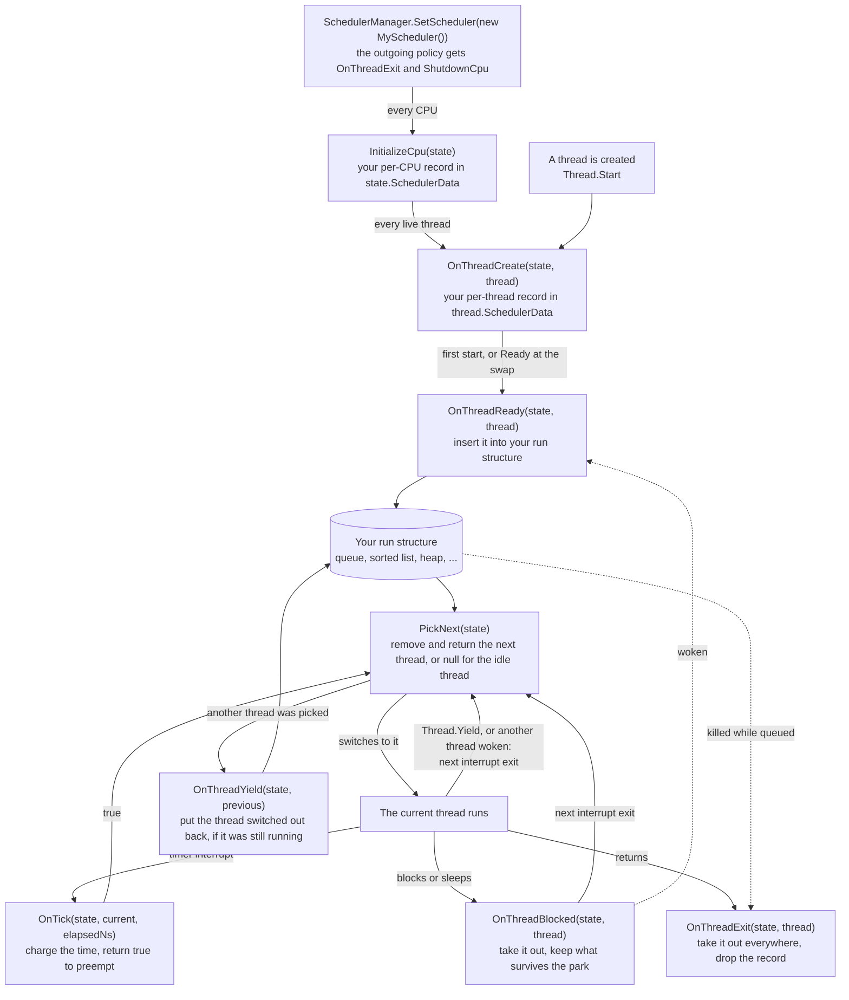

# Writing a scheduler

In this article, we will discuss how to write a scheduling policy for Cosmos Gen3: how to install it, the interface it implements, where it keeps its state and the rules its hooks run under, then sketches of the classic algorithms and what a real-time policy still lacks.

The kernel's scheduler is split in two, a [mechanism and a policy](../dev/sched-concepts/policy-and-mechanism.md). The mechanism switches threads, keeps the thread registry, takes the timer tick and lets the garbage collector find every thread, and it never changes. Everything that decides which thread runs when goes through one interface, [`IScheduler`](https://github.com/CosmosOS/Cosmos/blob/gen3/src/Cosmos.Kernel.Core/Scheduler/IScheduler.cs), and the policy installed at boot is Stride, a [virtual-time fair-share](../dev/sched-concepts/virtual-time-fair-share.md) scheduler. You write a policy when you want threads ordered some other way: by fixed priority, by deadline, in plain rotation, or without preemption while you chase a race. Each linked term has a short background note in the [scheduler glossary](../dev/scheduler-glossary.md), and the mechanism itself is described in [Scheduler](../dev/scheduler.md) in the contributor docs.

If you find bugs or something abnormal, please [submit an issue](https://github.com/CosmosOS/Cosmos/issues/new/choose) on our repository.

---

## Experimental status

The seam types (`IScheduler`, `SchedulerManager`, `SchedulerThread`, `PerCpuState`, `SchedulerExtensible`, `InterruptMaskScope`, `SchedulerThreadState`, `SchedulerThreadFlags`) carry `[Experimental("COSMOS0001")]`: they are usable today but make no compatibility promise, and they are promoted to the stable surface by removing the attribute once proven. Referencing them is a build error until the project acknowledges that contract:

```xml
<PropertyGroup>
  <NoWarn>$(NoWarn);COSMOS0001</NoWarn>
</PropertyGroup>
```

See [Public API Tracking](../dev/public-api.md) for how experimental seams fit the surface policy.

---

## Replacing the policy

Replacing the policy takes three steps:

1. Implement `IScheduler` in your kernel project, keeping the algorithm's bookkeeping in the per-thread and per-CPU data slots ([Attaching state](#attaching-state)). The seam is public, so a policy needs no access to `Cosmos.Kernel.Core` internals.
2. Respect the [kernel constraints](#kernel-constraints): the hooks run in interrupt context or with interrupts masked, on live scheduler state.
3. Install it with `SchedulerManager.SetScheduler`.

A kernel installs its policy once it is up, for example from `BeforeRun`:

```csharp
using Cosmos.Kernel.Core.Scheduler;
using Sys = Cosmos.Kernel.System;

namespace MyOS;

public class Kernel : Sys.Kernel
{
    protected override void BeforeRun()
    {
        SchedulerManager.SetScheduler(new MyScheduler());
    }

    protected override void Run()
    {
        // The kernel's main loop, which runs on the boot thread.
    }
}
```

You cannot get in ahead of the default. The kernel installs Stride while it boots, before the driver stage, so by the time your code runs Stride already manages the boot thread, the driver kit's worker thread and any thread a driver started. `SetScheduler` moves every one of them: the outgoing policy gets `OnThreadExit` for each live thread and `ShutdownCpu` for every CPU, then your policy gets `InitializeCpu` for every CPU, `OnThreadCreate` for each live thread and `OnThreadReady` for each one in the `Ready` state. The whole swap runs with interrupts masked, and every CPU reschedules on its next interrupt exit, so your policy picks from its own run structure from then on. To go back to Stride later, keep the policy `SchedulerManager.Current` returns before the swap and install it again; the `StrideScheduler` class itself is internal.

The scheduler has to be compiled in. With `CosmosEnableScheduler` off, or with `CosmosEnableInterrupts` or `CosmosEnableTimer` off, which turn it off too, `SetScheduler` throws `InvalidOperationException`.

---

## The interface

The manager calls the policy at fixed points in a thread's life and keeps everything else: it sets every `SchedulerThread.State`, keeps the thread registry, requests a reschedule when a thread wakes, returns an exiting thread's allocation buffer to the garbage collector, performs the switch and runs the idle thread when `PickNext` returns `null`, so a policy repeats none of it. The diagram follows a thread through the hooks:



Most hooks receive the `PerCpuState` they operate on, and run either with interrupts masked by the manager or in interrupt context itself; the exceptions are noted below. A policy that does not need a hook leaves it a no-op. The table lists when each member is called and what it has to do:

| Member | Called when | Contract |
|--------|-------------|----------|
| `Name` | `SchedulerDiagnostics.SchedulerName` reads it | A display name for logs |
| `InitializeCpu(state)` | once per CPU, when the policy is installed | Allocate the per-CPU bookkeeping into `state.SchedulerData` |
| `ShutdownCpu(state)` | once per CPU, when the policy is replaced | Release it, leaving a clean slot for the incoming policy |
| `OnThreadCreate(state, thread)` | a thread is created, and once for every live thread when the policy is installed | Allocate the per-thread bookkeeping into `thread.SchedulerData`; do not queue the thread yet |
| `OnThreadReady(state, thread)` | a thread becomes runnable: its first start, a wake, an expired sleep, or the `Ready` state at the swap | Place the thread and insert it into the run structure, once |
| `OnThreadBlocked(state, thread)` | a thread blocks on a primitive or goes to sleep | Remove the thread from the run structure; save whatever must survive the park |
| `OnThreadYield(state, thread)` | a switch takes the thread off the CPU while it is still `Running`, preempted or yielding | Re-insert the thread |
| `OnThreadExit(state, thread)` | a thread returns, or `SchedulerDiagnostics.RequestKill` kills it while it waits in the run structure, and for every live thread when the policy is replaced | Remove it everywhere and drop its bookkeeping |
| `OnTick(state, current, elapsedNs)` | every timer tick, inside the timer interrupt | Account the elapsed time; return `true` to request a reschedule. `elapsedNs` is the configured tick interval, not a measurement |
| `PickNext(state)` | every reschedule, in interrupt context | Remove and return the next thread to run, or return `null` to run the idle thread |
| `OnPickFailed(state, thread)` | never yet | Put back a thread the mechanism picked but could not switch to |
| `SelectCpu(thread, currentCpu, cpuCount)` | never yet | Choose a starting CPU for a thread; honor `SchedulerThreadFlags.Pinned` |
| `OnThreadMigrate(thread, fromState, toState)` | from the policy's own `Balance` | Move the thread's bookkeeping, and any virtual-time base, between CPUs |
| `Balance(state, allCpuStates)` | never yet | Rebalance load across CPUs; honor `Pinned` |
| `SetPriority(state, thread, priority)` / `GetPriority(thread)` | `SchedulerManager.SetPriority`; `SchedulerDiagnostics` reads `GetPriority` on every thread snapshot | Priority is policy-defined: Stride reads it as tickets, a real-time policy would read it as a priority level. Neither is called with interrupts masked |
| `GetRunQueueCount(state)` / `GetRunQueueThread(state, index)` | `SchedulerDiagnostics` reads the run structure | Read-only introspection; guard it yourself (see [kernel constraints](#kernel-constraints)) |

Four of these have no caller a policy can count on. `SelectCpu` and `Balance` are never called, because the kernel runs on one CPU ([CPU affinity and load balancing](../dev/sched-concepts/cpu-affinity.md)); `OnPickFailed` is never called, because the switch always goes to the thread `PickNext` returned; and `SetPriority` is reached only through `SchedulerManager.SetPriority`, which nothing in the kernel calls. Implement all four, but do not rely on them being exercised. `Name`, `SelectCpu` and `GetPriority` receive no `PerCpuState`, and `InitializeCpu` and `ShutdownCpu` run in thread context, inside the masked swap.

A running thread that `RequestKill` kills is only marked `Dead`: it leaves the CPU at the next switch without `OnThreadYield` and never reaches `OnThreadExit`, so its record stays in the slot.

`PickNext` runs on every reschedule, not only after `OnTick` returns `true`. A wake, a block, a `Thread.Yield` or a policy swap asks for a reschedule, and the next hardware interrupt exit calls `PickNext` for it: without calling `OnTick` at all when that interrupt is not the tick, and whatever `OnTick` answered when it is ([context switch](../dev/sched-concepts/context-switch.md)). The thread on the CPU is normally not in the run structure at that point ([thread states and the run queue](../dev/sched-concepts/run-queue.md)): it goes back through `OnThreadYield` only after `PickNext` has chosen another. The exception is a thread that blocked and was woken before the switch took it off the CPU: it is `Ready` and already queued, and `PickNext` may hand it back like any other queued thread. A policy that ranks threads, and so must not let every wake displace the current thread, compares the best queued thread with `state.CurrentThread` and returns `state.CurrentThread` itself while that thread's `State` is still `Running`, which keeps it on the CPU. Never return a thread that is `Blocked`, `Sleeping` or `Dead`: the manager does not check. Returning `null` runs the idle thread, which is the kernel's own boot thread, so an `OnTick` that returns `true` while nothing is queued hands the CPU to it.

**Keeping the current thread also keeps it through its own `Thread.Yield`.** `PickNext` is not told why it runs, and `Thread.Yield` asks for the same reschedule a wake does. `Thread.Start` relies on that reschedule: it calls `Thread.Yield` in a loop until the new thread has run for the first time, so a policy that keeps the starting thread over a new thread that does not outrank it never lets that thread run, and the call never returns. A policy that keeps the current thread therefore gives a queued thread that is still `Created` its first run at the next reschedule. Any other loop that waits through `Thread.Yield` for a thread the policy ranks lower spins the same way.

---

## Attaching state

`SchedulerThread` and `PerCpuState` both inherit `SchedulerExtensible`, which carries exactly one `object?` slot, `SchedulerData`, reserved for the active policy. Allocate in the creation hooks, and read the slot with `as`:

```csharp
public sealed class MyThreadData { public ulong Deadline; }
public sealed class MyCpuData { public List<SchedulerThread> Queue { get; } = new(SchedulerThread.MaxThreadCount); }

public void OnThreadCreate(PerCpuState state, SchedulerThread thread)
    => thread.SchedulerData = new MyThreadData();

public bool OnTick(PerCpuState state, SchedulerThread current, ulong elapsedNs)
{
    MyThreadData? data = current.SchedulerData as MyThreadData;
    if (data is null) { return true; }   // exited: get it off the CPU
    ...
}
```

Read the slot with `as`, never a cast, and handle `null` on every hook. `OnThreadExit` clears the slot, so a thread can lose its record between a tick and the hook that observes it, and dereferencing the empty slot fails inside the timer interrupt. A cast would not help there, since casting `null` yields `null`, and it would throw on a slot holding anything but your record; `as` turns both into `null`, which the one check handles.

A record written by another policy is not something a hook has to handle, because `SetScheduler` re-homes every live thread ([Replacing the policy](#replacing-the-policy)). A thread that arrives already running is. The thread on the CPU at the swap (the boot thread when Stride is installed at startup, or whichever thread calls `SetScheduler` later) reaches `OnThreadCreate` in the `Running` state and is never handed to `OnThreadReady`, so a policy that counts its runnable threads or their weights accounts for it there, without queuing it. Stride adds the thread's tickets to its total in `OnThreadCreate` for that reason.

One slot per object is the whole budget. A policy that needs several values defines one class holding them, as Stride does with one record per thread and one per CPU.

---

## Kernel constraints

The hooks run inside the kernel's most sensitive window, so four rules are not optional.

**A hook cannot wait.** `OnTick` runs inside the timer interrupt, and `PickNext` and `OnThreadYield` inside whichever interrupt exit carries the reschedule ([interrupt context](driver-concepts/interrupt-context.md)); `OnThreadReady` can run inside an interrupt too when the tick or a device handler wakes a thread, and the other lifecycle hooks run with interrupts masked on whatever thread called the manager. Either way, no other thread and no tick can run on that CPU until the hook returns, so a hook that blocks, parks or waits for another thread waits forever.

**Do not allocate on the tick path.** Allocation is interrupt-safe in this kernel, but an allocation in `OnTick` or `PickNext` can start a garbage collection inside an interrupt. Allocate in `OnThreadCreate` and `InitializeCpu`, where creating a thread already pays for it, and give collections their capacity there, since a list that grows inside `OnThreadReady` or `OnThreadYield` allocates on the same path.

**Compare threads with `ReferenceEquals`.** `List<T>.Remove`, `Contains` and `IndexOf` go through `EqualityComparer<T>.Default`, which needs runtime helpers the kernel does not provide. Scan with `ReferenceEquals` and remove with `RemoveAt`, as Stride does.

**Mask interrupts on the entries the manager does not.** A hook that changes the run structure can be interrupted by the tick halfway through unless interrupts are masked ([spinlocks and interrupt masking](../dev/sched-concepts/spinlocks-and-masking.md)). The manager masks them around the lifecycle hooks and the two per-CPU hooks, and the tick hooks run inside the interrupt itself, but four hooks get no mask: `SetPriority`, `GetPriority`, `GetRunQueueCount` and `GetRunQueueThread`. The per-CPU spinlock the manager holds around `SetPriority` does not help, because it keeps out another caller and the tick takes no lock at all. Those four, and any entry point a policy adds of its own, such as a tuning setter or a statistics read, mask interrupts themselves:

```csharp
public int GetRunQueueCount(PerCpuState state)
{
    using (SchedulerManager.MaskInterrupts())
    {
        MyCpuData? data = state.SchedulerData as MyCpuData;
        return data is null ? 0 : data.Queue.Count;
    }
}
```

Masking inside a hook makes one call atomic and no more: a caller that reads `GetRunQueueCount` and then walks the indices needs its own mask around the whole walk.

---

## Worked sketches

The same questions recur for every algorithm: what to store per thread and per CPU, what shape the run structure takes, what triggers preemption in `OnTick`, and what must survive a park. The sketches below answer them for the classic algorithms. Every policy that ranks threads (MLFQ, fixed priority, EDF) also needs the comparison in `PickNext` that [The interface](#the-interface) describes, keeping the current thread when nothing queued outranks it, together with the first-run exception for a `Created` thread that goes with it; the tables leave both out.

### Round-robin

A FIFO queue with fixed-quantum [preemption](../dev/sched-concepts/preemption.md):

| Hook | Behavior |
|------|----------|
| `PerCpuState.SchedulerData` | A queue of threads |
| `SchedulerThread.SchedulerData` | A remaining-quantum counter |
| `OnThreadReady` | Enqueue at the tail with a fresh quantum |
| `OnThreadBlocked` | Remove from the queue: the thread blocking is usually the running one, which is not queued, but a thread woken before it left the CPU is queued while it still runs |
| `OnTick` | Charge `elapsedNs` against the quantum; at zero, return `true` if another thread is queued, or grant a fresh quantum in place |
| `OnThreadYield` | Re-enqueue at the tail, reset the quantum |
| `PickNext` | Dequeue the head |

FIFO order already bounds latency at `quantum * queue depth`, so round-robin needs no wakeup placement logic at all.

This sketch exists as a complete policy written over the public seam only, exactly as a kernel's own would be: [`RoundRobinScheduler`](https://github.com/CosmosOS/Cosmos/blob/gen3/tests/Kernels/Cosmos.Kernel.Tests.Threading/RoundRobinScheduler.cs) on GitHub. Its quantum is two [ticks](../dev/sched-concepts/scheduler-tick.md), so its accounting has to carry over a tick in between. A kernel tests such a policy live, after installing it, because `PerCpuState` and `SchedulerThread` have no public constructor and the hooks cannot be driven on objects of your own. Check what only a running kernel shows: that new threads get dispatched, that a thread spinning in a loop is preempted when its quantum expires, that two spinners share the CPU the way the policy intends, and that `SchedulerDiagnostics.GetRunQueueCount` drops when a thread blocks and rises again when it wakes. Do not assert the order in which threads reach their delegate: it is not the order they became ready, because a thread preempted inside its start-up code goes back to the tail like any other.

Both swap directions are worth testing as well. Going out, the policy receives the boot thread and every other live thread through `OnThreadCreate`, and still has to read every slot with `as` for the reason given in [Attaching state](#attaching-state). Coming back, the policy saved from `SchedulerManager.Current` receives them the same way, so a thread that stays alive across both swaps changes policy, and a spinner kept running across them should keep making progress under each.

### Multi-level feedback queue (MLFQ)

Several priority levels; threads demote when they burn a full quantum and promote when they block early:

| Hook | Behavior |
|------|----------|
| `PerCpuState.SchedulerData` | An array of queues, one per level |
| `SchedulerThread.SchedulerData` | Current level and quantum-used counter |
| `OnThreadReady` | Enqueue at the thread's current level |
| `OnThreadBlocked` | Remove from its queue and promote one level: it blocked before its quantum ran out, so treat it as interactive |
| `OnTick` | Charge time; at the end of the level's quantum, mark the thread for demotion and return `true` |
| `OnThreadYield` | Re-enqueue at the thread's level, one lower if it was marked for demotion |
| `PickNext` | Scan levels top-down, dequeue the first non-empty head |
| periodic (e.g. every N ticks in `OnTick`) | Reset all threads to the top level, the classic boost against [starvation](../dev/sched-concepts/starvation.md) |

MLFQ tracks no virtual time; its whole bookkeeping is integer levels.

### Fixed-priority preemptive (FPP)

The default policy of most RTOSes (FreeRTOS, Zephyr, ThreadX): the highest-priority runnable thread always runs, FIFO within a level:

| Hook | Behavior |
|------|----------|
| `PerCpuState.SchedulerData` | An array of queues indexed by priority |
| `SchedulerThread.SchedulerData` | A static priority |
| `OnThreadReady` | Enqueue at the tail of the thread's level; the reschedule the manager requests on every wake runs `PickNext` at the next interrupt exit, which is how a higher-priority wake preempts |
| `OnThreadBlocked` / `OnThreadYield` | Remove from its level / re-enqueue at the tail of its level |
| `OnTick` | Return `true` if any level above the current thread's is non-empty (pure priority, no quantum) |
| `PickNext` | Top-down scan, dequeue the first head |
| `SetPriority` | Move the thread between levels, inside `SchedulerManager.MaskInterrupts()` |

Rate Monotonic is FPP with priorities assigned from each thread's period, the shorter the period the higher the priority ([real-time scheduling](../dev/sched-concepts/real-time-scheduling.md)). The seam carries no period, so the policy takes it through an entry point of its own, or encodes it in the `SetPriority` value. It also has to keep the total utilization under the schedulability bound itself, and since no hook can refuse a thread (`OnThreadCreate` returns nothing), that admission check belongs in the policy's own entry point, which the kernel calls before it starts the thread.

### Earliest deadline first (EDF)

Dynamic priority by absolute deadline. Earliest Deadline First is optimal on one CPU, meeting every deadline up to 100% utilization where Rate Monotonic guarantees about 69%, and harder to reason about under overload:

| Hook | Behavior |
|------|----------|
| `PerCpuState.SchedulerData` | A min-heap keyed on absolute deadline |
| `SchedulerThread.SchedulerData` | Period, relative deadline, absolute deadline, the first two through an entry point of the policy's own, as for Rate Monotonic |
| `OnThreadReady` | `absolute = now + relative`, insert into the heap |
| `OnThreadBlocked` / `OnThreadYield` | Remove from the heap / re-insert with its absolute deadline unchanged |
| `OnTick` | Return `true` if the heap root's deadline is earlier than the current thread's |
| `PickNext` | Pop the root |

### FIFO (cooperative)

A debugging policy, useful when chasing a race that disappears under preemption: one queue, `OnTick` always returns `false`, and `PickNext` keeps the current thread while it is still `Running`, so a thread runs until it blocks, sleeps or exits. Without that check in `PickNext`, every wake elsewhere would still switch threads, because the manager reschedules on each one. The check has two costs. A compute-bound thread that never blocks keeps the CPU for good, and so would a thread inside `Thread.Start`, which waits through `Thread.Yield` for the new thread's first run, so `PickNext` has to let a thread that is still `Created` run first.

---

## Real-time notes

The split between policy and mechanism makes the framework a plausible base for a [real-time](../dev/sched-concepts/real-time-scheduling.md) kernel. The context switch allocates nothing, so its cost is deterministic; a timed sleep provides the wake-up a periodic task needs, and `SetPriority` is the handle a priority protocol would use. Affinity is only half there: a policy honors `SchedulerThreadFlags.Pinned`, but only the idle threads carry it, since a kernel can read `SchedulerThread.Flags` and not set it. A hard real-time build still has to add pieces on both sides of the interface.

The policy side has to bound its own cost and police its load. Everything in `OnTick` and `PickNext` adds to the worst-case interrupt latency, so Stride's linear sorted insert would not qualify, while per-priority FIFOs or a heap keep the hooks at O(log n) or better. Nothing stops oversubscription either, and the admission check the Rate Monotonic sketch describes is the policy's own to add.

The kernel side lacks priority inheritance and a deadline-driven tick. The kernel's own mutex, internal to `Cosmos.Kernel.Core` and what CoreLib's low-level monitor waits are built on, wakes its waiters in FIFO order and hands ownership directly to the head waiter, with no boost for the holder: fair, but open to [priority inversion](../dev/sched-concepts/priority-inversion.md). An inheritance protocol, which boosts the holder to the highest waiter's priority through `SetPriority` and restores it on release, has its hook and no implementation. The scheduler tick runs at a fixed period, 10 ms from boot. On ARM64 its timer, the Generic Timer, is already re-armed as a one-shot on every interrupt; on x64 the tick comes from the periodic local APIC timer, which would have to be switched to one-shot re-arming. On either, the missing piece is a channel from the policy to the timer, so that the next interrupt is programmed for the next deadline instead of a fixed period.

---

## Summary

| Task | Call |
|---|---|
| Install a policy | `SchedulerManager.SetScheduler(policy)` |
| Keep the installed policy, to reinstall it later | `SchedulerManager.Current` |
| Attach per-CPU state | `state.SchedulerData = new MyCpuData()`, in `InitializeCpu` |
| Attach per-thread state | `thread.SchedulerData = new MyThreadData()`, in `OnThreadCreate` |
| Read either back | `SchedulerData as MyRecord`, handling `null` |
| Queue a runnable thread | `OnThreadReady`, `OnThreadYield` |
| Take a thread out | `OnThreadBlocked`, `OnThreadExit` |
| Choose the next thread | `PickNext`, returning `state.CurrentThread` to keep it or `null` for the idle thread |
| Preempt on the tick | `true` from `OnTick` |
| Guard an entry the manager does not | `using (SchedulerManager.MaskInterrupts())` |
| Change a thread's priority | `SchedulerManager.SetPriority(cpuId, thread, priority)` |
| Read the run structure at run time | `SchedulerDiagnostics.GetRunQueueCount(cpuId)`, `SchedulerDiagnostics.TryGetRunQueueThread(cpuId, index, out info)` |
| Read the tick period | `SchedulerDiagnostics.TickPeriodNs` |
